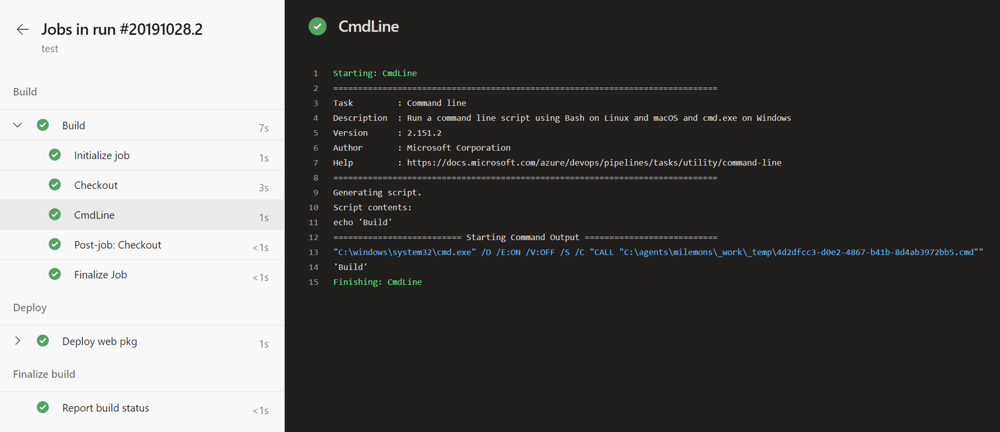
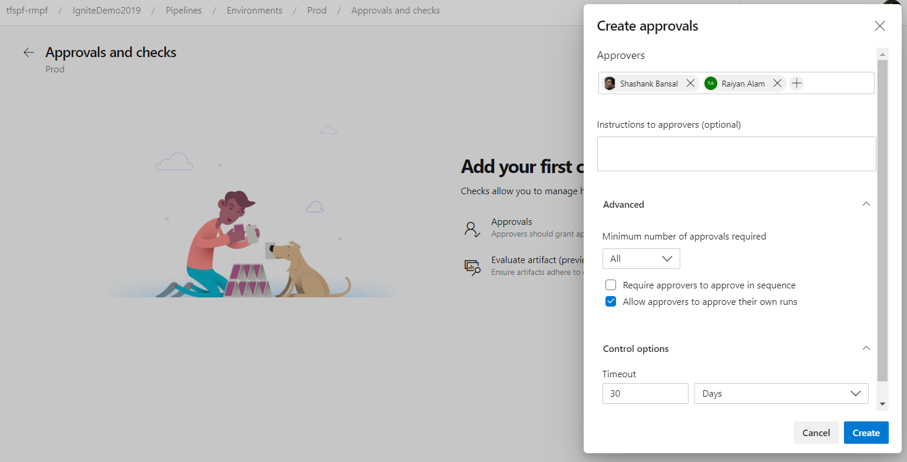
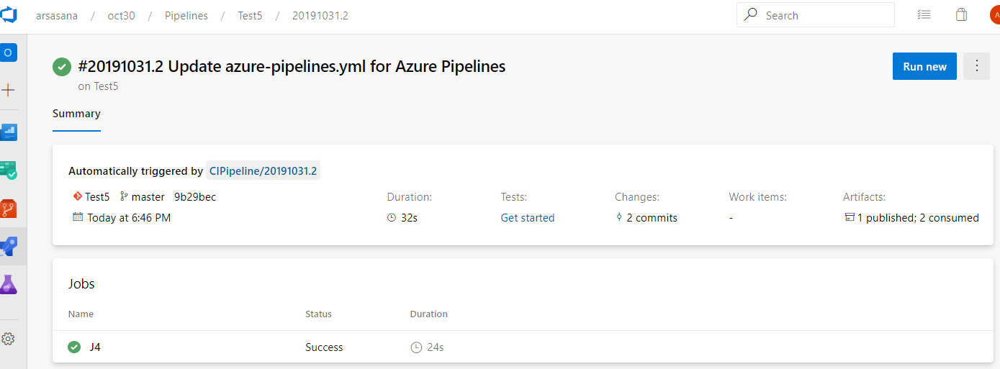
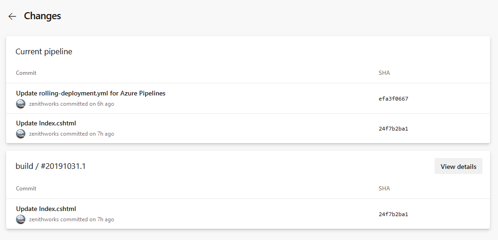
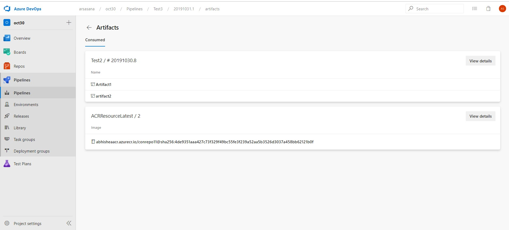
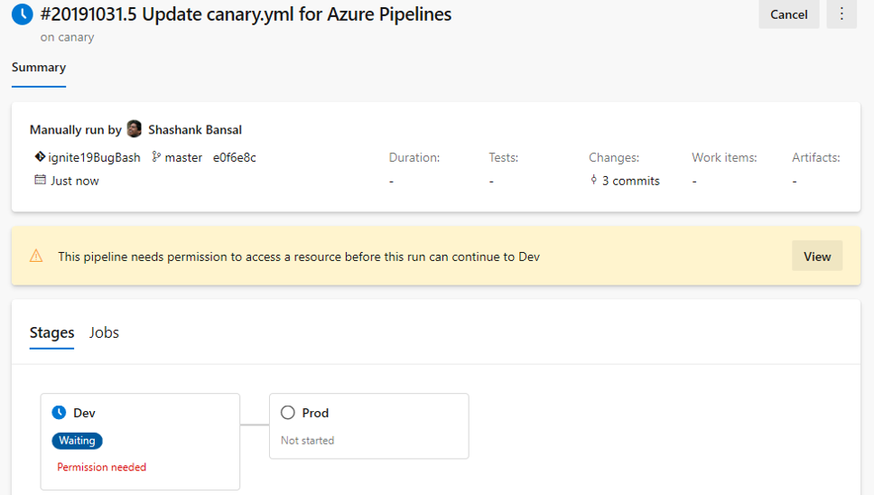
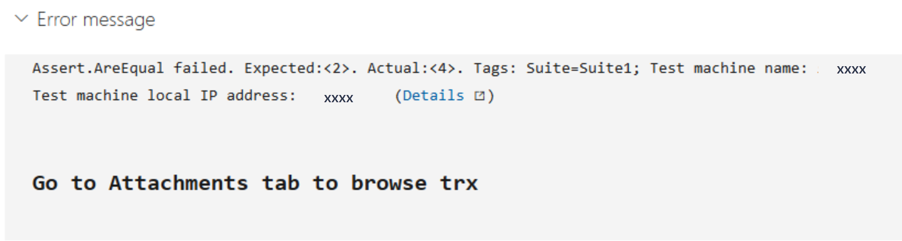
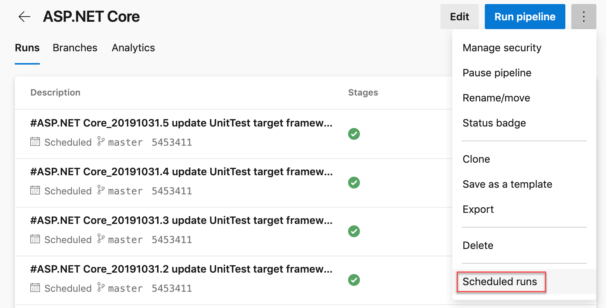
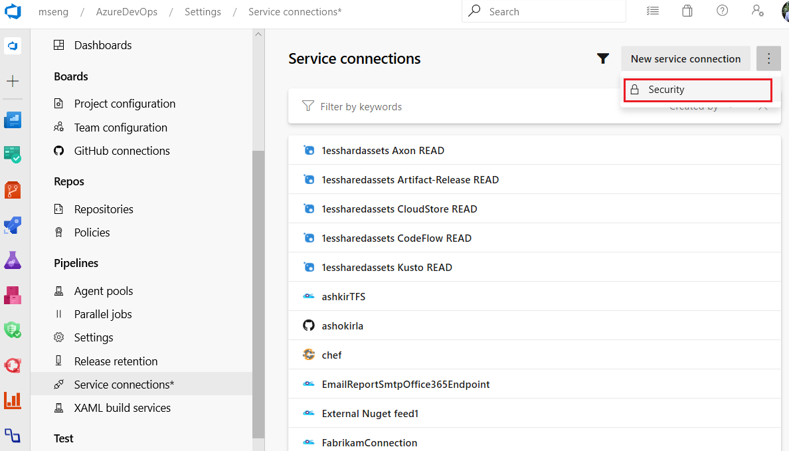

### Multi-stage pipelines UX

We've been working on an updated user experience to manage your pipelines. These updates make the pipelines experience modern and consistent with the direction of Azure DevOps. Moreover, these updates bring together classic build pipelines and multi-stage YAML pipelines into a single experience. For example, the following capabilities are included in the new experience; viewing and managing multiple stages, approving pipeline runs, ability to scroll all the way back in logs while a pipeline is still in progress, and per-branch health of a pipeline.

Thank you to all who have tried the new experience. If you haven't tried it, enable **Multi-stage pipelines** in the preview features. To learn more about multi-stage pipelines, see the documentation [here](/azure/devops/pipelines/process/stages?tabs=yaml&view=azure-devops&preserve-view=true) .

> [!div class="mx-imgBorder"]
> 

Thanks to your feedback, we addressed the following in the last two updates.

1. Discoverability of folders view.
2. Jumpiness in logs view.
3. Readily show logs from previous and current tasks even when a run is in progress.
4. Make it easier to navigate between tasks when reviewing logs.

> [!div class="mx-imgBorder"]
> 

> [!NOTE]
> In the next update, we plan to turn this feature on by default for everyone. You will still have the option to opt-out of the preview. A few weeks after that, the feature will be made generally available.

### Orchestrate canary deployment strategy on environment for Kubernetes

One of the key advantages of continuous delivery of application updates is the ability to quickly push updates into production for specific microservices. This gives you the ability to quickly respond to changes in business requirements. **Environment** was introduced as a first-class concept enabling orchestration of deployment strategies and facilitating zero downtime releases. Previously, we supported the *runOnce* strategy which executed the steps once sequentially. With support for canary strategy in multi-stage pipelines, you can now reduce the risk by slowly rolling out the change to a small subset. As you gain more confidence in the new version, you can start rolling it out to more servers in your infrastructure and route more users to it.

```yaml
jobs:
- deployment:
  environment: musicCarnivalProd
  pool:
    name: musicCarnivalProdPool 
  strategy:                 
    canary:     
      increments: [10,20] 
      preDeploy:                                    
        steps:          
        - script: initialize, cleanup....  
      deploy:            
        steps:
        - script: echo deploy updates...
        - task: KubernetesManifest@0
          inputs:
            action: $(strategy.action)      
            namespace: 'default'
            strategy: $(strategy.name)
            percentage: $(strategy.increment)
            manifests: 'manifest.yml'
      postRouteTaffic:
        pool: server
        steps:          
        - script: echo monitor application health...  
      on:
        failure:
          steps:
	  - script: echo clean-up, rollback...  
        success:
          steps:
          - script: echo checks passed, notify...

```
The canary strategy for Kuberenetes will first deploy the changes with 10% pods followed by 20% while monitoring the health during *postRouteTraffic*. If all goes well, it will promote to 100%. 

We are looking for early feedback on support for VM resource in environments and performing rolling deployment strategy across multiple machines. [Contact us](mailto:rm_customer_queries@microsoft.com?subject=VMResourcePrivateBeta) to enroll.

### Approval policies for YAML pipelines

In YAML pipelines, we follow a resource owner-controlled approval configuration. Resource owners configure approvals on the resource and all pipelines that use the resource pause for approvals before start of the stage consuming the resource. It is common for SOX based application owners to restrict the requester of the deployment from approving their own deployments. 

You can now use **advanced approval options** to configure approval policies like requester should not approve, require approval from a subset of users and approval timeout.

> [!div class="mx-imgBorder"]
> 

### ACR as a first-class pipeline resource

If you need to consume a container image published to ACR (Azure Container Registry) as part of your pipeline and trigger your pipeline whenever a new image got published, you can use ACR container resource. 

```yaml
resources:
  containers:
  - container: MyACR  #container resource alias
    type: ACR
    azureSubscription: RMPM  #ARM service connection
    resourceGroup: contosoRG
    registry: contosodemo
    repository: alphaworkz
    trigger: 
      tags:
        include: 
        - production 
```

Moreover, ACR image meta-data can be accessed using predefined variables. The following list includes the ACR variables available to define an ACR container resource in your pipeline.

```
resources.container.<Alias>.type
resources.container.<Alias>.registry
resources.container.<Alias>.repository
resources.container.<Alias>.tag 
resources.container.<Alias>.digest
resources.container.<Alias>.URI
resources.container.<Alias>.location
```

### Pipeline resource meta-data as predefined variables

We've added predefined variables for YAML pipelines resources in the pipeline. Here is the list of the pipeline resource variables available.

```
resources.pipeline.<Alias>.projectName 
resources.pipeline.<Alias>.projectID 
resources.pipeline.<Alias>.pipelineName 
resources.pipeline.<Alias>.pipelineID 
resources.pipeline.<Alias>.runName 
resources.pipeline.<Alias>.runID
resources.pipeline.<Alias>.runURI
resources.pipeline.<Alias>.sourceBranch 
resources.pipeline.<Alias>.sourceCommit
resources.pipeline.<Alias>.sourceProvider 
resources.pipeline.<Alias>.requestedFor
resources.pipeline.<Alias>.requestedForID
```

### Traceability for pipelines and ACR resources

We ensure full E2E traceability when pipelines and ACR container resources are used in a pipeline. For every resource consumed by your YAML pipeline, you can trace back to the commits, work items and artifacts.

In the pipeline run summary view, you can see:

  * The **resource version that triggered the run**. Now, your pipeline can be triggered upon completion of another Azure pipeline run or when a container image is pushed to ACR.

    > [!div class="mx-imgBorder"]
    > 

  * The **commits** that are consumed by the pipeline. You can also find the breakdown of the commits by each resource consumed by the pipeline.

    > [!div class="mx-imgBorder"]
    > 

  * The **work items** that are associated with each resource consumed by the pipeline.

  * The **artifacts** that are available to be used by the run.

    > [!div class="mx-imgBorder"]
    > 

In the environment's deployments view, you can see the commits and work items for each resource deployed to the environment.

> [!div class="mx-imgBorder"]
> 

### Simplified resource authorization in YAML pipelines

A resource is anything used by a pipeline that is outside the pipeline. Resources must be authorized before they can be used. Previously, when using unauthorized resources in a YAML pipeline, it failed with a resource authorization error. You had to authorize the resources from the summary page of the failed run. In addition, the pipeline failed if it was using a variable that referenced an unauthorized resource. 

We are now making it easier to manage resource authorizations. Instead of failing the run, the run will wait for permissions on the resources at the start of the stage consuming the resource. A resource owner can view the pipeline and authorize the resource from the Security page.

> [!div class="mx-imgBorder"]
> 

### Improve pipeline security by restricting the scope of access tokens

Every job that runs in Azure Pipelines gets an access token. The access token is used by the tasks and by your scripts to call back into Azure DevOps. For example, we use the access token to get source code, upload logs, test results, artifacts, or to make REST calls into Azure DevOps. A new access token is generated for each job, and it expires once the job completes. With this update, we added the following enhancements. 

- **Prevent the token from accessing resources outside a team project** 

    Until now, the default scope of all pipelines was the team project collection. You could change the scope to be the team project in classic build pipelines. However, you did not have that control for classic release or YAML pipelines. With this update we are introducing an organization setting to force every job to get a project-scoped token no matter what is configured in the pipeline. We also added the setting at the project level. Now, every new project and organization that you create will automatically have this setting turned on.

    > [!NOTE]
    > The organization setting overrides the project setting. 

    Turning this setting on in existing projects and organizations may cause certain pipelines to fail if your pipelines access resources that are outside the team project using access tokens. To mitigate pipeline failures, you can explicitly grant _Project Build Service Account_ access to the desired resource. We strongly recommend that you turn on these security settings. 

- **Remove certain permissions for the access token** 

    By default, we grant a number of permissions to the access token, one of this permission is **Queue builds**. With this update, we removed this permission to the access token. If your pipelines need this permission, you can explicitly grant it to the _Project Build Service Account_ or _Project Collection Build Service Account_ depending on the token that you use.

### Evaluate artifact check

You can now define a set of policies and add the policy evaluation as a check on an environment for container image artifacts. When a pipeline runs, the execution pauses before starting a stage that uses the environment. The specified policy is evaluated against the available metadata for the image being deployed. The check passes when the policy is successful and marks the stage as failed if the check fails.

> [!div class="mx-imgBorder"]
> 

### Markdown support in automated test error messages

We now support markdown in error messages for automated tests. You can easily format error messages for both test run and test result to improve readability and ease troubleshooting the failure in Azure Pipelines. The supported markdown syntax can be found [here](/azure/devops/project/wiki/markdown-guidance?view=azure-devops&preserve-view=true).

> [!div class="mx-imgBorder"]
> 

### Diagnosing cron schedules in YAML

We have seen a steady increase in the use of cron syntax for specifying schedules in your YAML pipelines. As we listened to your feedback, we heard that it was hard for you to determine whether Azure Pipelines had processed your syntax correctly. Previously, you would have to wait for the actual time of the scheduled run to debug schedule problems. To help you diagnose branch/syntax errors, we added a new action menu for pipeline. The **Scheduled runs** in the Run pipeline menu will give you a preview of the upcoming few scheduled runs for your pipeline to help you diagnose errors with your cron schedules.

> [!div class="mx-imgBorder"]
> 

### Updates to the ARM template deployment task

Previously, we didn't filter the service connections in the ARM template deployment task. This may result in the deployment to fail if you are selecting a lower scope service connection to perform ARM template deployments to a broader scope. Now, we added filtering of service connections to filter out lower scoped service connections based on the deployment scope you choose.

### Project level security for service connections

With this update, we added hub level security for service connections. Now, you can add/remove users, assign roles and manage access in a centralized place for all the service connections.

> [!div class="mx-imgBorder"]
> 

### Ubuntu 18.04 pool

Azure Pipelines now supports running your jobs on Ubuntu 18.04. We updated the Microsoft-hosted Azure Pipelines pool to include the Ubuntu-18.04 image. Now, when you reference `ubuntu-latest` pool in your YAML pipelines, it will mean `ubuntu-18.04` and not `ubuntu-16.04`. You can still target 16.04 images in your jobs by using `ubuntu-16.04` explicitly.
### Service Mesh Interface based canary deployments in KubernetesManifest task

Previously when canary strategy was specified in the KubernetesManifest task, the task would create baseline and canary workloads whose replicas equaled a percentage of the replicas used for stable workloads. This was not exactly the same as splitting traffic up to the desired percentage at the request level. To tackle this, we've added support for **Service Mesh Interface** based canary deployments to the KubernetesManifest task. 

Service Mesh Interface abstraction allows for plug-and-play configuration with service mesh providers such as Linkerd and Istio. Now the KubernetesManifest task takes away the hard work of mapping SMI's TrafficSplit objects to the stable, baseline and canary services during the lifecycle of the deployment strategy. The desired percentage split of traffic between stable, baseline and canary are more accurate as the percentage traffic split is controlled on the requests in the service mesh plane. 

The following is a sample of performing SMI based canary deployments in a rolling manner. 

```yaml
- deployment: Deployment
    displayName: Deployment
    pool:
      vmImage: $(vmImage)
    environment: ignite.smi
    strategy:
      canary:
        increments: [25, 50]
        preDeploy:
          steps:
          - task: KubernetesManifest@0
            displayName: Create/update secret
            inputs:
              action: createSecret
              namespace: smi
              secretName: $(secretName)
              dockerRegistryEndpoint: $(dockerRegistryServiceConnection)
        deploy:
          steps:
          - checkout: self
          - task: KubernetesManifest@0
            displayName: Deploy canary
            inputs:
              action: $(strategy.action)
              namespace: smi
              strategy: $(strategy.name)
              trafficSplitMethod: smi
              percentage: $(strategy.increment)
              baselineAndCanaryReplicas: 1
              manifests: |
                manifests/deployment.yml
                manifests/service.yml
              imagePullSecrets: $(secretName)
              containers: '$(containerRegistry)/$(imageRepository):$(Build.BuildId)'
        postRouteTraffic:
          pool: server
          steps:
            - task: Delay@1
              inputs:
                delayForMinutes: '2'
```

### ReviewApp in Environment

ReviewApp deploys every pull request from your Git repository to a dynamic environment resource. Reviewers can see how those changes look as well as work with other dependent services before they’re merged into the main branch and deployed to production. This will make it easy for you to create and manage **reviewApp** resources and benefit from all the traceability and diagnosis capability of the environment features. By using the **reviewApp** keyword, you can create a clone of a resource (dynamically create a new resource based on an existing resource in an environment) and add the new resource to the environment.

The following is a sample YAML snippet of using reviewApp under environments.

```yaml
jobs:
- deployment:
  environment: 
     name: smarthotel-dev      
     resourceName: $(System.PullRequest.PullRequestId) 
  pool:
    name: 'ubuntu-latest'
  strategy:                 
    runOnce:            
      pre-deploy: 
        steps:       
        - reviewApp: MasterNamespace
```