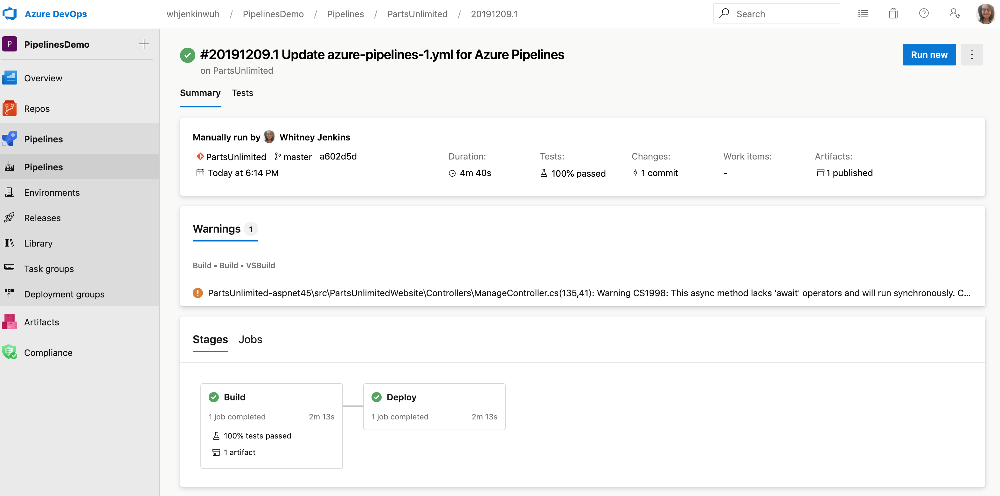
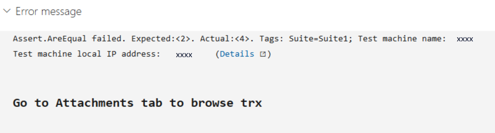
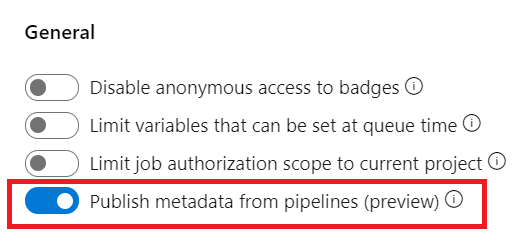
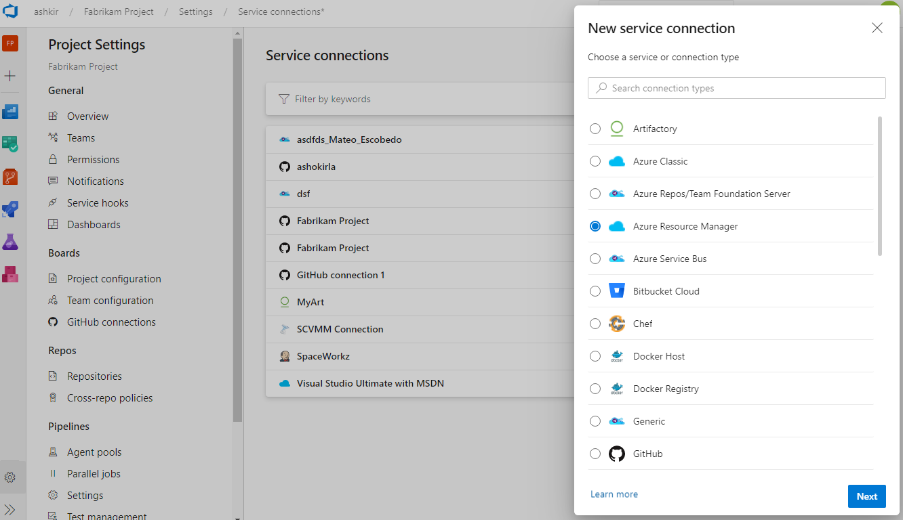
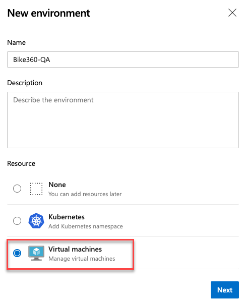
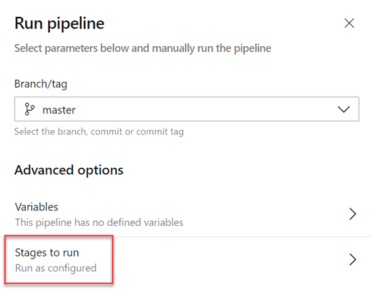

### Updated multi-stage pipelines UI

An updated version of the multi-stage pipelines UI is now available by default. The multi-stage pipelines experience brings improvements and ease of use to the pipeline's portal UI. You can view and manage your pipelines by choosing **Pipelines** from the left-hand menu. In addition, you can drill down and view pipeline details, run details, pipeline analytics, job details, logs, and more.

To learn more about the multi-stage pipelines user experience, see the documentation [here](/azure/devops/pipelines/get-started/multi-stage-pipelines-experience?view=azure-devops&preserve-view=true).

> [!div class="mx-imgBorder"]
> 

### VSTest TestResultsDirectory option is available in the task UI

The VSTest task stores test results and associated files in the `$(Agent.TempDirectory)\TestResults` folder. We've added an option to the task UI to let you configure a different folder to store test results. Now any subsequent tasks that need the files in a particular location can use them.

> [!div class="mx-imgBorder"]
> 

### Use extends keyword in pipelines

Currently, pipelines can be factored out into templates, promoting reuse and reducing boilerplate. The overall structure of the pipeline was still defined by the root YAML file. With this update, we added a more structured way to use pipeline templates. A root YAML file can now use the keyword **extends** to indicate that the main pipeline structure can be found in another file. This puts you in control of what segments can be extended or altered and what segments are fixed. We've also enhanced pipeline parameters with data types to make clear the hooks that you can provide.

This example illustrates how you can provide simple hooks for the pipeline author to use. The template will always run a build, will optionally run additional steps provided by the pipeline, and then run an optional testing step.

```yaml

# azure-pipelines.yml
extends:
  template: build-template.yml
  parameters:
    runTests: true
    postBuildSteps:
    - script: echo This step runs after the build!
    - script: echo This step does too!

# build-template.yml
parameters:
- name: runTests
  type: boolean
  default: false
- name: postBuildSteps
  type: stepList
  default: []
steps:
- task: MSBuild@1   # this task always runs
- ${{ if eq(parameters.runTests, true) }}:
  - task: VSTest@2  # this task is injected only when runTests is true
- ${{ each step in parameters.postBuildSteps }}:
  - ${{ step }}
```

### Markdown support in automated test error messages

We've added markdown support to error messages for automated tests. Now you can easily format error messages for both test run and test result to improve readability and ease the test failure troubleshooting experience in Azure Pipelines. The supported markdown syntax can be found [here](/azure/devops/project/wiki/markdown-guidance?view=azure-devops&preserve-view=true).

> [!div class="mx-imgBorder"]
> 

### Collect automatic and user-specified metadata from pipeline

Now you can enable automatic and user-specified metadata collection from pipeline tasks. You can use metadata to enforce artifact policy on an environment using the [evaluate artifact check](/azure/devops/pipelines/process/approvals?tabs=check-pass&view=azure-devops&preserve-view=true#evaluate-artifact).

> [!div class="mx-imgBorder"]
> 

### Updates to service connections UI

We've been working on an updated user experience to manage your service connections. These updates make the service connection experience modern and consistent with the direction of Azure DevOps. We introduced the new UI for service connections as a preview feature earlier this year. Thanks to everyone who tried the new experience and provided their valuable feedback to us.

> [!div class="mx-imgBorder"]
> 

Along with the user experience refresh, we've also added two capabilities which are critical for consuming service connections in YAML pipelines: pipeline authorizations and approvals and checks.

> [!div class="mx-imgBorder"]
> 

The new user experience will be **turned on by default** with this update. You will still have the option to opt-out of the preview.

> [!NOTE]
> We plan to introduce **Cross-project Sharing of Service Connections** as a new capability. You can find more details about the sharing experience and the security roles [here](/azure/devops/pipelines/library/service-endpoints).

### VM deployments with Environments

One of the most requested features in Environments was VM deployments. With this update, we are enabling Virtual Machine resource in Environments. You can now orchestrate deployments across multiple machines and perform **rolling** updates using YAML pipelines. You can also install the agent on each of your target servers directly and drive rolling deployment to those servers. In addition, you can use the full task catalog on your target machines.

> [!div class="mx-imgBorder"]
> 

A rolling deployment replaces instances of the previous version of an application with instances of the new version of the application on a set of machines (rolling set) in each iteration. 

For example, below rolling deployment updates up to five targets in each iteration. `maxParallel` will determine the number of targets that can be deployed in parallel. The selection accounts for the number of targets that must remain available at any time, excluding the targets that are being deployed to. It is also used to determine the success and failure conditions during deployment.

```yaml
jobs:
- deployment:
  displayName: web
  environment:
    name: musicCarnivalProd
    resourceType: VirtualMachine
  strategy:                 
    rolling:
      maxParallel: 5 #for percentages, mention as x%
      preDeploy:
        steps:
        - script: echo initialize, cleanup, backup, install certs...
      deploy:              
        steps:                                     
        - script: echo deploy ...      
      routeTraffic:
        steps:
        - script: echo routing traffic...   
      postRouteTaffic:
        steps:          
        - script: echo health check post routing traffic...  
      on:
        failure:
          steps:
          - script: echo restore from backup ..     
        success:
          steps:
          - script: echo notify passed...
```

> [!NOTE]
> With this update, all available artifacts from the current pipeline and from the associated pipeline resources are downloaded only in `deploy` lifecycle-hook. However, you can choose to download by specifying [Download Pipeline Artifact task](/azure/devops/pipelines/yaml-schema?tabs=schema&view=azure-devops&preserve-view=true#download).
> There are a few known gaps in this feature. For example, when you retry a stage, it will re-run the deployment on all VMs not just failed targets. We are working to close these gaps in future updates.

### Skipping stages in a YAML pipeline

When you start a manual run, you may sometimes want to skip a few stages in your pipeline. For instance, if you do not want to deploy to production, or if you want to skip deploying to a few environments in production. You can now do this with your YAML pipelines.

The updated run pipeline panel presents a list of stages from the YAML file, and you have the option to skip one or more of those stages. You must exercise caution when skipping stages. For instance, if your first stage produces certain artifacts that are needed for subsequent stages, then you should not skip the first stage. The run panel presents a generic warning whenever you skip stages that have downstream dependencies. It is left to you as to whether those dependencies are true artifact dependencies or whether they are just present for sequencing of deployments.

> [!div class="mx-imgBorder"]
> 

Skipping a stage is equivalent to rewiring the dependencies between stages. Any immediate downstream dependencies of the skipped stage are made to depend on the upstream parent of the skipped stage. If the run fails and if you attempt to rerun a failed stage, that attempt will also have the same skipping behavior. To change which stages are skipped, you have to start a new run.

> [!div class="mx-imgBorder"]
> 