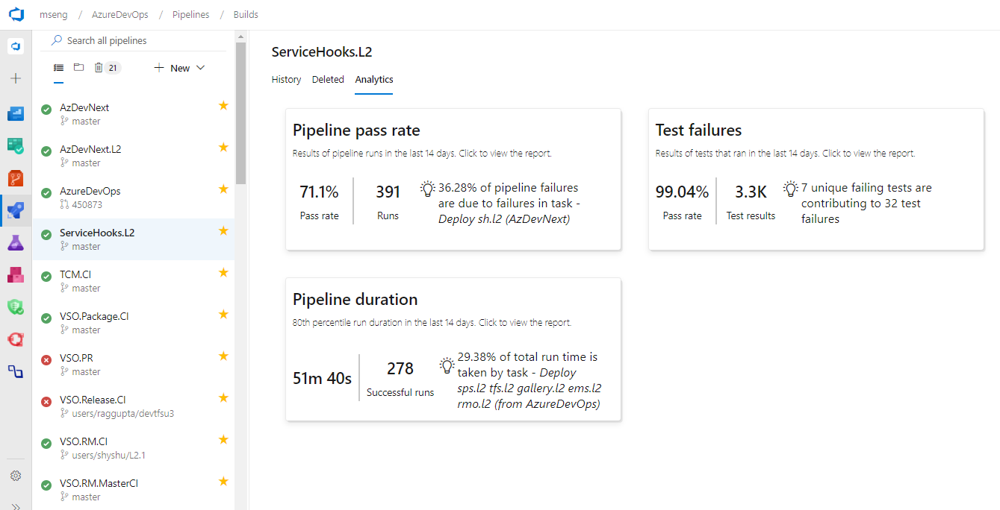
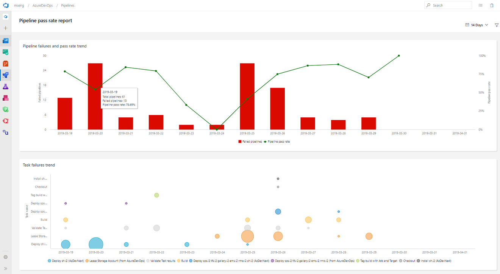
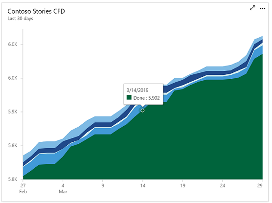
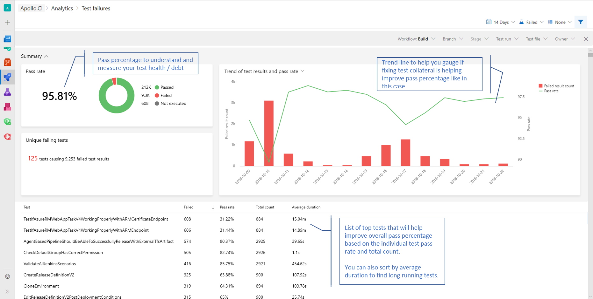

### Build failure and duration reports

It is important to have metrics and insights to continuously improve the throughput and stability of your pipeline. As the first step towards providing you with pipeline analytics, we added two reports to give you metrics and insights about your pipelines.  

1. The failure report will show the build pass rate and the failure trend. In addition, it will also show the tasks failure trend to provide insights on which task is contributing to the maximum number of failures.

    > [!div class="mx-imgBorder"]
    > 

2. The duration report will have the pipeline duration along with its trend.

    > [!div class="mx-imgBorder"]
    > 

### General availability of Analytics

We're excited to announce that the following Analytics features will be included in Azure DevOps at no additional cost. 

1. The [Analytics Widgets](/azure/devops/report/analytics/analytics-widgets?view=azure-devops&preserve-view=true) are configurable modules that display data on a dashboard and help you monitor the progress of your work. The widgets included are the following:

    * [Burndown and Burnup](/azure/devops/report/dashboards/configure-burndown-burnup-widgets?bc=%2fazure%2fdevops%2freport%2fanalytics%2fbreadcrumb%2ftoc.json&toc=%2fazure%2fdevops%2freport%2fanalytics%2ftoc.json&view=azure-devops&preserve-view=true) charts monitor the progress of a set of scoped work over a period of time.

        > [!div class="mx-imgBorder"]
        > 

    * [Cycle Time and Lead Time](/azure/devops/report/dashboards/cycle-time-and-lead-time?bc=%2fazure%2fdevops%2freport%2fanalytics%2fbreadcrumb%2ftoc.json&toc=%2fazure%2fdevops%2freport%2fanalytics%2ftoc.json&view=azure-devops&preserve-view=true) to visualize how work moves through your team's development cycle

        > [!div class="mx-imgBorder"]
        > 

    * [Cumulative Flow Diagram (CFD)](/azure/devops/report/dashboards/cumulative-flow?bc=%2fazure%2fdevops%2freport%2fanalytics%2fbreadcrumb%2ftoc.json&toc=%2fazure%2fdevops%2freport%2fanalytics%2ftoc.json&view=azure-devops&preserve-view=true) tracks work items as they progress through various states.

        > [!div class="mx-imgBorder"]
        > 

    * [Velocity](/azure/devops/report/dashboards/team-velocity?bc=%2fazure%2fdevops%2freport%2fanalytics%2fbreadcrumb%2ftoc.json&toc=%2fazure%2fdevops%2freport%2fanalytics%2ftoc.json&view=azure-devops&preserve-view=true) track how a team is delivering value over multiple sprints.

        > [!div class="mx-imgBorder"]
        > 

    * [Test Results Trend](/azure/devops/report/dashboards/configure-test-results-trend?view=azure-devops&preserve-view=true) to monitor test trends, detect failure and duration patterns for tests over single or multiple pipelines.

        > [!div class="mx-imgBorder"]
        > 

2. In the product we are including the [top failing test report](/azure/devops/pipelines/test/test-analytics?bc=%2fazure%2fdevops%2freport%2fanalytics%2fbreadcrumb%2ftoc.json&toc=%2fazure%2fdevops%2freport%2fanalytics%2ftoc.json&view=azure-devops&preserve-view=true#view-test-analytics-for-builds) to get insights about top failing tests in your pipeline to help improve pipeline reliability and reduce test debt.

    > [!div class="mx-imgBorder"]
    > 

We will also continue to offer [Power BI integration through analytics views](/azure/devops/report/powerbi/index?view=azure-devops&preserve-view=true) and direct access to our [OData endpoint](/azure/devops/report/extend-analytics/index?view=azure-devops&preserve-view=true) in preview for all Azure DevOps Services customers.

If you are using the Analytics marketplace extension, you can continue to use Analytics as you did before and do not need to follow any additional steps. This means that we will deprecate the [Analytics marketplace extension](https://marketplace.visualstudio.com/items?itemName=ms.vss-analytics) for hosted customers.

The Azure DevOps Analytics offering is the future of reporting and we will continue to invest in new features driven by Analytics. You can find more information about Analytics in the links below.

* [Analytics overview documentation](/azure/devops/report/analytics/what-is-analytics?view=azure-devops&preserve-view=true)

* [Analytics widgets](/azure/devops/report/analytics/analytics-widgets?view=azure-devops&preserve-view=true)

* [Top failing test report](/azure/devops/pipelines/test/test-analytics?bc=%2fazure%2fdevops%2freport%2fanalytics%2fbreadcrumb%2ftoc.json&toc=%2fazure%2fdevops%2freport%2fanalytics%2ftoc.json&view=azure-devops&preserve-view=true#view-test-analytics-for-builds)

* [Power BI integration](/azure/devops/report/powerbi/index?view=azure-devops&preserve-view=true)

* [OData endpoint](/azure/devops/report/extend-analytics/index?view=azure-devops&preserve-view=true)

* [Azure DevOps Analytics](https://channel9.msdn.com/Events/connect/2017/T251)