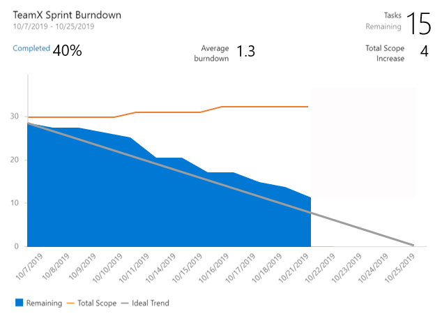

### A Sprint Burndown widget with everything you've been asking for

The new Sprint Burndown widget supports burning down by Story Points, count of Tasks, or by summing custom fields. You can even create a sprint burndown for Features or Epics. The widget displays average burndown, % complete, and scope increase. You can configure the team, letting you display sprint burndowns for multiple teams on the same dashboard. With all this great information to display, we let you resize it up to 10x10 on the dashboard. 

> [!div class="mx-imgBorder"]
> 

To try it out, you can add it from the widget catalog, or by editing the configuration for the existing Sprint Burndown widget and checking the **Try the new version now** box.

> [!Note] 
> The new widget uses Analytics. We kept the legacy Sprint Burndown in case you don't have access to Analytics.