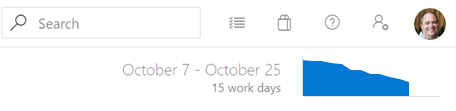
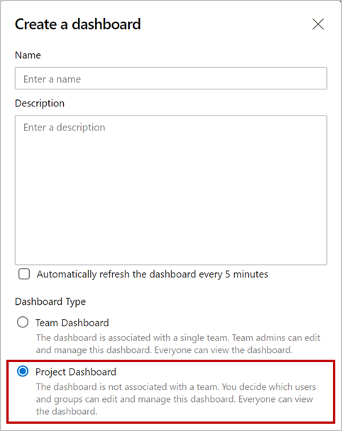
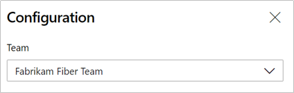

### Inline sprint burndown thumbnail

The Sprint Burndown is back! A few sprint ago, we removed the in-context sprint burndown from the Sprint Burndown and Taskboard headers. Based on your feedback, we've improved and reintroduced the sprint burndown thumbnail.

> [!div class="mx-imgBorder"]
> 

Clicking on the thumbnail will immediately display a larger version of the chart with an option to view the full report under the Analytics tab.
Any changes made to the full report will be reflected in the chart displayed in the header. So you can now configure it to burndown based on stories, story points, or by count of tasks, rather than just the amount of work remaining.

### Create a dashboard without a team

You can now create a dashboard without associating it with a team. When creating a dashboard, select the **Project Dashboard** type.

> [!div class="mx-imgBorder"]
> 

A Project Dashboard is like a Team Dashboard, except it's not associated with a Team and you can decide who can edit/manage the dashboard. Just like a Team Dashboard, it is visible to everyone in the project. 

All Azure DevOps widgets that require a team context have been updated to let you select a team in their configuration. You can add these widgets to Project Dashboards and select the specific team you want.

> [!div class="mx-imgBorder"]
> 

> [!Note] 
> For custom or third-party widgets, a Project Dashboard will pass the default team's context to those widgets. If you have a custom widget that relies on team context, you should update the configuration to let you select a team.