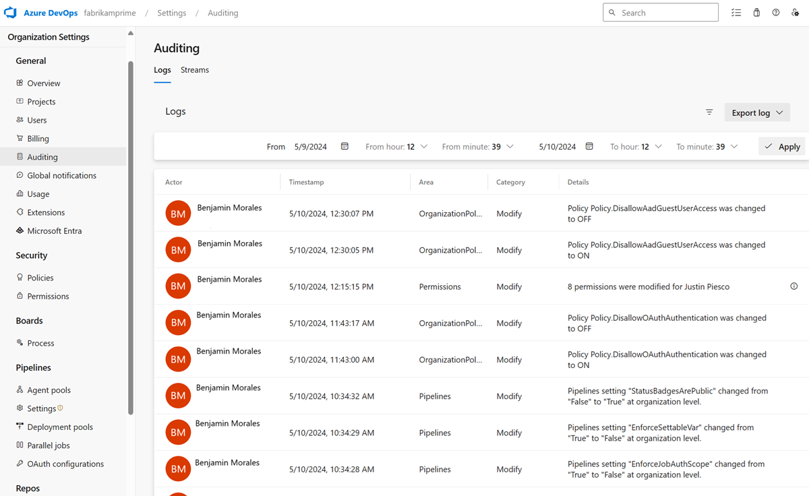

### Auditing for Azure Repos events 

We've added events for Repos that can be consumed through the Azure DevOps auditing tab in the organization settings. You can now view events for policies when they are created, removed, modified, or bypassed. In addition, you can view events for repositories when they are created (including via fork or undelete), renamed, soft-deleted, destroyed, or when the default branch changed.

> [!div class="mx-imgBorder"]
> 
