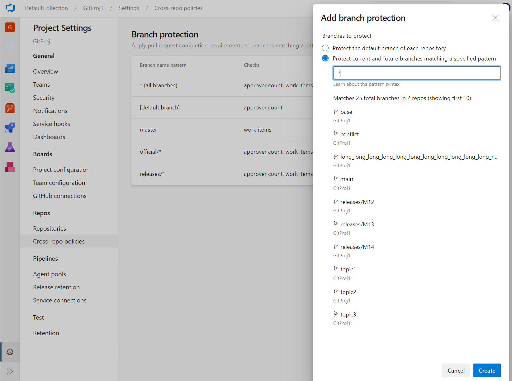

### Cross-repo branch policy administration

Branch policies are one of the powerful features of Azure Repos that help you protect important branches. Although the ability to set policies at project level exists in the REST API, there was no user interface for it. Now, admins can set policies on a specific branch or the default branch across all repositories in their project. For example, an admin could require two minimum reviewers for all pull requests made into every main branch across every repository in their project. You can find the **Add branch protection** feature in the Repos Project Settings.

> [!div class="mx-imgBorder"]
> 
