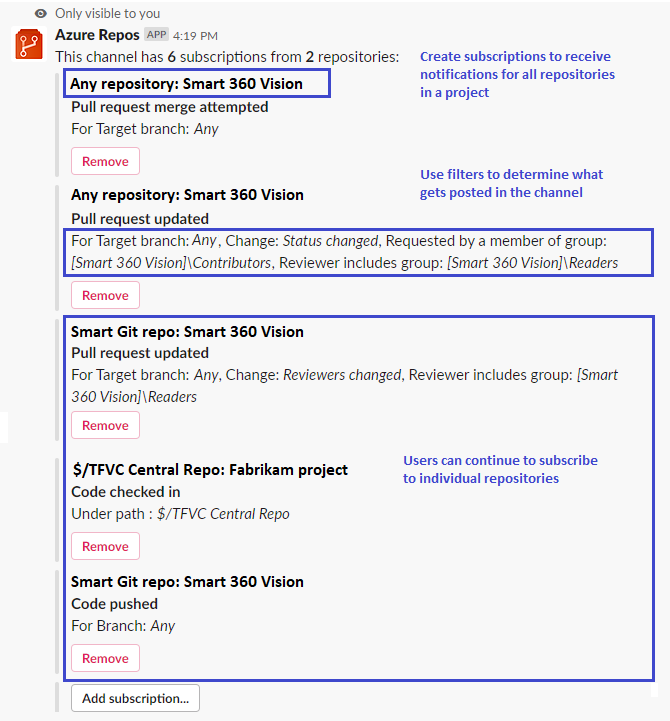

### Create bulk subscriptions in Azure Repos app for Slack and Microsoft Teams 
​
Users of the Azure Repos apps for Slack and Microsoft Teams can now bulk subscribe to all the Git repositories in a project. Filters can still be used to manage what gets posted in the Slack or Teams channels. You can still subscribe to individual Git or TFVC repositories.

Slack:

Slash command: /azrepos subscribe [project url] ​

Example: /azrepos subscribe `https://dev.azure.com/myorg/myproject`​

> [!div class="mx-imgBorder"]
> 

Microsoft Teams:

Command: @Azure Repos subscribe [project url] ​

Example: @Azure Repos subscribe `https://dev.azure.com/myorg/myproject​`