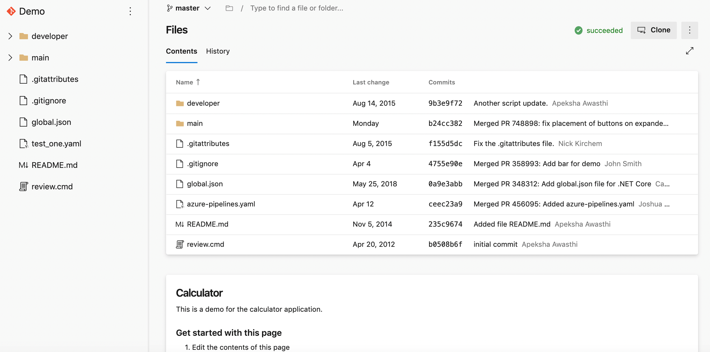
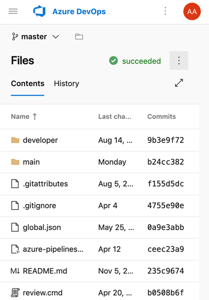
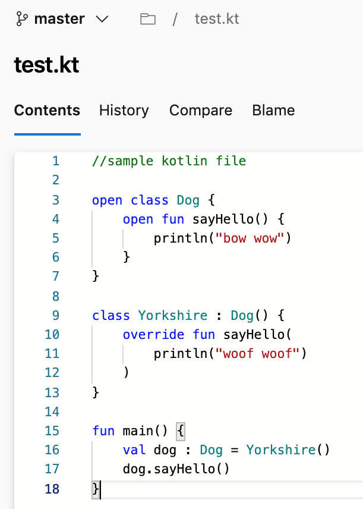

### New web platform conversion landing pages
​
We've updated the Repos landing pages user experience to make it modern, fast, and mobile-friendly. Here are two examples of the pages that have been updated, we will continue to update other pages in future updates.

Web experience:

> [!div class="mx-imgBorder"]
> 

Mobile experience:

> [!div class="mx-imgBorder"]
> 

> [!div class="mx-imgBorder"]
> 

### Support for Kotlin language 

We're excited to announce that we now support Kotlin language highlighting in the file editor. Highlighting will improve the readability of your Kotlin text file and help you quickly scan to find errors. We prioritized this feature based on a suggestion from the [Developer Community](https://developercommunity.visualstudio.com/idea/365651/kotlin-language-highlighting-support.html).

> [!div class="mx-imgBorder"]
> 
