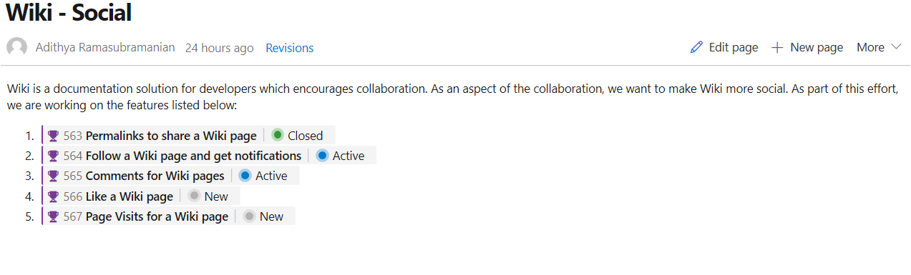

### Permalinks for Wiki pages

Until now, shared Wiki page links broke if the linked page was renamed or moved. With this update, we've introduced permanent links by adding a page IDs to the URL. This ensures that links you share remain intact as the wiki changes over time.

This feature was prioritized based on a suggestion ticket.

### Show work item status in Wiki pages

In this update, we've enhanced work item mentions in Wiki pages by adding the status of the work item to the page, along with its ID and title.

> [!div class="mx-imgBorder"]
> 

Work item references in Pull Request comments and Boards discussions will also show the status.

This feature was prioritized based on a suggestion.
