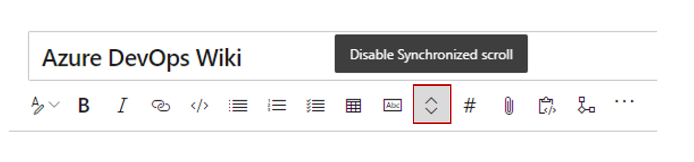
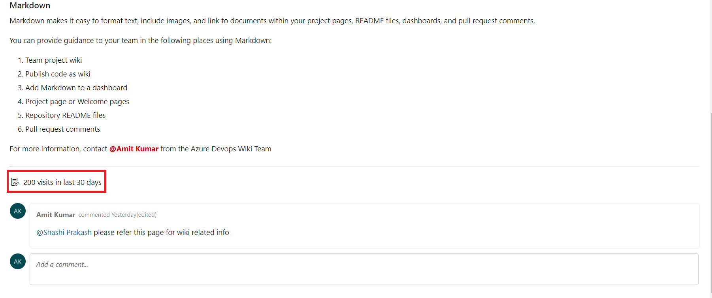

### Synchronous scroll for editing wiki pages

Editing wiki pages is now easier with synchronous scroll between the edit and the preview pane. Scrolling on one side will automatically scroll the other side to map the corresponding sections. You can disable the synchronous scroll with the toggle button. 

> [!div class="mx-imgBorder"]
> 

> [!NOTE]
> The state of the synchronous scroll toggle is saved per user and account.

### Page visits for wiki pages

You can now get insights into the page visits for wiki pages. The REST API let you access the page visits information in the last 30 days. You can use this data to create reports for your wiki pages. In addition, you can store this data in your data source and create dashboards to get specific insights like *top-n most viewed pages*.

You will also see an aggregated page visits count for the last 30 days in every page.

> [!div class="mx-imgBorder"]
> 

> [!NOTE]
> A page visit is defined as a page view by a given user in a 15-minute interval.