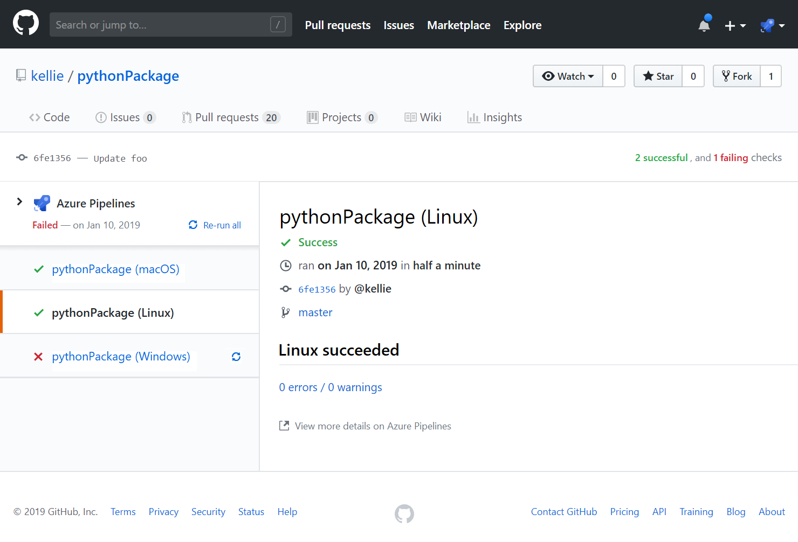
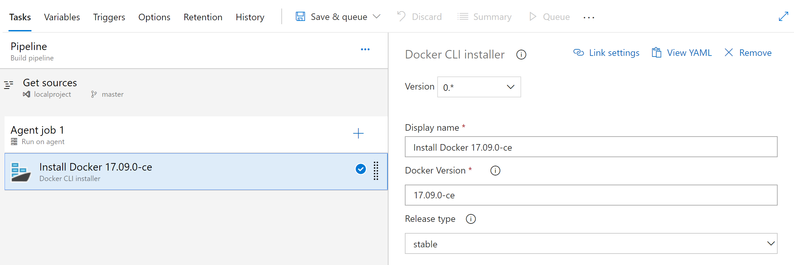
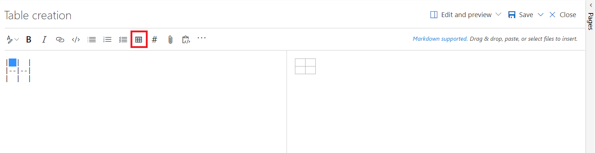
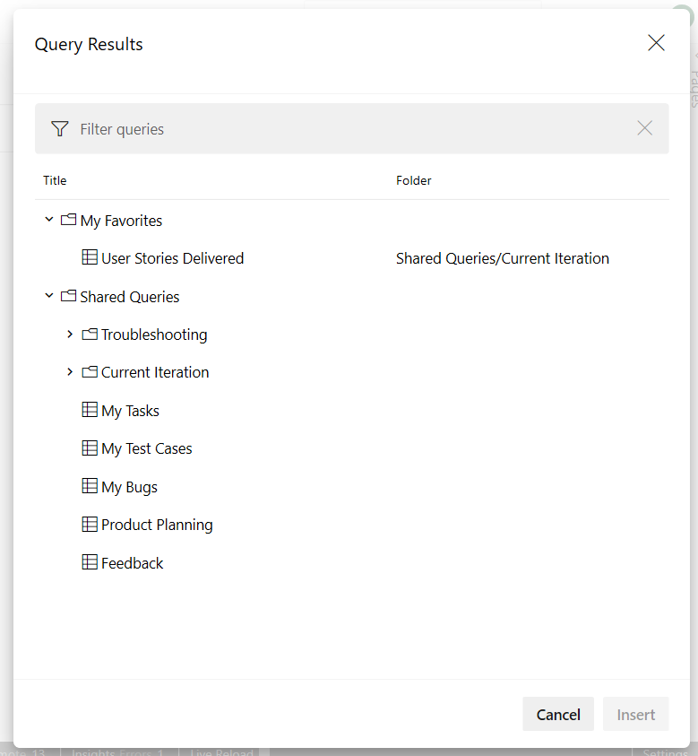
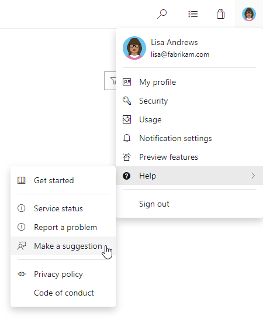

# GitHub Enterprise support and automatic GitHub service connections in build pipelines - Sprint 146 Update

In the **Sprint 146 Update** of Azure DevOps, we improved our GitHub integration with Azure Pipelines. The New build pipeline wizard can now create pipelines for **GitHub Enterprise** repositories. It also analyzes your repository to provide a suggested language template. In addition, it can create and re-use service connections for the GitHub repositories you select.

Check out the [Features](#features) list below for more.

## Features

Azure Boards:

- [Simplify the organization of your work using the Basic process](#simplify-the-organization-of-your-work-using-the-basic-process)

Azure Pipelines:

- [GitHub Enterprise support in the pipeline wizard](#github-enterprise-support-in-the-pipeline-wizard)
- [Automatic GitHub service connections in pipelines](#automatic-github-service-connections-in-pipelines)
- [Display status for each pipeline job in GitHub Checks](#display-status-for-each-pipeline-job-in-github-checks)
- [Default authorization for YAML resources in GitHub](#default-authorization-for-yaml-resources-in-github)
- [Service containers for YAML pipelines](#service-containers-for-yaml-pipelines)
- [Work items linked to GitHub commits in Release Summary](#work-items-linked-to-github-commits-in-release-summary)
- [New Azure App service tasks optimized for YAML](#new-azure-app-service-tasks-optimized-for-yaml)
- [Azure Active Directory (AD) authentication support for Azure SQL task](#azure-active-directory-ad-authentication-support-for-azure-sql-task)
- [Grafana annotations service hook](#grafana-annotations-service-hook)
- [Query Azure Monitor alerts tasks](#query-azure-monitor-alerts-tasks)
- [Inline input of spec file in Deploy to Kubernetes task](#inline-input-of-spec-file-in-deploy-to-kubernetes-task)
- [Docker CLI Installer task](#docker-cli-installer-task)
- [Java long-term support (LTS) on Microsoft hosted agents](#java-long-term-support-lts-on-microsoft-hosted-agents)
- [YAML support for Bitbucket Cloud pipelines](#yaml-support-for-bitbucket-cloud-pipelines)
- [Avoid triggering multiple CI builds for pull requests](#avoid-triggering-multiple-ci-builds-for-pull-requests)
- [Change build numbers, upload and download artifacts in forked repository builds](#change-build-numbers-upload-and-download-artifacts-in-forked-repository-builds)
- [New option in Publish Test Results task to fail build on failed tests](#new-option-in-publish-test-results-task-to-fail-build-on-failed-tests)
- [Updates to the Azure Portal for creating an Azure DevOps project](#updates-to-the-azure-portal-for-creating-an-azure-devops-project)
- [Use the Azure Portal to setup and deploy to a CosmosDB database](#use-the-azure-portal-to-setup-and-deploy-to-a-cosmosdb-database)
- [Setup builds and release pipelines for Functions in Azure Portal](#setup-builds-and-release-pipelines-for-functions-in-azure-portal)

Azure Artifacts:

- [Package usage stats](#package-usage-stats)

Wiki:

- [Monospaced font for Wiki Markdown editor](#monospaced-font-for-wiki-markdown-editor)
- [Bold Wiki page titles](#bold-wiki-page-titles)
- [Insert Markdown table](#insert-markdown-table)
- [Embed Azure Boards query results in Wiki](#embed-azure-boards-query-results-in-wiki)

Administration:

- [Restore deleted projects](#restore-deleted-projects)

## Azure Boards

### Simplify the organization of your work using the Basic process

> [!IMPORTANT]  
> The Basic process is in public preview as the default process for new projects within new organizations created in the Central US region.

Historically, Agile has been the default process for new projects, offering a robust and flexible set of work item types and states to suit a variety of project delivery methods. For some teams, who are more familiar with other tools or who are growing and want to adopt a more powerful tool set, want to get started quickly using terminology they are more familiar with.

The new Basic process provides three work item types (Epics, Issues, and Tasks) to plan and track your work. We recommend that you use Issues to track things like user stories, bugs, and features while using Epics to group Issues together into larger units of work. As you make progress on your work, move items along a simple state workflow of To Do, Doing, and Done.

> [!div class="mx-imgBorder"]


See the [track issues and tasks](https://docs.microsoft.com/en-us/azure/devops/boards/get-started/track-issues-tasks?view=azure-devops) documentation to help you get started with your new project.

## Azure Pipelines

### GitHub Enterprise support in the pipeline wizard

Previously, you could use the [visual designer](https://docs.microsoft.com/en-us/azure/devops/pipelines/get-started-designer?view=azure-devops&tabs=new-nav) to create pipelines for GitHub Enterprise repositories. Now, you can also use the **New build pipeline** wizard to create your pipelines.

> [!div class="mx-imgBorder"]


The wizard analyzes your GitHub Enterprise repository to suggest a YAML template which matches your project language. You can then edit and save the YAML as a direct commit to your default branch or as a pull request.

> [!div class="mx-imgBorder"]


For more details, see the documentation on creating your first pipeline [here](https://docs.microsoft.com/en-us/azure/devops/pipelines/get-started-yaml?view=azure-devops).

### Automatic GitHub service connections in pipelines

When using the **New build pipeline** wizard to create a pipeline for GitHub, the page for choosing or creating a GitHub service connection led to confusion about which connection to select from the list. Now, you don’t need to choose a connection. The wizard automatically creates and re-uses a service connection for the repository you choose.

If you wish to manually choose a connection other than the one that is automatically selected, follow the **Choose connection** hyperlink. For more details, see [Build GitHub repositories](https://docs.microsoft.com/en-us/azure/devops/pipelines/repos/github?view=azure-devops).

> [!NOTE]
> The selection is based on the [Azure Pipelines GitHub App](https://github.com/apps/azure-pipelines) (if it is installed in the repository) or your personal GitHub identity (using OAuth).

### Display status for each pipeline job in GitHub Checks

Previously, a single build status was posted to GitHub Checks for your pipeline even if it included jobs for multiple platforms (e.g., Linux, macOS, and Windows). Now, status is posted to GitHub Checks for each job in the pipeline. Additionally, you can re-run the entire build or only individual failed jobs from GitHub Checks. To use this functionality, your pipeline must be configured to use the [Azure Pipelines GitHub App](https://github.com/apps/azure-pipelines). For additional details, see [Integrate using the GitHub App](https://docs.microsoft.com/en-us/azure/devops/pipelines/repos/github?view=azure-devops#integrate-using-the-github-app). To set up a pipeline with jobs for multiple platforms, see [Create a multi-platform pipeline](https://docs.microsoft.com/en-us/azure/devops/pipelines/get-started-multiplatform?view=azure-devops).

> [!div class="mx-imgBorder"]


### Default authorization for YAML resources in GitHub

If you manage your source code in GitHub and use YAML to define your pipeline, you probably experienced a resource authorization build failure. When you edited your YAML file and added a reference to one of the protected resources (e.g., service connection, agent pool, variable group, or secure file), Azure Pipelines couldn’t validate the identity of the user that made that change and failed the build. To work around this issue, you had to save the build pipeline in the web editor after making a change to the YAML file. Many of the users who hit this issue simply wanted to allow all the pipelines to use the resource.

To avoid the resource authorization build failure, we changed the default behavior of all new service connections, agent pools, and variable groups to be authorized for use in all pipelines. If you want tighter controls on your resources, you can disable the default authorization model (see figure below). When you do so, someone with permissions to use the resource must save the pipeline in the web editor after a resource reference is added to the YAML file.

> [!div class="mx-imgBorder"]


### Service containers for YAML pipelines

Previously, you had to install, start and stop services such as databases or memory caches if your YAML pipeline was using these services. With this update, we added **service containers** that can handle these tasks.
For example, if your pipeline uses a redis cache for integration tests, you can include the redis container image as a service in the pipeline. The agent will automatically fetch the image, start it up and network it so that your pipeline steps can refer to it by the hostname redis.  When the pipeline is complete, the agent will spin down the service container cleanly.

### Work items linked to GitHub commits in Release Summary

In December we introduced the capability to link GitHub commits to work items.  We are excited to announce that you can now see all Azure Board work items linked to GitHub commits in the release summary page. This will help teams track and retrieve more information about the commits that have been deployed to an environment.

### New Azure App Service tasks optimized for YAML

We now support four new tasks which provide an easy yet powerful way to deploy Azure App Services with modern developers in mind. These tasks have an optimized YAML syntax making it simple and intuitive to author deployments to Azure AppServices, including WebApps, FunctionApps, WebApps for Containers and FunctionApp for Containers on both Windows and Linux platforms.

We also support a new utility task for file transformation and variable substitution for XML and JSON formats.

### Azure Active Directory (AD) authentication support for Azure SQL task

The Azure SQL task has been enhanced to support connecting to a database using Azure AD (Integrated & Password) and a connection string in addition to the existing support for SQL server authentication.

> [!div class="mx-imgBorder"]


### Grafana annotations service hook

We now support a new service hook that lets you add Grafana annotations for **Deployment Completed** events to a Grafana dashboard. This allows you to correlate deployments with the changes in application or infrastructure metrics that are being visualized in a Grafana dashboard.

> [!div class="mx-imgBorder"]


### Query Azure Monitor alerts tasks

The previous version of the **Query Azure Monitors task** supported querying alerts only on the classic monitoring experience. With this new version of the task, you can query alerts on the unified monitoring experience recently introduced by Azure Monitor.

> [!div class="mx-imgBorder"]


### Inline input of spec file in Deploy to Kubernetes task

Previously, the Kubernetes deployment task required you to provide a file path for the configuration. Now you can add the configuration inline as well.

> [!div class="mx-imgBorder"]


### Docker CLI Installer task

This task allows installation of any version of Docker CLI on the agents as specified by the user.

> [!div class="mx-imgBorder"]


### Java long-term support (LTS) on Microsoft hosted agents

Previously, Microsoft hosted agents had JDKs pre-installed that were overloaded by complex licensing, end-user restrictions, and lack of long-term support. In this update, we replaced the JDKs with tested, certified, LTS builds of OpenJDK from Azul Systems. Java developers using Azure can now build and run production Java applications using Azul Systems Zulu Enterprise builds of OpenJDK without incurring additional support costs.

This new offering is designed to make Microsoft hosted Java builds and deployments worry-free by incorporating quarterly security updates and bug fixes as well as critical out-of-band updates and patches as needed. If you’re currently building or running Java apps on-premises or with other JDKs, consider moving to Zulu on Azure for free support and maintenance. For more information, see the blog [Microsoft and Azul Systems bring free Java LTS support to Azure](https://azure.microsoft.com/en-us/blog/microsoft-and-azul-systems-bring-free-java-lts-support-to-azure/).

### YAML support for Bitbucket Cloud pipelines

Previously, [YAML-based pipelines](https://docs.microsoft.com/en-us/azure/devops/pipelines/get-started/pipelines-get-started?view=azure-devops) didn’t support Bitbucket Cloud. Now, you can either use YAML to define your Bitbucket Cloud pipelines or use the visual designer to do the same. To use YAML, add an **azure-pipelines.yml** file to your repository. In Azure Pipelines, choose **New build pipeline**, then select **Use the visual designer** hyperlink, select "Bitbucket Cloud" and "YAML". Here you can enter the path to your repository’s YAML file.

For more details, see the [YAML syntax guide](https://docs.microsoft.com/en-us/azure/devops/pipelines/yaml-schema?view=azure-devops&tabs=schema) and [GitHub repository of YAML samples](https://github.com/microsoft/azure-pipelines-yaml). 

### Avoid triggering multiple CI builds for pull requests

The YAML build templates included with Azure Pipelines were configured to trigger builds for any branch within a repository. This included pull request topic branches. As a result, two builds were triggered when pull requests were created. One build for the pull request branch in response to the continuous integration trigger, and a second build for the pull request branch in response to the pull request trigger.

By using the YAML snippet below, the built-in YAML templates will be configured to trigger a continuous integration build only for the **master** branch. New pull requests will still build using the pull request trigger. For more details, see the documentation for [build pipeline triggers](https://docs.microsoft.com/en-us/azure/devops/pipelines/build/triggers?view=azure-devops&tabs=yaml).

```yaml
trigger:
- master
```

### Change build numbers, upload and download artifacts in forked repository builds

Until now, pull request validation builds for forked repositories didn’t have permission to upload and download build artifacts or change the build number. Permissions were restricted because it was insecure to make the agent’s broader-scoped permissions available during a fork build triggered by an unknown user. With this update, agent permissions are scoped so that your pipeline can perform these operations if you need to.

Below is an example of the YAML that you can use to archive build outputs in a tar.gz file into the artifact staging directory. Then, it publishes the output to Azure Pipelines to be associated with the build. For more details, see the documentation on [Archive Files task](https://docs.microsoft.com/en-us/azure/devops/pipelines/tasks/utility/archive-files?view=azure-devops&tabs=yaml) and [Publish Build Artifacts task](https://docs.microsoft.com/en-us/azure/devops/pipelines/tasks/utility/publish-build-artifacts?view=azure-devops).

```yaml
- task: ArchiveFiles@2
  inputs:
    archiveType: 'tar'
    tarCompression: 'gz'
    includeRootFolder: false
    rootFolderOrFile: '$(build.sourcesDirectory)/target'
    archiveFile: '$(build.artifactStagingDirectory)/$(build.buildId).tar.gz'
- task: PublishBuildArtifacts@1
  inputs:
    pathtoPublish: '$(build.artifactStagingDirectory)'
```

### New option in Publish Test Results task to fail build on failed tests

[Publish Test Results task](https://docs.microsoft.com/en-us/azure/devops/pipelines/tasks/test/publish-test-results) is used to publish test results to Azure Pipelines when tests are run using your choice of test runner. Until now, the task would simply publish results from a results file and would not fail the build even if the results file contained failed tests. This meant that you had to write custom steps to have the build fail on test failures.

We have now added an option in the task to fail the build if there are any failed tests.

> [!div class="mx-imgBorder"]


### Updates to the Azure Portal for creating an Azure DevOps project

The Azure Portal now includes additional functionality to support more frameworks and services when creating an Azure DevOps project. Below are the list of changes for each area.

**Framework**

Azure IoT is a fully managed service that delivers cloud intelligence locally on cross-platform IoT devices. Now, you can create an Azure DevOps project from the Azure Portal and use the **Simple IoT** as the application framework.

> [!div class="mx-imgBorder"]


**Service**

Previously, the Create Azure DevOps Project workflow in the Azure Portal only supported **Create New** as an option for Kubernetes Service. A new option has been added to allow you to choose an existing cluster as the deployment target for the pipeline setup.

> [!div class="mx-imgBorder"]


### Use the Azure Portal to setup and deploy to a CosmosDB database

Currently, you can use the Azure DevOps Project workflow in the Azure Portal to setup build and release pipelines for a Git repository. Now, you can deploy to Azure Web App for Containers (Linux) or Azure Kubernetes Service with a CosmosDB provisioned as a database backing the apps on these targets. This is currently available for all Node.js templates and we expect to add support for other templates in the future.

> [!div class="mx-imgBorder"]


### Setup builds and release pipelines for Functions in Azure Portal

You can now use the Azure DevOps Project workflow in the Azure Portal to setup build and release pipelines for Git repository that deploy Azure Functions 2.0 (Windows). This is functionality is available for Node.js and .NET Core.

> [!div class="mx-imgBorder"]


## Azure Artifacts

### Package usage stats

Until now, Azure Artifacts didn’t provide a way to gauge the usage or popularity of packages. With this update, we added a count of **Downloads** and **Users** to both the package list and package details pages. You can see the stats on the right side of either page.

> [!div class="mx-imgBorder"]


## Wiki

### Monospaced font for Wiki Markdown editor

With the introduction of monospaced fonts for wiki Markdown editor, readability is no longer a challenge. The Markdown source looks clean and easy to read. This feature has been prioritized based on [this suggestion ticket](https://developercommunity.visualstudio.com/content/idea/365936/tfs-wiki-editor-monospaced-font.html).

> [!div class="mx-imgBorder"]


### Bold Wiki page titles

Earlier, both the Wiki page title and Header 1 looked the same. This made it difficult for readers to differentiate between them. Now, the Wiki page titles have been made bold and distinct from Header 1.
This feature has been prioritized based on [this suggestion ticket](https://developercommunity.visualstudio.com/content/idea/366271/make-styling-of-wiki-page-title-different-from-h1.html).

> [!div class="mx-imgBorder"]


### Insert Markdown table

Creating Markdown tables in a wiki is no longer a challenge. You can now add a Markdown table with a click of a button. This feature has been prioritized based on [this feature suggestion ticket](https://developercommunity.visualstudio.com/content/idea/365879/include-table-support-in-the-wiki-wysiwyg-editor.html).

> [!div class="mx-imgBorder"]


### Embed Azure Boards query results in Wiki

You can now embed Azure Boards query results in a wiki page in the form of a table.
The image below shows a sample of a wiki page with a list of all features released and all the active bugs in the current sprint embedded in the wiki. The content displayed in the page is using an existing work item query. With this new feature you can create dynamic content and not need to worry about manually updating the wiki page.

> [!div class="mx-imgBorder"]


The query results can be added in two steps

1. Click on the "Query Results" button from the edit toolbar.

> [!div class="mx-imgBorder"]


2. Select the required query and click on "Insert" button.

The results of the query can now be viewed in the form of a table after you save the page.

> [!div class="mx-imgBorder"]


This has been prioritized based on the following features suggestions:

1. [Work Item Queries in Wiki](https://developercommunity.visualstudio.com/content/idea/365790/work-item-queries-in-wiki.html)
2. [Add Dynamic Wiki Content](https://developercommunity.visualstudio.com/content/idea/379611/add-dynamic-wiki-content.html)

## Administration

### Restore deleted projects

In this update, we added the ability to restore deleted projects from the Azure DevOps portal. If you have “delete project” permission you can also restore a deleted project from the **Organization Settings > Overview Page**. For step by step guidance, view the documentation [here](https://docs.microsoft.com/en-us/azure/devops/organizations/projects/restore-project?view=azure-devops).

## Next steps

> [!NOTE]
> These features will roll out over the next two to three weeks.

Read about the new features below and head over to Azure DevOps to try them for yourself.

> [!div class="nextstepaction"]
> [Go to Azure DevOps](http://go.microsoft.com/fwlink/?LinkId=307137&campaign=o~msft~docs~product-vsts~release-notes)

## Feedback

We would love to hear what you think about these features. Use the feedback menu to report a problem or provide a suggestion.

> [!div class="mx-imgBorder"]


You can also get advice and your questions answered by the community on [Stack Overflow](https://stackoverflow.com/questions/tagged/vsts).

Thanks,

Jeremy Epling
