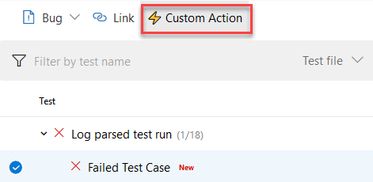
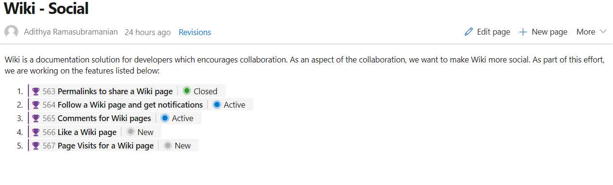

# NuGet, npm, and other Artifacts tasks support proxies - Sprint 147 Update

In the **Sprint 147 Update** of Azure DevOps, we have updated the various artifacts-related Pipelines tasks to support proxies. With this update, proxies now work in the npm, NuGet, .NET Core, and Universal Packages tasks.

Check out the [Features](#features) list below for more.

## Features

Azure Boards:

- [Show work item status in #ID mentions](#show-work-item-status-in-id-mentions)

Azure Repos:

- [View just the left or right file in a pull request](#view-just-the-left-or-right-file-in-a-pull-request)

Azure Pipelines:

- [Restore deleted release pipelines](#restore-deleted-release-pipelines)
- [YAML files for a new pipeline are committed by your identity, not our bot](#yaml-files-for-a-new-pipeline-are-committed-by-your-identity-not-our-bot)
- [Create pipelines from an existing YAML file in any branch or path](#create-pipelines-from-an-existing-yaml-file-in-any-branch-or-path)
- [Run pipelines using GitHub pull request comments](#run-pipelines-using-github-pull-request-comments)
- [Limit pull request validation builds to authorized team members](#limit-pull-request-validation-builds-to-authorized-team-members)
- [Publish build artifacts with long file paths](#publish-build-artifacts-with-long-file-paths)
- [New extension contribution points in the Pipelines Test tab](#new-extension-contribution-points-in-the-pipelines-test-tab)

Azure Artifacts:

- [Proxy support for Artifacts-related tasks](#proxy-support-for-artifacts-related-tasks)
- [Delegate who can manage feeds](#delegate-who-can-manage-feeds)

Reporting:

- [Test result trend (Advanced) widget](#test-result-trend-advanced-widget)

Wiki:

- [Permalinks for wiki pages](#permalinks-for-wiki-pages)
- [Show work item status in wiki pages](#show-work-item-status-in-wiki-pages)

Administration:

- [All users now on New Navigation](#all-users-now-on-new-navigation)

## Azure Boards

### Show work item status in #ID mentions

In order to enhance the work item mentioning experience, we’ve added more information when you link a work item using #ID. You will now see in the discussion section the status of the work item you linked in addition to the ID, title, and work item type.

> [!div class="mx-imgBorder"]

This experience can also be used in Wiki pages as described [here](#show-work-item-status-in-wiki-pages), as well as in pull request comments. For more details, see the documentation on using #ID to link to work items [here](https://docs.microsoft.com/en-us/azure/devops/notifications/add-links-to-work-items?view=azure-devops).

## Azure Repos

### View just the left or right file in a pull request

Today, when viewing file changes in a pull request, you can use either a **Side-by-side diff** or **Inline diff** mode. We have received feedback that many of you just want to see the original file or the changed file, without comparing them. So we added a new option that will allow you to view either the left file or the right file individually.

> [!div class="mx-imgBorder"]

## Azure Pipelines

### Restore deleted release pipelines

Deleting unused release pipelines helps to keep the release pipeline list clean but sometimes you delete something by mistake. With this update, it's now possible to restore a release pipeline that was deleted within the last 30 days. We added a new tab to the left panel of the Releases page that will display a list of deleted release pipelines. From this view you can restore a deleted release pipeline by selecting the pipeline from the list and clicking the **Restore** button.

> [!div class="mx-imgBorder"]

### YAML files for a new pipeline are committed by your identity, not our bot

While creating a pipeline, Azure Pipelines will optionally commit a YAML file to your repository and then create a pull request for the pipeline. Previously, if the repository was on GitHub and you had the [Azure Pipelines GitHub App](https://github.com/marketplace/azure-pipelines) installed, the commit and pull request appeared to be created by the GitHub App: "Azure Pipelines [bot]". With this update, we will show your GitHub identity as the creator of the pipeline instead of the GitHub App.

### Create pipelines from an existing YAML file in any branch or path

Currently, Azure Pipelines will detect and automatically use an existing YAML file named `azure-pipelines.yml` or `.azure-pipelines.yml` at the root of your repository in the default branch when creating a new pipeline. With this update, you can choose an existing Azure Pipelines YAML file with a different name or path, or in a non-default branch.

To select an existing file, from the **New build pipeline** wizard configuration page select **Existing Azure Pipelines YAML file**. Then, choose the branch and browse to select the YAML file path.

> [!div class="mx-imgBorder"]

### Run pipelines using GitHub pull request comments

With this update, you can run a pipeline or test suite to validate a GitHub pull request from the comments section of that PR. Any owner or collaborator can comment on a pull request with `/AzurePipelines run` or `/AzurePipelines run <pipeline_name>` to trigger a build.

You can also abbreviate the `/AzurePipelines` moniker as `/azp`. For more details on this feature type `/azp help` in the comment.

> [!div class="mx-imgBorder"]

### Limit pull request validation builds to authorized team members

It's a good practice to protect the quality of a branch by implementing [pull request validation builds](https://docs.microsoft.com/en-us/azure/devops/pipelines/build/triggers?view=azdevops#pull-request-validation). Until now, those validation builds were triggered automatically by any GitHub pull request, which could be risky since the build would start without your review.

With this update, you can require pull request validation builds to be authorized by your team. To do so, select the Triggers tab in your pipeline's settings. Then, under Pull request validation, enable **Only trigger builds for collaborators' pull request comments** and save the pipeline.

Now, pull request validation builds will not be triggered automatically. Any repository owner or contributor can trigger a validation build by commenting on the pull request with `/AzurePipelines run` or `/AzurePipelines run <pipeline_name>`.

> [!div class="mx-imgBorder"]

### Publish build artifacts with long file paths

Until now, there was a limitation that prevented uploading build artifacts with paths longer than 233 characters. This could prevent you from uploading code coverage results from Linux and macOS builds with file paths longer than the limit. With this update, we've extended the limit to support long paths.

### New extension contribution points in the Pipelines Test tab

This sprint, we've continued to make the extension framework more powerful by adding two new contribution points in the Test Results tab in Pipelines. This will enable [Marketplace extensions](https://marketplace.visualstudio.com/azuredevops) to provide more tailored reporting experiences and add further interactivity.

The two contribution points are:

1. **Custom Action button in the toolbar**

    Sometimes you may want to perform an action like updating an API's data or running custom tools using metadata from your test results. With this contribution point, you can create extensions which use the immediate context of the selected test result to add a custom action to the **Custom Action*- button.

    > [!div class="mx-imgBorder"]
    > 

2. **Custom Details Tab in the details pane**

    You may have a wide variety of test report consumption workflows and may want to see different data points against failed tests for debugging and analysis. By using this contribution point, your team can add a new tab to the details pane that will come up when you select the any test result row in the data grid. This new tab can show a view with static content or dynamic data fetched using internal or external APIs.

## Azure Artifacts

### Proxy support for Artifacts-related tasks

Until now, many Artifacts-related build tasks didn't provide full support for Azure Pipelines' proxy infrastructure, which led to challenges using the tasks from on-premises agents. With this update, we've added support for proxies to the following tasks:

- [npm](https://docs.microsoft.com/en-us/azure/devops/pipelines/tasks/package/npm?view=azdevops)
- [NuGet](https://docs.microsoft.com/en-us/azure/devops/pipelines/tasks/package/nuget?view=azdevops) - restore and push commands only
- [.NET Core CLI](https://docs.microsoft.com/en-us/azure/devops/pipelines/tasks/build/dotnet-core-cli?view=azdevops) - restore and NuGet push commands only
- [Universal Packages](https://docs.microsoft.com/en-us/azure/devops/pipelines/artifacts/universal-packages?view=azdevops&tabs=yaml)
- [npm Authenticate](https://docs.microsoft.com/en-us/azure/devops/pipelines/tasks/package/npm-authenticate?view=azdevops), [Pip Authenticate](https://docs.microsoft.com/en-us/azure/devops/pipelines/tasks/package/pip-authenticate?view=azdevops), [Twine Upload Authenticate](https://docs.microsoft.com/en-us/azure/devops/pipelines/tasks/package/twine-authenticate?view=azdevops)
    > [!NOTE]
    > These tasks do not configure the proxy for the underlying tool (npm, pip, twine). They support proxies during the acquisition of auth tokens, but it is still necessary to configure any subsequent tasks/scripts/tools to also use the proxy.
- [.NET Core Tool Installer](https://docs.microsoft.com/en-us/azure/devops/pipelines/tasks/tool/dotnet-core-tool-installer?view=azdevops), [NuGet Tool Installer](https://docs.microsoft.com/en-us/azure/devops/pipelines/tasks/tool/nuget?view=azdevops), [Node.js Tool Installer](https://docs.microsoft.com/en-us/azure/devops/pipelines/tasks/tool/node-js?view=azdevops)

### Delegate who can manage feeds

In Azure Artifacts, [Project Collection Administrators](https://docs.microsoft.com/en-us/azure/devops/organizations/security/set-project-collection-level-permissions?view=azdevops&tabs=new-nav) (PCAs) have always been able to administer all feeds in an Azure DevOps organization. With this update, PCAs can also give this ability to other users and groups, thus delegating the ability to manage any feed.

## Reporting

### Test result trend (Advanced) widget

The **Test result trend (Advanced) widget** is now available for those who have installed the [Analytics Extension](https://marketplace.visualstudio.com/items?itemName=ms.vss-analytics) on their Azure DevOps organization. It provides near real-time visibility into your test data for multiple builds and releases. The **Test result trend (Advanced) widget** displays a trend of your test results for your pipelines or across pipelines. You can use it to track the daily count of test, pass rate, and test duration. Tracking test quality over time and improving test collateral is key to maintaining a healthy DevOps pipeline.

> [!div class="mx-imgBorder"]

The **Test result trend (Advanced) widget** helps you find outliers in your test results and answer questions like: are tests taking longer to run than usual? What test file or pipeline is affecting my overall pass rate? What are my long running tests?

To help you answer these questions, the widget provides these features:
* Displays a trend of pass rate, and count of test results or test duration
* Presents test results based on multiple build pipelines or release pipelines
* Uses combined charting options to display two metrics over the same trend
* Filters the test count over time by test outcome
* Filters all your test results by branch or test
* Stacks your metrics by test attributes such as **Priority** or **Environment**
* Group you data on Test files, owner or pipelines

The widget is highly configurable allowing you to use it for a wide variety of scenarios.

## Wiki

### Permalinks for Wiki pages

Until now, shared Wiki page links broke if the linked page was renamed or moved. With this update, we've introduced permanent links by adding a page IDs to the URL. This ensures that links you share remain intact as the wiki changes over time.

This feature was prioritized based on [this](https://developercommunity.visualstudio.com/content/idea/365921/add-permalinks-in-wiki.html) suggestion ticket.

### Show work item status in Wiki pages

In this update, we've enhanced work item mentions in Wiki pages by adding the status of the work item to the page, along with its ID and title.

> [!div class="mx-imgBorder"]

Work item references in Pull Request comments and Boards discussions will also show the status.

This feature was prioritized based on [this](https://visualstudio.uservoice.com/forums/330519-azure-devops-formerly-visual-studio-team-services/suggestions/33715744-improve-work-item-display-in-wiki-page) suggestion.

## Administration

### All users now on New Navigation

With this sprint all users have been moved to the New Navigation. We’ve removed the preview feature toggle that allowed users to return to the previous navigation model. To learn more about navigating in the web portal, see [Web portal navigation in Azure DevOps](https://docs.microsoft.com/en-us/azure/devops/project/navigation/index?view=azure-devops&tabs=new-nav). 

## Next steps

> [!NOTE]
> These features will roll out over the next two to three weeks.

Head over to Azure DevOps and take a look.

> [!div class="nextstepaction"]
> [Go to Azure DevOps](http://go.microsoft.com/fwlink/?LinkId=307137&campaign=o~msft~docs~product-vsts~release-notes)

## Feedback

We would love to hear what you think about these features. Use the feedback menu to report a problem or provide a suggestion.

> [!div class="mx-imgBorder"]

You can also get advice and your questions answered by the community on [Stack Overflow](https://stackoverflow.com/questions/tagged/azure-devops).

Thanks,

Alex Mullans
