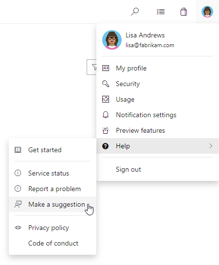

# New Azure DevOps CLI preview and feature updates in Pipelines - Sprint 148 Update

In the **Sprint 148 Update** of Azure DevOps, we added a new Azure DevOps command-line interface (CLI) extension which allows you to interact with Azure DevOps Services using command-line.

In addition, we added new options to the Azure Deployment Center to make it simpler to deploy web apps for Windows, Linux and Containers to Azure. You can now use Azure Pipelines to deploy these resources from your local Git repo to Azure. We are also releasing a new Azure subscription option in the service connection to facilitate the authentication process for Kubernetes.

Check out the [Features](#features) list below for more.

## Features

General:

[!INCLUDE [sprint-148-update-links](includes/general/sprint-148-update-links.md)]

Azure Boards:

[!INCLUDE [sprint-148-update-links](includes/boards/sprint-148-update-links.md)]

Azure Pipelines:

[!INCLUDE [sprint-148-update-links](includes/pipelines/sprint-148-update-links.md)]

Azure Artifacts:

[!INCLUDE [sprint-148-update-links](includes/artifacts/sprint-148-update-links.md)]

Wiki:

[!INCLUDE [sprint-148-update-links](includes/wiki/sprint-148-update-links.md)]

## General

[!INCLUDE [sprint-148-update](includes/general/sprint-148-update.md)]

## Azure Boards

[!INCLUDE [sprint-148-update](includes/boards/sprint-148-update.md)]

## Azure Pipelines

[!INCLUDE [sprint-148-update](includes/pipelines/sprint-148-update.md)]

## Azure Artifacts

[!INCLUDE [sprint-148-update](includes/artifacts/sprint-148-update.md)]

## Wiki

[!INCLUDE [sprint-148-update](includes/wiki/sprint-148-update.md)]

## Next steps

> [!NOTE]
> These features will roll out over the next two to three weeks.

Head over to Azure DevOps and take a look.

> [!div class="nextstepaction"]
> [Go to Azure DevOps](https://go.microsoft.com/fwlink/?LinkId=307137&campaign=o~msft~docs~product-vsts~release-notes)

## How to provide feedback

We would love to hear what you think about these features. Use the feedback menu to report a problem or provide a suggestion.

> [!div class="mx-imgBorder"]
> 

You can also get advice and your questions answered by the community on [Stack Overflow](https://stackoverflow.com/questions/tagged/azure-devops).

Thanks,

Gopinath Chigakkagari ([Twitter](https://twitter.com/gopinach))
