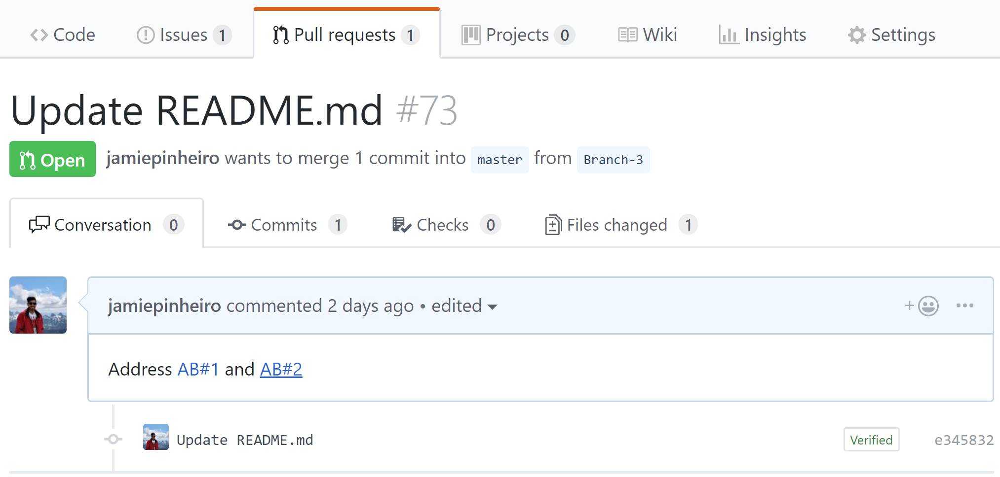
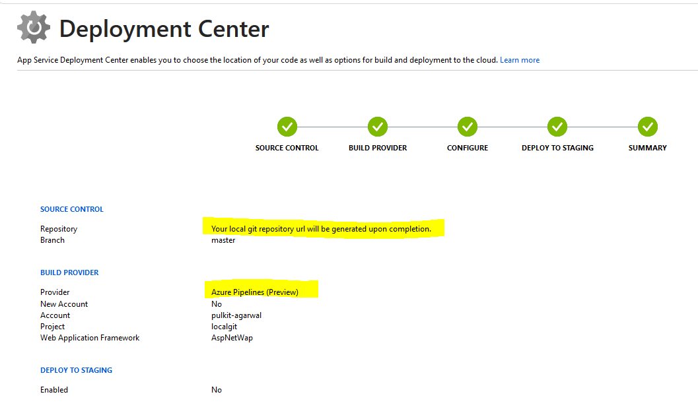
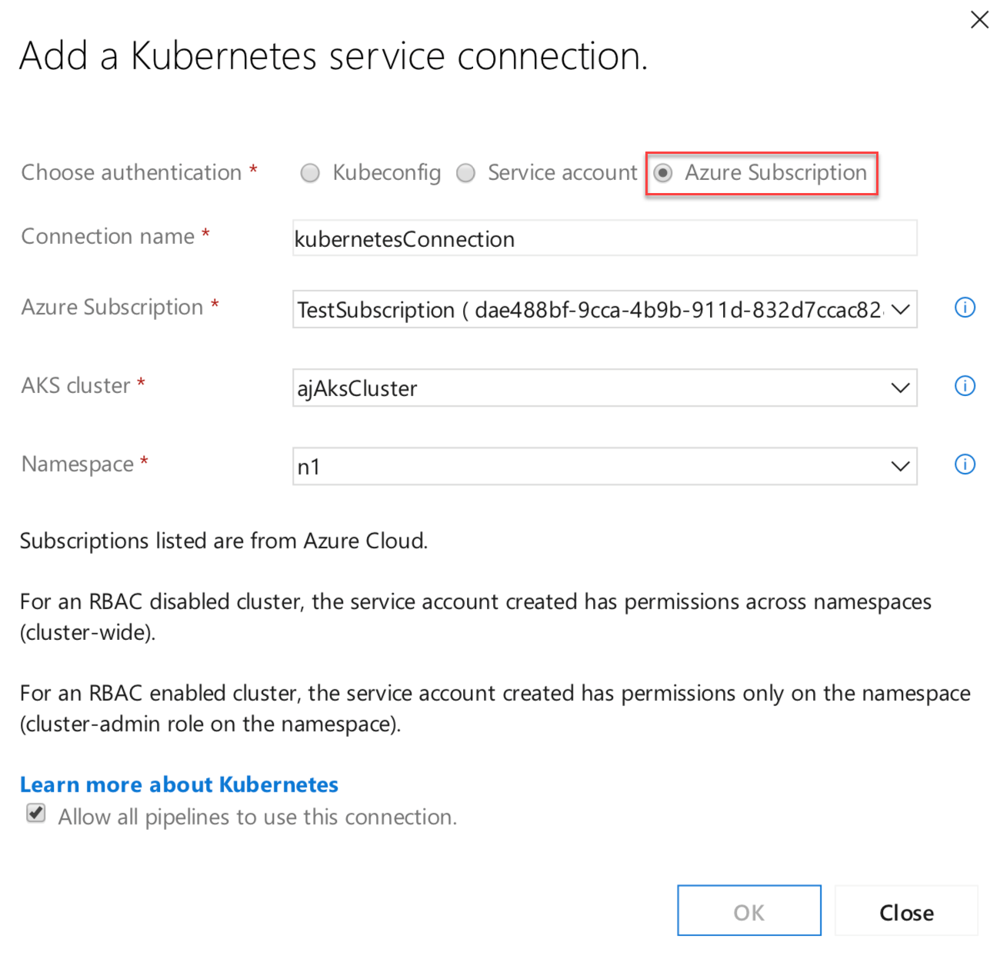
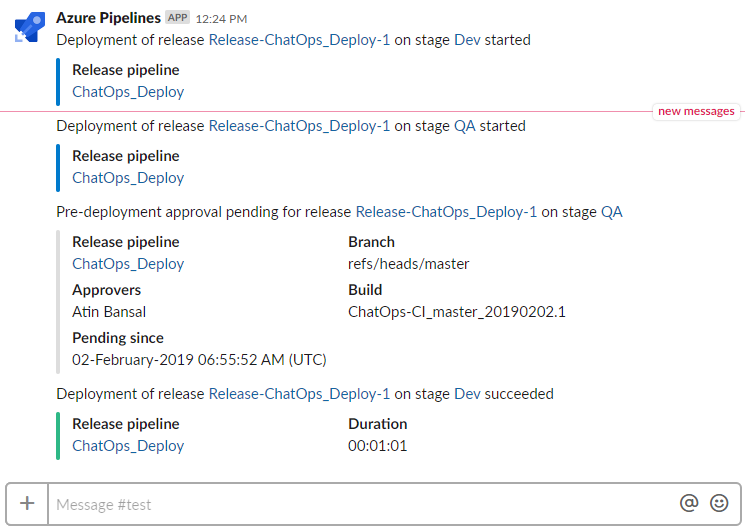
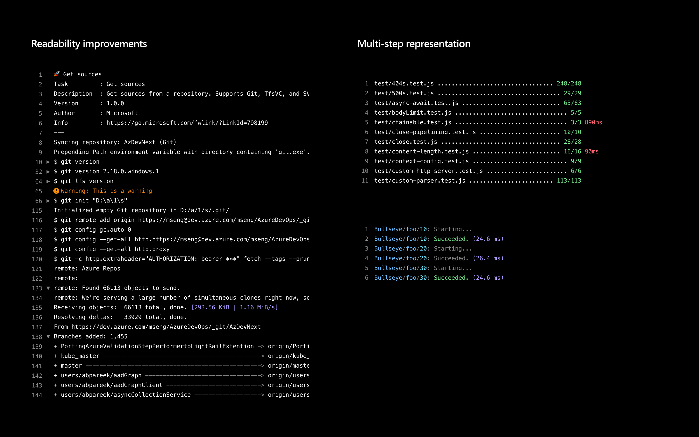
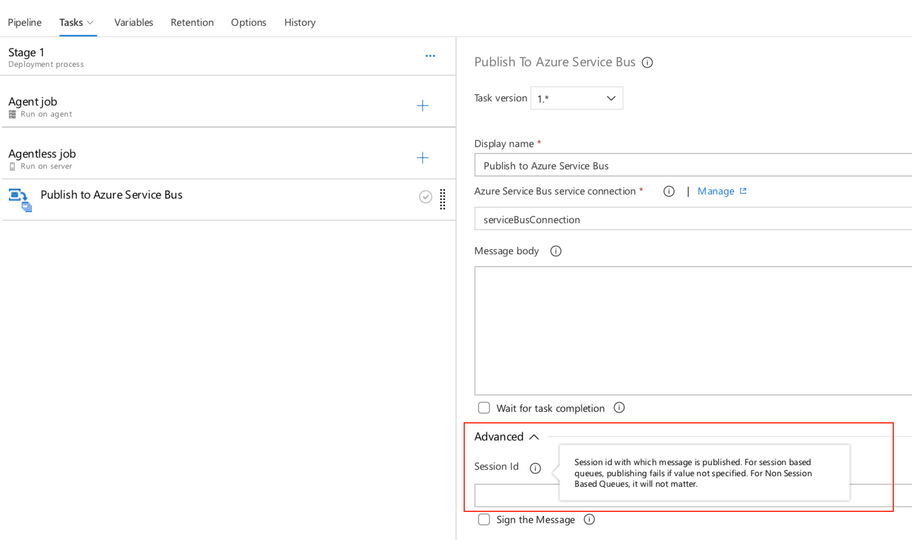
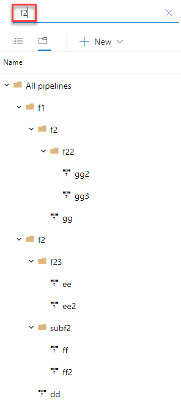
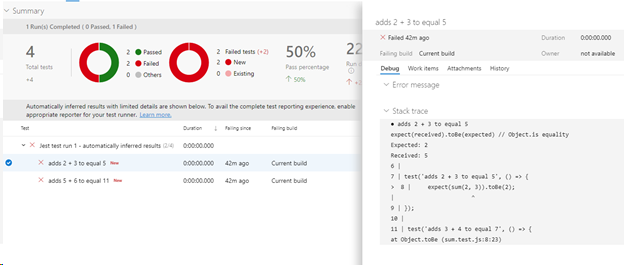
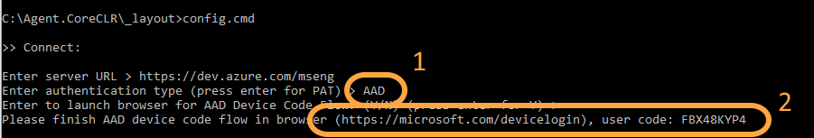
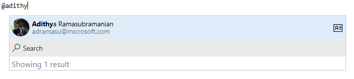

# New Azure DevOps CLI preview and feature updates in Pipelines - Sprint 148 Update

In the **Sprint 148 Update** of Azure DevOps, we added a new Azure DevOps command-line interface (CLI) extension which allows you to interact with Azure DevOps services using command-line.

In addition, we added new options to the Azure Deployment Center to make it simpler to deploy web apps for Windows, Linux and Containers to Azure. You can now use Azure Pipelines to deploy these resources from your local Git repo to Azure. We are also releasing a new Azure subscription option in the service connection to facilitate the authentication process for Kubernetes.

Check out the [Features](#features) list below for more.

## Features

General:

- [Azure DevOps CLI extension](#azure-devops-cli-extension)

Azure Boards:

- [Navigate to Azure Boards work items directly from GitHub pull request mentions](#navigate-to-azure-boards-work-items-directly-from-github-pull-request-mentions)

Azure Pipelines:

- [Deploy your local Git web apps for Windows, Linux and Containers to Azure](#deploy-your-local-git-web-apps-for-windows-linux-and-containers-to-azure)
- [New Azure subscription option in Kubernetes service connection](#new-azure-subscription-option-in-kubernetes-service-connection)
- [Notifications on failure of a release creation request](#notifications-on-failure-of-a-release-creation-request)
- [Azure Pipelines app for Slack](#azure-pipelines-app-for-slack)
- [Skip continuous integration (CI) for a commit](#skip-continuous-integration-ci-for-a-commit)
- [Updates to hosted pipelines images](#updates-to-hosted-pipelines-images)
- [Contribution point for variables in the create release dialog](#contribution-point-for-variables-in-the-create-release-dialog)
- [Support for Python Function Apps in DevOps projects](#support-for-python-function-apps-in-devops-projects)
- [Schedule releases on source or pipeline change](#schedule-releases-on-source-or-pipeline-change)
- [Build and release log viewer enhancements](#build-and-release-log-viewer-enhancements)
- [Publish to Azure Service Bus session queues](#publish-to-azure-service-bus-session-queues)
- [Search by folder name in release definitions](#search-by-folder-name-in-release-definitions)
- [Simplified publishing of test results](#simplified-publishing-of-test-results)
- [Azure Active Directory device code authentication flow for pipelines agent](#azure-active-directory-device-code-authentication-flow-for-pipelines-agent)
- [Support for Red Hat Enterprise Linux 6](#support-for-red-hat-enterprise-linux-6)

Azure Artifacts:

- [All Artifacts package types supported in releases](#all-artifacts-package-types-supported-in-releases)
- [Artifacts views supported in releases](#artifacts-views-supported-in-releases)
- [Retention policies can skip packages downloaded recently](#retention-policies-can-skip-packages-downloaded-recently)

Wiki:

- [@mention users and groups](#mention-users-and-groups)

## General

### Azure DevOps CLI extension

We're excited to announce the public preview of the Azure DevOps extension for the Azure CLI.  This extension is available across platforms and allows you to experience Azure DevOps from the command line, bringing the capability to manage Azure DevOps right to your fingertips. You can now work in a streamlined task/command-oriented way without having to worry about the GUI flows hence making your interactions flexible and faster.

For more details on the commands that are supported, take a look at the documentation [here](https://docs.microsoft.com/en-us/cli/azure/ext/azure-devops/?view=azure-cli-latest).

If you have any suggestions for new features or improvements, we’d love your feedback in the [Azure DevOps Extension for Azure CLI](https://github.com/Microsoft/azure-devops-cli-extension) repo – we’re taking PR’s!

## Azure Boards

### Navigate to Azure Boards work items directly from GitHub pull request mentions

In December [we released](/azure/devops/release-notes/2018/sprint-144-update#link-github-commits-and-pull-requests-to-azure-boards-work-items) the beginning of our integration between Azure Boards and GitHub. One way to establish links using this integration is to mention a work item within the description of a pull request using the `AB#{work item ID}` syntax.
Now, those mentions will become hyperlinks that you or others in your project can click to navigate directly to the mentioned work item.

> [!div class="mx-imgBorder"]

## Azure Pipelines

### Deploy your local Git web apps for Windows, Linux and Containers to Azure

With this update we added a few enhancements to the **Deployment Center** workflow for Azure. Now you can deploy your web apps for Windows, Linux and Containers from your local Git repository to these Azure Resources using Azure Pipelines. When you create the Azure Pipeline in the Deployment Center, an Azure Pipeline will get triggered for your local repo with every code commit.

> [!div class="mx-imgBorder"]

### New Azure subscription option in Kubernetes service connection

Service connections for builds and releases allow you to connect to external and remote services to execute tasks for a build or deployment. You can [define and manage a service connection](https://docs.microsoft.com/en-us/azure/devops/pipelines/library/service-endpoints?view=azure-devops#create-a-service-connection) from the Admin settings of your project.

With this update, we added an authentication option to the Kubernetes service connection form. Now you can select **Azure Subscription** to authenticate your connection. This makes it easy to deploy to specific namespaces by setting up Kubernetes connections with your Azure subscription and cluster name.

For a role-based access control (RBAC) enabled cluster, [ServiceAccount](https://kubernetes.io/docs/tasks/configure-pod-container/configure-service-account/) and [RoleBinding](https://kubernetes.io/docs/reference/access-authn-authz/rbac/#rolebinding-and-clusterrolebinding) objects are created in the chosen namespace. The RoleBinding object limits the operations of the created service account only to the chosen namespace. For an RBAC disabled cluster, the service account created has cluster-wide permissions across namespaces.

> [!div class="mx-imgBorder"]

### Notifications on failure of a release creation request

You can set notifications to receive emails as changes occur to your builds, code base, and other operations. For example, you can set an alert to get notified when a work item is assigned to you.

With this update, we added a new notification subscription to the **Release** category. This notification will send you an email when a request for a release creation fails. An example scenario where this may be useful is when a request to create a release fails because an artifact version is not available.
To learn how to manage your notifications see the documentation [here](https://docs.microsoft.com/en-us/azure/devops/notifications/howto-manage-personal-notifications?view=azure-devops).

> [!div class="mx-imgBorder"]

### Azure Pipelines app for Slack

Users of Azure Pipelines and Slack can now use the Azure Pipelines app for Slack to easily monitor their pipelines. You can set up and manage subscriptions for completed builds, releases, pending approvals and more from the app and get notifications for these events in your Slack channels.

See the full announcement and instructions [here](https://devblogs.microsoft.com/devops/announcing-launch-of-azure-pipelines-app-for-slack/).

> [!div class="mx-imgBorder"]

### Skip continuous integration (CI) for a commit

Previously, you didn't have the option to use `[skip ci]` to skip a build when using the Azure Pipeline GitHub app. You can now tell Azure Pipelines to ignore a commit and skip running a pipeline that the commit would normally trigger. Just include `[skip ci]` in the commit message of the HEAD commit and Azure Pipelines will skip CI. You can also use any of the variations listed below. This is supported for commits to Azure Repos Git, Bitbucket Cloud, GitHub, and GitHub Enterprise Server.

- `[skip ci]` or `[ci skip]`
- `skip-checks: true` or `skip-checks:true`
- `[skip azurepipelines]` or `[azurepipelines skip]`
- `[skip azpipelines]` or `[azpipelines skip]`
- `[skip azp]` or `[azp skip]`
- `***NO_CI***`

### Updates to hosted pipelines images

We're excited to announce that we've added a new VM image that you can use with your Hosted Pipelines. This image is based on Windows Server 2019 and comes with the Visual Studio 2019 Preview installed. It also carries over most of the tools from our Visual Studio 2017 image.

In addition, we've made updates to the Azure Pipelines hosted images. The following images were changed as part of this update:
* VS2017
* Ubuntu 16.04
* Windows Container 1803

For more details on the tools and versions available on our image content, visit our image generation repo on GitHub [here](https://github.com/Microsoft/azure-pipelines-image-generation).

### Contribution point for variables in the create release dialog

Previously, the variables values needed during release creation had to be entered by the user without any assistance or suggestions. We've added contribution points to the **Create a new release** dialog to support extensions that will help populate the value of a variable during the release creation.

> [!div class="mx-imgBorder"]

### Support for Python Function Apps in DevOps projects

[Azure DevOps Projects](https://docs.microsoft.com/en-us/azure/devops-project/) provide an easy way to start running your applications in Azure. Until now, you only had the option to create a Windows Web App or Web App for Containers when adding a service for a Python application. With this update, we added support for a Function App. This will give you the flexibility to develop, deploy and monitor your Python Function App in Azure.

### Schedule releases on source or pipeline change

Previously, when you had a scheduled release trigger, a release would get triggered even when there wasn't any change detected in the upstream artifact or in the release definition. An option has been added to the **Schedule release trigger** panel to schedule releases only if the artifact version or the release definition changed.

> [!div class="mx-imgBorder"]

### Build and release log viewer enhancements

We are rolling out enhancements to the log viewer for build and release. With this update, we are including the following changes:
  * Do not show timestamps on every line of log, hence making it easy to parse the logs.
  * Better support for ANSI color codes and special characters.

> [!div class="mx-imgBorder"]

### Publish to Azure Service Bus session queues

We've extended the **Agentless job** build task to include the ability to publish messages to session queues. This option has been added to the **Publish to Azure Service Bus** task.

> [!div class="mx-imgBorder"]

### Search by folder name in release definitions

You can organize your release definitions by storing them in folders. Previously, you didn't have the option to do a search by folder. It was challenging to find a specific release definition if you had created a lot of folders. Now you can search by folder name in the release definition making it easier to find the definitions you are looking for.

> [!div class="mx-imgBorder"]

### Simplified publishing of test results

We've simplified the publishing of test results in pipelines by parsing the error log generated during the build operation and checking for signs of test failures. With this update, you can start using test reporting in Azure DevOps without additional configuration.
By default, your pipeline will infer the test output for a few popular test runners. 

Currently, the following languages and test runners are supported:
* Javascript - Mocha
* Javascript - Jest
* Javascript - Jasmine
* Python - Unittest

> [!NOTE] 
> The test report is a preview of the full test report and Insights experience. The following features are not available at this time:
> * Associate a test failure with a new bug or see a list of associated work items for the failure.
> * Group the test results by test file, owner, priority etc.
> * Search and filter the test results.
> * Preview attachments generated during the test runs in the web UI.

For more details on analyzing test results see the documentation [here](https://docs.microsoft.com/en-us/azure/devops/pipelines/test/test-analytics?view=azure-devops).

> [!div class="mx-imgBorder"]

### Azure Active Directory device code authentication flow for pipelines agent

We've added support for [Azure Active Directory Device Code Flow](https://github.com/AzureAD/microsoft-authentication-library-for-dotnet/wiki/Device-Code-Flow) to the pipelines agent. Previously you had to set up a PAT manually for a one-time setup. Now you can use your web browser to easily create a PAT.
When you run the agent configuration script, enter "AAD" for authentication type. The script will guide you through the next steps, including where to go on the web and what code to enter.

> [!div class="mx-imgBorder"]

### Support for Red Hat Enterprise Linux 6

With this update, we added agent support for Red Hat Enterprise Linux 6. You can now configure agents targeting the Red Hat Enterprise Linux 6 platform for build and release jobs execution.

## Azure Artifacts

### All Artifacts package types supported in releases

Until now, only NuGet packages have been supported in the [Azure Artifacts artifact type](https://docs.microsoft.com/en-us/azure/devops/pipelines/release/artifacts?view=azure-devops#nuget) in Pipelines releases. With this update, all Azure Artifacts package types - Maven, npm, Python, and Universal - are supported.

### Artifacts views supported in releases

Previously, the Azure Artifacts artifact type could only trigger when new package versions were published to the feed. Now, we've also added support for views, so you can trigger releases when packages already in the feed are promoted to a view.

### Retention policies can skip packages downloaded recently

Until now, Azure Artifacts feeds have offered basic retention policies that would start deleting old package versions when a "maximum number of versions per package" was reached. With this update, we've added the ability to skip recently-downloaded packages when doing this clean-up. To enable, edit your feed and check the **Skip packages downloaded recently** checkbox.

## Wiki

### @mention users and groups

You can now @mention users and groups in a wiki page. This makes documents like a team's contact page, guidance documents and knowledge documents richer. The image below is an example showing a sprint retrospective with tasks and the person responsible.

> [!div class="mx-imgBorder"]

In addition, you can also select a user or a group from the autosuggestion by typing "@" in the wiki edit page. The person mentioned will also get notified by mail.

> [!div class="mx-imgBorder"]

Finally, you can also click on the @mentioned user to view the profile information card.
This feature has been prioritized based on [this](https://developercommunity.visualstudio.com/content/idea/365698/wiki-mention.html) feature suggestion.

## Next steps

> [!NOTE]
> These features will roll out over the next two to three weeks.

Head over to Azure DevOps and take a look.

> [!div class="nextstepaction"]
> [Go to Azure DevOps](http://go.microsoft.com/fwlink/?LinkId=307137&campaign=o~msft~docs~product-vsts~release-notes)

## Feedback

We would love to hear what you think about these features. Use the feedback menu to report a problem or provide a suggestion.

> [!div class="mx-imgBorder"]

You can also get advice and your questions answered by the community on [Stack Overflow](https://stackoverflow.com/questions/tagged/azure-devops).

Thanks,

Gopinath Chigakkagari ([Twitter](https://twitter.com/gopinach))
