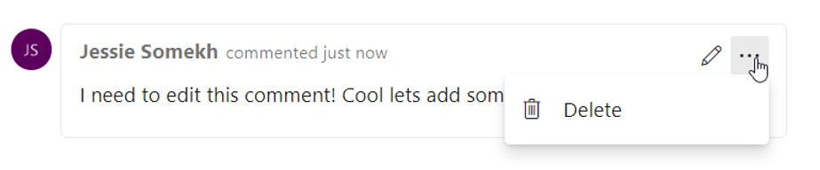
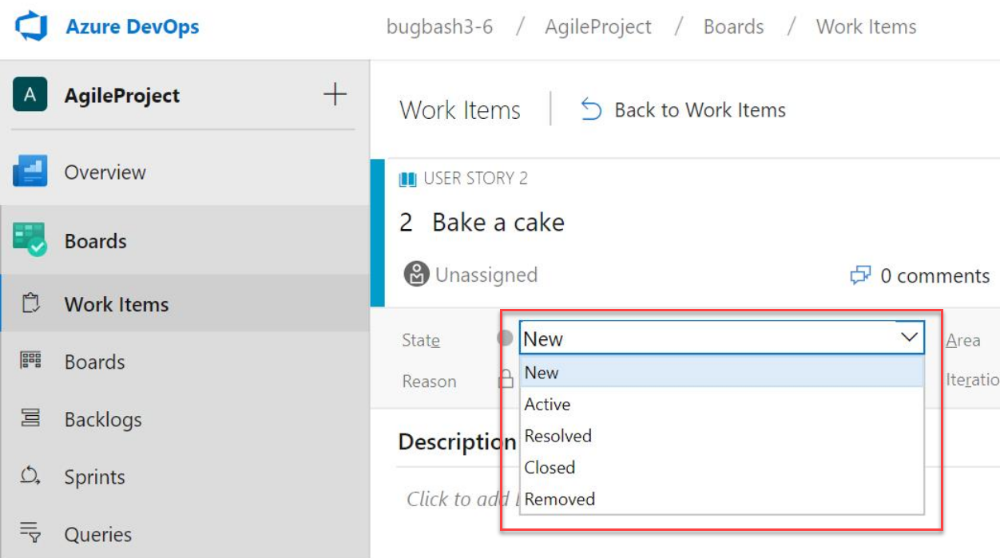
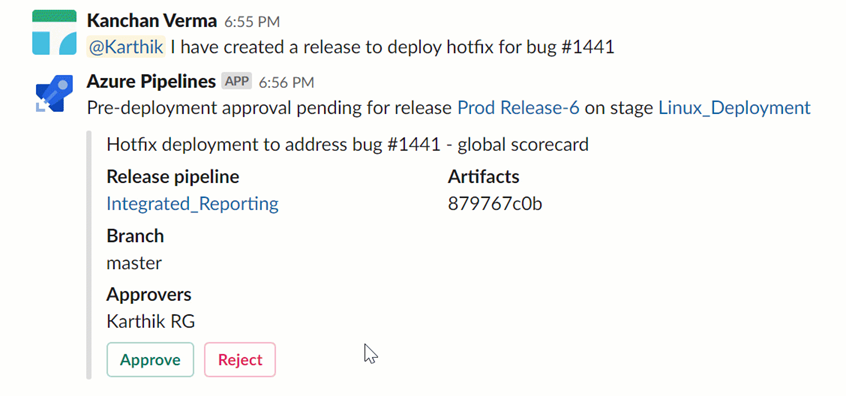
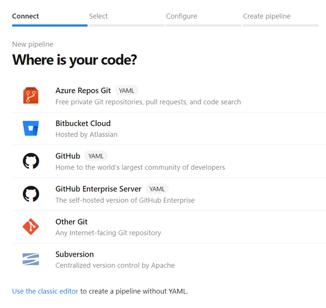
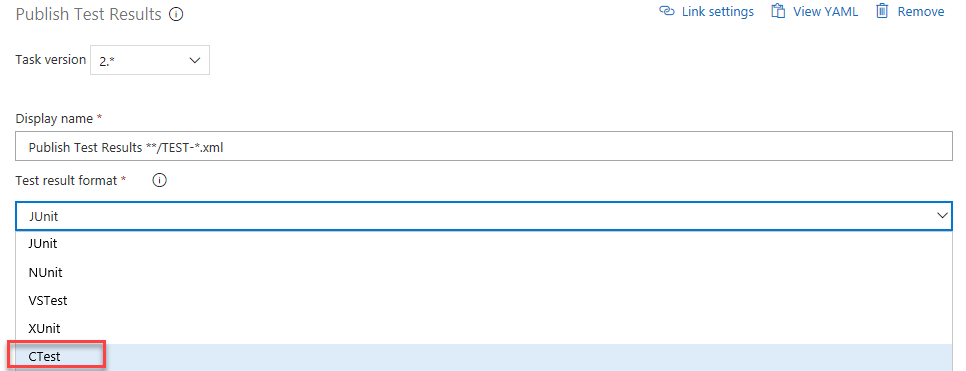

# Azure Boards and Azure Pipelines GitHub Integration Improvements - Sprint 149 Update

In the **Sprint 149 Update** of Azure DevOps, we added the ability to navigate to Azure Boards directly from mentions in a GitHub comment as well as support for Azure Boards in GitHub Enterprise.  

For Azure Pipelines we enabled a new feature on GitHub pull requests that lets you run optional checks by mentioning /azp in the comment.  You can also require a comment on the pull request from a repository contributor before the pipeline will run giving you the ability to review code from unknown users before building it.

Check out the [Features](#features) list below for more.

## Features

Azure Boards:

- [Navigate to Azure Boards work items directly from mentions in any GitHub comment](#navigate-to-azure-boards-work-items-directly-from-mentions-in-any-github-comment)
- [Updates to work item transition rules](#updates-to-work-item-transition-rules)
- [Azure Boards GitHub Enterprise support](#azure-boards-github-enterprise-support)
- [Edit and delete comments in work item](#edit-and-delete-comments-in-work-item)
- [State value order on work item form](#state-value-order-on-work-item-form)

Azure Pipelines:

- [Choose the directory of checked out code in YAML pipelines](#choose-the-directory-of-checked-out-code-in-yaml-pipelines)
- [Private projects now get 60 minutes of run time per pipeline job](#private-projects-now-get-60-minutes-of-run-time-per-pipeline-job)
- [Updates to hosted pipeline images](#updates-to-hosted-pipeline-images)
- [Duffle tool installer task in build and release pipeline](#duffle-tool-installer-task-in-build-and-release-pipeline)
- [Approve Azure Pipelines deployments from Slack](#approve-azure-pipelines-deployments-from-slack)
- [All source providers included in the new build pipeline wizard](#all-source-providers-included-in-the-new-build-pipeline-wizard)
- [GitHub comments trigger optimizations](#github-comments-trigger-optimizations)
- [Publish CTest and PHPUnit test results](#publish-ctest-and-phpunit-test-results)

Azure Artifacts:

- [Upstream sources for Maven](#upstream-sources-for-maven)

Reporting:

- [Analytics services OData version change for test entity sets](#analytics-services-odata-version-change-for-test-entity-sets)

Administration:

- [Resolve Azure Active Directory (Azure AD) disconnected users](#resolve-azure-active-directory-azure-ad-disconnected-users)

## Azure Boards

### Navigate to Azure Boards work items directly from mentions in any GitHub comment

Now when you mention a work item within the comment of an issue, pull request, or commit in GitHub using the `AB#{work item ID}` syntax, those mentions will become hyperlinks that you can click on to navigate directly to the mentioned work item.

This doesn't create a formal link that clutters up the work item in Azure Boards for every related conversation, but instead gives your team a way to provide a little more information about work items while discussing code or a customer-reported issue. See the [Azure Boards GitHub integration](https://aka.ms/azureboardsgithub) documentation for more information.

> [!div class="mx-imgBorder"]


### Updates to work item transition rules

We cleaned up multiple work item transition rules that have been inconsistent across different processes and work item types. Closed By, Closed Date, and State Changed Date have been fixed across all standard work item types and newly customized inherited work item types. Activated By and Activated Date are fixed for all system work item types but will not be fixed for customized inherited work item types.

### Azure Boards GitHub Enterprise support

Teams can now connect Azure Boards projects to repositories hosted in GitHub Enterprise Server instances. When connecting using OAuth, follow the steps in the documentation for [Registering an OAuth application](https://docs.microsoft.com/en-us/azure/devops/boards/github/connect-to-github?view=azure-devops-2019) before creating a connection to your repositories.

### Edit and delete comments in work item

We’re excited to announce that you can now edit and delete comments in your work item's discussion in Azure Boards a highly voted feature from our [Developer Community forum](https://developercommunity.visualstudio.com/content/idea/365434/edit-comments-on-tickets-discussion.html). To edit your comment, simply hover over any comment that you own, and you wil­­l see two new buttons. If you click the pencil icon, you will enter in to edit mode and can simply make your edits and press the “Update” button to save your edits.

> [!div class="mx-imgBorder"]


When you click the overflow menu, you will see the option to delete your comment. Once you click this, you will be prompted again to confirm that you want to delete this comment, and the comment will be deleted.

> [!div class="mx-imgBorder"]


You will have a full audit trail of all the edited and deleted comments in the history tab on the work item form. You will also see that we’ve updated the UI of our discussion experience to make it feel more modern and interactive. In addition, we added bubbles around comments to make it clearer where individuals comments start and end.

### State value order on work item form

Previously, the state value on the work item form was ordered alphabetically. With this update we changed how the state values are ordered to match the workflow order in the process settings.

> [!div class="mx-imgBorder"]


> [!NOTE]
> The order change will only affect the form in the web and the REST APIs. The state value order will not be changed in clients using WIT Client OM such as Visual Studio 2017 or Excel.

## Azure Pipelines

### Choose the directory of checked out code in YAML pipelines

Previously, we checked out repos to the `s` directory under $(Agent.BuildDirectory). Now you can choose the directory where your Git repo will be checked out for use with YAML pipelines.

Use the `path` keyword on `checkout` and you will be in control of the folder structure. Below is an example of the YAML code that you can use to specify a directory.

```yaml
steps:
- checkout: self
  path: my-great-repo
```

In this example, your code will be checked out to the `my-great-repo` directory in the agent’s workspace. If you don’t specify a path, your repo will continue to be checked out to a directory called `s`.

### Private projects now get 60 minutes of run time per pipeline job

Until now, a free account (that is, one which had not purchased parallel jobs) would run a job for up to 30 minutes at a time, up to 1,800 minutes per month. With this update, we have increased the limit from 30 to 60 minutes for free accounts.  

If you need to run your pipeline for more than 60 minutes, you can pay for additional capacity per parallel job or run in a self-hosted agent. Self-hosted agents don't have a job length restrictions.

### Updates to hosted pipeline images

We've made updates to the VS2017, Ubuntu 16.04, and Windows Container 1803 VM images for your hosted Azure Pipelines. You can find more details on the latest releases [here](https://github.com/Microsoft/azure-pipelines-image-generation/releases). For a full look at the tools available on our images, visit our Image Generation repo on GitHub [here](https://github.com/Microsoft/azure-pipelines-image-generation).

In addition, we adopted Moby as the container runtime. Moby is an open framework created by Docker for assembling components into custom container-based systems. This will allow us to deliver frequent upstream patches and improvements to the container runtime.

### Duffle tool installer task in build and release pipeline

Duffle is a command line tool that allows you to install and manage Cloud Native Application Bundles (CNAB). With CNABs, you can bundle, install and manage container-native apps and their services.

In this update, we added a new task for build and release pipelines that allows you to install a specific version of Duffle binary.

> [!div class="mx-imgBorder"]


### Approve Azure Pipelines deployments from Slack

Until now, Slack users have had limited capabilities to manage release deployments from within a channel. The Azure Pipelines app for Slack lets you approve or reject a release deployment from the channel. This will make the approval process easier since you are not forced to navigate to the Azure Pipelines portal. In addition, you can approve deployments on the go by using the Slack mobile app.

> [!div class="mx-imgBorder"]


For more detailed on Azure Pipelines and Slack see the documentation [here](https://docs.microsoft.com/en-us/azure/devops/pipelines/integrations/slack?view=azure-devops).

### All source providers included in the new build pipeline wizard

Until now, source providers like GitHub, Azure Repos, and Bitbucket Cloud were split between the classic pipeline editor and the new pipeline wizard. With this update we added all of them to the new pipeline wizard for a single starting point. You can still click the link at the bottom of the page to create a pipeline without YAML in the classic editor.

> [!div class="mx-imgBorder"]


### GitHub comments trigger optimizations

We improved the experience for teams who use GitHub pull request comments to trigger builds. Usually for security, these teams don’t want to automatically build pull requests. Instead, they want a team member to review the pull request and once it’s deemed safe, trigger the build with a [pull request comment](https://docs.microsoft.com/en-us/azure/devops/pipelines/repos/github?view=azure-devops#trigger-builds-using-github-pull-request-comments). A new setting keeps this option while still allowing automatic pull request builds _only_ for team members.

> [!div class="mx-imgBorder"]


### Publish CTest and PHPUnit test results

With this update, we’ve added support to publish test results from a [CTest]( https://cmake.org/cmake/help/latest/manual/ctest.1.html) run in pipelines. To publish CTest results, select the CTest option in the **Test result format** input of the publish test results tab.

> [!div class="mx-imgBorder"]


In addition, we included publishing for [PHPUnit]( https://phpunit.readthedocs.io/en/8.0/configuration.html#logging) test runs. While JUnit results format has always been supported, you can now leverage the specific constructs of PHPUnit. For more details on publishing test results see the documentation [here]( https://docs.microsoft.com/en-us/azure/devops/pipelines/tasks/test/publish-test-results?view=azure-devops&tabs=yaml).

## Azure Artifacts

### Upstream sources for Maven

Upstream sources are now available for Maven feeds. This includes the primary Maven Central repository and Azure Artifacts feeds. To add Maven upstreams to an existing feed, visit **Feed settings**, select the **Upstream sources pivot**, then select **Add upstream source**.

> [!div class="mx-imgBorder"]


## Reporting

### Analytics services OData version change for test entity sets

The Analytics service in Azure DevOps consists of entity sets that you can directly query from a supported browser using OData. The service provides a versioned OData API that you can add to the _odata element.

With this update we are migrating the test entity sets to version 3.0-preview. If you are using the OData 2.0-preview version endpoint, you will have to change to version 3.0-preview to prevent breaking changes.

The following list includes the entity sets that will be migrated to version 3.0-preview:

* TestRuns
* TestResults
* Tests
* Builds
* Branches
* Releases
* ReleaseEnvironments
* TestResultsDaily
* ReleasePipelines
* ReleaseStages
* BuildPipelines

For more information on using the OData endpoint with the Analytics service see the documentation [here](https://docs.microsoft.com/en-us/azure/devops/report/extend-analytics/odata-api-version?view=azure-devops).

## Administration

### Resolve Azure Active Directory (Azure AD) disconnected users

With our Sprint 148 update we gave you the ability to connect your organization to an Azure Active Directory from within the Azure DevOps portal. This new simplified experience saved several steps previously required in the Azure portal. However, that new experience left an open gap since you still had to call support to restore access for members who lost access during the connection process. Users lose access when their previous login identity is not found in the newly connected Azure Active Directory. With this release we allow you to restore those disconnected members on your own, saving you a customer support call and increasing your productivity.

There are two steps to restore disconnected members. First, the current identities of those members are mapped to identities in the newly connected Azure AD. Since some disconnected members may not have matching identities in the Azure AD, the second step is to invite those remaining members as guests to the Azure AD. This update provides an interface to take both steps right from the Azure AD settings page in the Azure DevOps portal.

Look for updates in our documentation [here](https://docs.microsoft.com/en-us/azure/devops/organizations/accounts/connect-organization-to-azure-ad?view=azure-devops).

## Next steps

> [!NOTE]
> These features will roll out over the next two to three weeks.

Head over to Azure DevOps and take a look.

> [!div class="nextstepaction"]
> [Go to Azure DevOps](http://go.microsoft.com/fwlink/?LinkId=307137&campaign=o~msft~docs~product-vsts~release-notes)

## Feedback

We would love to hear what you think about these features. Use the feedback menu to report a problem or provide a suggestion.

> [!div class="mx-imgBorder"]


You can also get advice and your questions answered by the community on [Stack Overflow](https://stackoverflow.com/questions/tagged/azure-devops).

Thanks,

Chris Patterson
