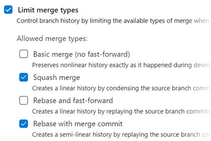
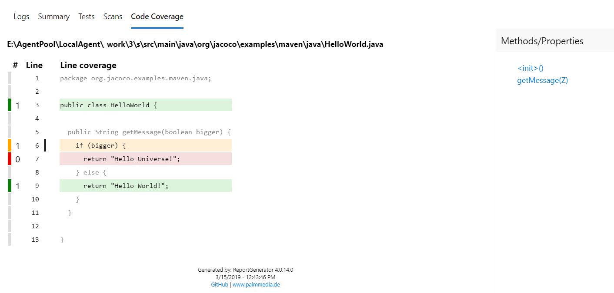
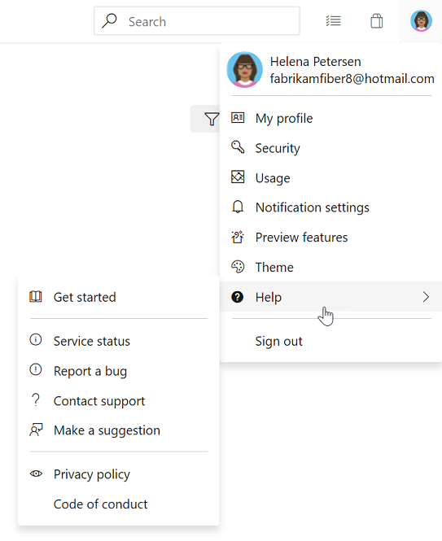

# Manage organization billing in Azure DevOps - Sprint 150 Update

In the **Sprint 150 Update** of Azure DevOps, we added the ability to manage billing for your organization within our portal.

From the new billing tab you can choose the Azure subscription you use for billing, and pay for additional users. You no longer need to go to the Visual Studio Marketplace or the Azure portal to manage billing.

Check out the [Features](#features) list below for more.

## Features

General:

- [Dark theme general availability](#dark-theme-general-availability)

Azure Boards:

- [Query work based on Azure Active Directory groups](#query-work-based-on-azure-active-directory-groups)
- [Share you team’s board using a badge](#share-you-teams-board-using-a-badge)
- [Query for work relative to the start of the day, week, month, or year](#query-for-work-relative-to-the-start-of-the-day-week-month-or-year)
- [Export query results to a CSV file](#export-query-results-to-a-csv-file)

Azure Repos:

- [New merge types for completing pull requests](#new-merge-types-for-completing-pull-requests)

Azure Pipelines:

- [Kubernetes manifest task](#kubernetes-manifest-task)
- [Upgrades to Docker task](#upgrades-to-docker-task)
- [Kubectl tool installer](#kubectl-tool-installer)
- [Azure Container Registry in Docker registry service connection](#azure-container-registry-in-docker-registry-service-connection)
- [cgroup support on hosted Ubuntu pool](#cgroup-support-on-hosted-ubuntu-pool)
- [Run once agent](#run-once-agent)
- [Support for Visual Studio 2019 (VS2019) in Visual Studio test task](#support-for-visual-studio-2019-vs2019-in-visual-studio-test-task)
- [Agent pool user interface update](#agent-pool-user-interface-update)
- [Task assistant for editing YAML files](#task-assistant-for-editing-yaml-files)
- [Hosted pipelines image updates](#hosted-pipelines-image-updates)
- [Improvements to ServiceNow integration](#improvements-to-servicenow-integration)
- [Support for Azure PowerShell Az module](#support-for-azure-powershell-az-module)
- [Resource authorization improvements](#resource-authorization-improvements)
- [Simplified retention policies for build pipelines](#simplified-retention-policies-for-build-pipelines)
- [Pipeline artifacts fetched automatically in release](#pipeline-artifacts-fetched-automatically-in-release)
- [Cobertura code coverage report updates](#cobertura-code-coverage-report-updates)

Reporting:

- [Build failure and duration reports](#build-failure-and-duration-reports)
- [General availability of Analytics](#general-availability-of-analytics)

Wiki:

- [Notifications on wiki pages](#notifications-on-wiki-pages)

Administration:

- [Manage billing for your organization from Azure DevOps](#manage-billing-for-your-organization-from-azure-devops)

## General

### Dark theme general availability

Last October, we released the public preview of the dark theme as part of the new navigation. After several months in preview, listening to feedback, and tuning the experience, we're excited to announce the general availability of the dark theme.

## Azure Boards

### Query work based on Azure Active Directory groups

With the increased adoption of Azure Active Directory and prevalence of using groups to manage security, teams have increasingly been looking for ways to leverage those groups in Azure Boards. Now, in addition to querying work items which have been assigned or changed by specific people using the **In Group** or **Not In Group** operators, you can also use Azure Active Directory groups directly.

See the [query operators]( https://docs.microsoft.com/en-us/azure/devops/boards/queries/query-by-workflow-changes?view=azure-devops#team-or-group-membership-queries) documentation for more information.

> [!div class="mx-imgBorder"]


### Share you team’s board using a badge

The repository’s README is often the home that your project team turns to for information about how to contribute to and use your solution. Now, like you can with a build or deployment status in Azure Pipelines, you can add a badge for your team’s board in Azure Boards to your README. The badge can be configured to show only the **In Progress** columns or all columns, and even be made visible publicly if your project is open source.

> [!div class="mx-imgBorder"]


If your README is based on Markdown you can simply copy the sample Markdown from the status badge settings page and paste it into your file.

> [!div class="mx-imgBorder"]


### Query for work relative to the start of the day, week, month, or year

While teams often focus on work within the context of what’s coming up next or based on sprint iterations, it’s often interesting to look back at work through the lens of the calendar to report on all the work that happened last month or in the first quarter of the year. Now you can use the following new set of **@StartOf** macros along with any date-based field to query based on the start of the day, week, month or year:

* @StartOfYear
* @StartOfMonth
* @StartOfWeek
* @StartOfDay

Each of these macros also accepts a new modifier string that lets you shift the data by different date units. For example, you can write a query to find all work items completed in the first quarter of this year by querying on State Change Date >= @StartOfYear and State Change Date <= @StartOfYear(“+3M”). See the [query macros](https://docs.microsoft.com/en-us/azure/devops/boards/queries/query-operators-variables?view=azure-devops#query-macros-or-variables) documentation for more information.

> [!div class="mx-imgBorder"]


### Export query results to a CSV file

You can now export query results directly to a CSV format file from the web.

> [!div class="mx-imgBorder"]


## Azure Repos

### New merge types for completing pull requests

You now have more options when merging the changes from a pull request to the target branch. We have added support for two of our most requested features on the Developer Community: [Fast-Forward merging](https://developercommunity.visualstudio.com/idea/365639/enable-fastforward-merge-from-pullrequest.html) and [Semi-Linear merging](https://developercommunity.visualstudio.com/idea/365761/add-rebase-and-merge-to-pull-requests.html) (also called “Rebase and Merge”).

You will now see these new options available in the **Complete Pull Request** dialog:

> [!div class="mx-imgBorder"]


The updated policy administration page allows administrators to control which merge strategies are allowed on a branch or folder of branches.

> [!div class="mx-imgBorder"]


> [!NOTE]
> Existing policies are still enforced. For example, if your branch currently has a “squash merge only” policy in place, you will have to edit that policy in order to use the new merge strategies.

There are a few situations when rebasing during pull request completion is not possible:
* If a policy on the target branch prohibits using rebase strategies, you will need “Override branch policies” permission.
* If the source branch of the pull request has policies, you won’t be able to rebase it. Rebasing will modify the source branch without going through the policy approval process.
* If you’ve used the [Merge Conflict Extension](https://nam06.safelinks.protection.outlook.com/?url=https://marketplace.visualstudio.com/items?itemName%3Dms-devlabs.conflicts-tab&data=02%7c01%7cJoe.Bourne%40microsoft.com%7cb19b5f47678043aadffc08d6b126cda9%7c72f988bf86f141af91ab2d7cd011db47%7c1%7c0%7c636891177544782502&sdata=FaoKHy%2BZ5W/YI4rmT7E%2Bn22Kato/wrE18%2B3lWXPq778%3D&reserved=0) to resolve merge conflicts. Conflict resolutions applied to a three-way merge are seldom successful (or even valid) when rebasing all the commits in a pull request one at a time.

In all these cases, you still have the option of rebasing your branch locally and pushing to the server, or squash-merging your changes when completing the pull request.

## Azure Pipelines

### Kubernetes manifest task

We added a new task to our release pipelines to simplify the process of deploying to Kubernetes clusters using manifest files. This task will provide the following benefits in comparison to the usage of kubectl binary in scripts:

* Artifact substitution - The deploy action takes as input a list of container images which can be specified along with their tags or digests. This is substituted into the non-template version of the manifest files before applying it to the cluster to ensure that the right version of the image is pulled by the cluster's nodes.

* Manifest stability - Rollout status is checked for the Kubernetes objects deployed to incorporate stability checks while computing the task status as success/failure.

* Traceability annotations - Annotations are added to the deployed Kubernetes objects to superimpose traceability information about originating organization, project, pipeline, and run.

* Bake manifest - The bake action of the task allows for baking Helm charts into Kubernetes manifest files so that they can be applied to the cluster.

* Deployment strategy - Choosing canary strategy with deploy action leads to creation of desired percentage of workloads suffixed with **-baseline** and **-canary** so that they can be compared during a `ManualIntervention` task before utilizing the promote/reject action of the task to finalize the version to be retained.

```yaml
steps:
- task: KubernetesManifest@0
  name: bake
  displayName: Bake K8s manifests from Helm chart
  inputs:
    action: bake
    helmChart: charts/sample
    overrides: 'image.repository:nginx'

- task: KubernetesManifest@0
  displayName: Deploy K8s manifests
  inputs:
    kubernetesServiceConnection: k8sSC1
    manifests: $(bake.manifestsBundle)
    containers: |
      nginx: 1.7.9
```

### Upgrades to Docker task

We upgraded the Docker task to simplify the pipeline authoring experience. The **buildAndPush** command can now be used to build multiple tags for a specific container repository and push it to multiple container registries in a single step. The task can use Docker registry service connections for logging into container registries. Traceability metadata about source repository, commit and build provenance are added as labels to the images built using this task.

```yaml
steps:
- task: Docker@2
  displayName: Container registry login - ACR1 service connection
  inputs:
    command: login
    containerRegistry: acr1
- task: Docker@2
  displayName: Container registry login - ACR2 service connection
  inputs:
    command: login
    containerRegistry: acr2
- task: Docker@2
  displayName: Build and push images
  inputs:
    repository: test
    tags: |
      d1
      d2
```

### Kubectl tool installer

We added a new task that allows you to install a specific version of the Kubectl binary on the agents. The **latest** and **semver** version strings such as 'v1.14.0' are accepted as valid values for the Kubectl Version Spec input.

> [!div class="mx-imgBorder"]


### Azure container registry in Docker registry service connection

Now you can create a Docker registry service connection from your project's settings page. To create the connection, choose an Azure container registry in one of the subscriptions associated with your Azure Active Directory (AAD) identity. All tasks requiring service connections to container registries such as **Docker@2** and **KubernetesManifest@0** will support a single way of specifying a connection.

> [!div class="mx-imgBorder"]


### cgroup support on hosted Ubuntu pool

On Linux, when memory usage gets too high, the kernel will terminate some processes to protect the remainder. If the Azure Pipelines agent process is selected for termination, your pipeline run will fail with an error message about losing communication with the agent. On the Microsoft-hosted Ubuntu pool, we've reduced the chances that the agent will be terminated by running steps inside a custom **cgroup**. While your pipeline may still fail if you exceed available memory, the agent process is more likely to survive and report the failure correctly. If you run a private Linux agent, we've [published](https://github.com/Microsoft/azure-pipelines-agent/blob/master/docs/start/resourceconfig.md) the settings we use so you can consider a similar setup.

### Run once agent

If you're using infrastructure such as Azure Container Instances to run elastic private agents, often, you want each agent to accept only one job before going away. Until now, this wasn't easy since you had to terminate the agent (possibly causing a failure to be reported) or accept the risk that an agent might receive another job before you could shut it down. With this update, we added the **--once** flag to the agent configuration. When you configure the agent this way, it'll accept only one job and then shut itself down.

### Support for Visual Studio 2019 (VS2019) in Visual Studio Test task

We've added support for VS2019 to the Visual Studio Test task in pipelines. To run tests using the test platform for VS2019, select the **Latest** or **Visual Studio 2019** options from the Test platform version dropdown.

> [!div class="mx-imgBorder"]
 in Visual Studio Test task")

### Agent pool user interface update

The agent pools management page in project settings has been updated with a new user interface. Now you can easily see all the jobs that are running in a pool. In addition you can learn why a job is not running.

> [!div class="mx-imgBorder"]
 update")

### Task assistant for editing YAML files

We continue to receive a lot of feedback asking to make it easier to edit YAML files for pipelines. In the previous updates, we added intellisense support. Now we are adding a task assistant to the YAML editor. With this, you will have the same familiar experience for adding a new task to a YAML file as in the classic editor. This new assistant supports most of the common task input types such as pick lists and service connections. To use the new task assistant, select **Edit** on a YAML-based pipeline, and then select the **Task assistant**.

> [!div class="mx-imgBorder"]


### Hosted pipelines image updates

We're excited to announce updates to the hosted **macOS pool** to **OS X Mojave** (10.4) which will also include support for **Xcode 10.2**. If your designer-based pipelines are using the **Hosted macOS** pool, your pipelines will automatically upgrade to Mojave. If you'd like to stay on OS X High Sierra (10.3), then change the pool your builds run on to **Hosted macOS High Sierra**.

If you are using YAML, the new vmImage labels that you can use are the following:

* Image label that will always point to the latest version of macOS, currently 10.4

```yaml
vmImage: 'macOS-latest'
```

* This image label specifically targets mac OS 10.4 if you want to be sure your pipeline runs against Mojave

```yaml
vmImage: 'macOS-10.14'
```

* Image label that will specifically target mac OS 10.3 if you want to be sure your pipeline runs against High Sierra

```yaml
vmImage: 'macOS-10.13'
```

We also made updates to the Windows Server 2019 image for your Hosted Azure Pipelines. The latest releases can be found [here](https://github.com/Microsoft/azure-pipelines-image-generation/releases). This update includes new versions of the VS2019 Preview, Docker, PowerShell Core, Node.js, npm, and others.

For more details about what's contained in our Hosted macOS VM images, and learn about the tools available on our images visit our [Image Generation repo](https://github.com/Microsoft/azure-pipelines-image-generation) on GitHub.

### Improvements to ServiceNow integration

Last December, we released the ServiceNow Change Management integration with release pipelines. A key capability for cross-team collaboration which enabled each team to use a service of their choice and have effective end-to-end delivery.
With this update, we enhanced the integration to support all types of changes (normal, standard and emergency). In addition, you can now specify the gate used to create a new change request using an existing template, as per the ITSM process followed in your organization. Finally, you can also gate releases based on existing change requests. This enables you to adopt CD, without needing to change the process recommended by your IT teams.

> [!div class="mx-imgBorder"]


### Support for Azure PowerShell Az module

Azure PowerShell provides a set of cmdlets that you can use to manage Azure resources from the command line. Last December, the Azure PowerShell Az module became available and is now the intended module for managing your Azure resources.  

Previously, we didn’t provide support for the Azure PowerShell Az module in our hosted agents. With the new Azure PowerShell task version 4.* in build and release pipelines, we have added support for the new Az module for all platforms. Azure PowerShell task version 3.* will continue to support the AzureRM module. However, to keep up with the latest Azure services and features, we recommend that you switch to the Azure PowerShell task version 4.* as soon as possible.

The Az module has a compatibility mode to help you use existing scripts while you update them to use the new syntax. To enable compatibility for the Az module, use the `Enable-AzureRmAlias` command. Aliases let you use the old cmdlet names with Az module. You can get more details on migrating from the Azure RM module to the Azure PowerShell Az module [here](https://docs.microsoft.com/en-us/powershell/azure/new-azureps-module-az?view=azps-1.5.0#migrate-existing-scripts-to-az).

> [!NOTE]
> You need to install the Az module on your agent machine if you are using private agents.

For more information on the Azure PowerShell Az module, see the documentation [here](https://docs.microsoft.com/en-us/powershell/azure/new-azureps-module-az?view=azps-1.4.0&viewFallbackFrom=azps-1.3.0#the-future-of-support-for-azurerm).

### Resource authorization improvements

We needed to provide security for protected resources (e.g., service connections, variable groups, agent pools, secure files) when referenced in a YAML file. At the same time, we wanted to make it easier for you to set up and use pipelines that use these types of resources for non-production scenarios. Previously, we added a setting to mark a resource as 'authorized for use in all pipelines'.

With this update, we are making it easier for you to fix a resource authorization problem even if you have not marked a resource as such. In the new experience, when a build fails because of a resource authorization error, you will see an option to explicitly authorize the use of those resources in the pipeline, and then proceed. Team members with permissions to authorize resources will be able to complete this action right from a failed build.

> [!div class="mx-imgBorder"]


### Simplified retention policies for build pipelines

We simplified the retention model for all build pipelines including YAML builds. There is a new setting at the project level that lets you control how many days you want to retain the builds of each pipeline and how many days you want to retain the artifacts of each build. If you used the classic editor to create your build pipeline, then the older retention settings will continue to be honored, but newer pipelines will use the new settings. You can manage retention under the **pipelines settings** page of **project settings**.

### Pipeline artifacts fetched automatically in release

Previously, if the build pipeline linked to a release had published artifacts using the **Publish Pipeline Artifact** task, the artifacts were not automatically fetched in release. Instead you had to explicitly add a **Download Pipeline Artifact** task in the release pipeline to download the artifacts.

Now, any pipeline artifacts published by the build pipeline are automatically downloaded and made available for you in the release. You can also customize the download of your pipeline artifact from the phase properties of the release pipeline.

### Cobertura code coverage report updates

Previously, when you ran tests in pipeline and published code coverage results to Azure DevOps, it was necessary to specify both the XML summary and an HTML report file. Additionally, styles in the HTML reports were removed before they were rendered in the code coverage tab. This removal of styling was necessary from a security standpoint as arbitrary HTML files could be uploaded.

With this update we have addressed these limitations for Cobertura coverage reports. When publishing code coverage reports, you no longer need to specify HTML files. Reports are automatically generated and are rendered with appropriate styling in the code coverage tab. This capability uses the open source tool [ReportGenerator](https://github.com/danielpalme/ReportGenerator).

> [!div class="mx-imgBorder"]


## Reporting

### Build failure and duration reports

It is important to have metrics and insights to continuously improve the throughput and stability of your pipeline. As the first step towards providing you with pipeline analytics, we added two reports to give you metrics and insights about your pipelines.  

1. The failure report will show the build pass rate and the failure trend. In addition, it will also show the tasks failure trend to provide insights on which task is contributing to the maximum number of failures.

    > [!div class="mx-imgBorder"]
    > 

2. The duration report will have the pipeline duration along with its trend.

    > [!div class="mx-imgBorder"]
    > 

### General availability of Analytics

We're excited to announce that the following Analytics features will be included in Azure DevOps at no additional cost. 

1. The [Analytics Widgets](https://docs.microsoft.com/en-us/azure/devops/report/analytics/analytics-widgets?view=azure-devops) are configurable modules that display data on a dashboard and help you monitor the progress of your work. The widgets included are the following:

    * [Burndown and Burnup](https://docs.microsoft.com/en-us/azure/devops/report/dashboards/configure-burndown-burnup-widgets?toc=/azure/devops/report/analytics/toc.json&bc=/azure/devops/report/analytics/breadcrumb/toc.json&view=azure-devops) charts monitor the progress of a set of scoped work over a period of time.

        > [!div class="mx-imgBorder"]
        > 

    * [Cycle Time and Lead Time](https://docs.microsoft.com/en-us/azure/devops/report/dashboards/cycle-time-and-lead-time?toc=/azure/devops/report/analytics/toc.json&bc=/azure/devops/report/analytics/breadcrumb/toc.json&view=azure-devops) to visualize how work moves through your team's development cycle

        > [!div class="mx-imgBorder"]
        > 

    * [Cumulative Flow Diagram (CFD)](https://docs.microsoft.com/en-us/azure/devops/report/dashboards/cumulative-flow?toc=/azure/devops/report/analytics/toc.json&bc=/azure/devops/report/analytics/breadcrumb/toc.json&view=azure-devops) tracks work items as they progress through various states.

        > [!div class="mx-imgBorder"]
        > 

    * [Velocity](https://docs.microsoft.com/en-us/azure/devops/report/dashboards/team-velocity?toc=/azure/devops/report/analytics/toc.json&bc=/azure/devops/report/analytics/breadcrumb/toc.json&view=azure-devops) track how a team is delivering value over multiple sprints.

        > [!div class="mx-imgBorder"]
        > 

    * [Test Results Trend](https://docs.microsoft.com/en-us/azure/devops/report/dashboards/configure-test-results-trend?view=azure-devops) to monitor test trends, detect failure and duration patterns for tests over single or multiple pipelines.

        > [!div class="mx-imgBorder"]
        > 

2. In the product we are including the [top failing test report](https://docs.microsoft.com/en-us/azure/devops/pipelines/test/test-analytics?toc=/azure/devops/report/analytics/toc.json&bc=/azure/devops/report/analytics/breadcrumb/toc.json&view=azure-devops#view-test-analytics-for-builds) to get insights about top failing tests in your pipeline to help improve pipeline reliability and reduce test debt.

    > [!div class="mx-imgBorder"]
    > 

We will also continue to offer [Power BI integration through analytics views](https://docs.microsoft.com/en-us/azure/devops/report/powerbi/index?view=azure-devops) and direct access to our [OData endpoint](https://docs.microsoft.com/en-us/azure/devops/report/extend-analytics/index?view=azure-devops) in preview for all Azure DevOps Services customers.

If you are using the Analytics marketplace extension, you can continue to use Analytics as you did before and do not need to follow any additional steps. This means that we will deprecate the [Analytics marketplace extension](https://marketplace.visualstudio.com/items?itemName=ms.vss-analytics) for hosted customers.

The Azure DevOps Analytics offering is the future of reporting and we will continue to invest in new features driven by Analytics. You can find more information about Analytics in the links below.

* [Analytics overview documentation](https://docs.microsoft.com/en-us/azure/devops/report/analytics/what-is-analytics?view=azure-devops)

* [Analytics widgets](https://docs.microsoft.com/en-us/azure/devops/report/analytics/analytics-widgets?view=azure-devops)

* [Top failing test report](https://docs.microsoft.com/en-us/azure/devops/pipelines/test/test-analytics?toc=/azure/devops/report/analytics/toc.json&bc=/azure/devops/report/analytics/breadcrumb/toc.json&view=azure-devops#view-test-analytics-for-builds)

* [Power BI integration](https://docs.microsoft.com/en-us/azure/devops/report/powerbi/index?view=azure-devops)

* [OData endpoint](https://docs.microsoft.com/en-us/azure/devops/report/extend-analytics/index?view=azure-devops)

* [Azure DevOps Analytics](https://channel9.msdn.com/Events/connect/2017/T251)

## Wiki

### Notifications on wiki pages

Until now, you didn't have a way of knowing when the content on a  wiki page was changed. Now you can follow wiki pages to get notified via email when the page is edited, deleted or renamed. To track changes made to a wiki, select the **Follow** button from the wiki page.

> [!div class="mx-imgBorder"]


This feature has been prioritized based on [this](https://developercommunity.visualstudio.com/content/idea/379604/wiki-notifications.html) suggestion ticket. To learn more, see our documentation [here](https://docs.microsoft.com/en-us/azure/devops/project/wiki/follow-notifications-wiki-pages?view=azure-devops).

## Administration

### Manage billing for your organization from Azure DevOps

We are happy to announce that you can now manage your organization's billing from the Azure DevOps portal. Administrators no longer need to set up billing via the Azure portal. To manage the billing settings, go to your **Organization Settings** and select **Billing**.

Below is a list of settings that you can manage from the **Billing** tab.

1. You can choose an Azure subscription to use for billing.

    > [!div class="mx-imgBorder"]
    > 

2. You can change the Azure subscription your organization uses for billing by selecting a different subscription. Previously, you had to remove billing and then carefully repurchase the same level for each of your paid resources (Basic users, Package Management users, MS Hosted pipelines, etc...). This process was tedious and prone to error. You can now change the Azure subscription your organization uses for billing by selecting a different subscription and clicking save.

    > [!div class="mx-imgBorder"]
    > 

3. There is no longer a need to go to the Visual Studio Marketplace to manage billing setup. We've added the ability to pay for additional Basic, Test Manager, and Package Management (Azure Artifacts) users. You can increase or decrease the count of users your organization is paying from the new **Billing** tab.

    > [!div class="mx-imgBorder"]
    > 

## Next steps

> [!NOTE]
> These features will roll out over the next two to three weeks.

Head over to Azure DevOps and take a look.

> [!div class="nextstepaction"]
> [Go to Azure DevOps](http://go.microsoft.com/fwlink/?LinkId=307137&campaign=o~msft~docs~product-vsts~release-notes)

## Feedback

We would love to hear what you think about these features. Use the feedback menu to report a problem or provide a suggestion.

> [!div class="mx-imgBorder"]


You can also get advice and your questions answered by the community on [Stack Overflow](https://stackoverflow.com/questions/tagged/azure-devops).

Thanks,

Jeremy Epling
