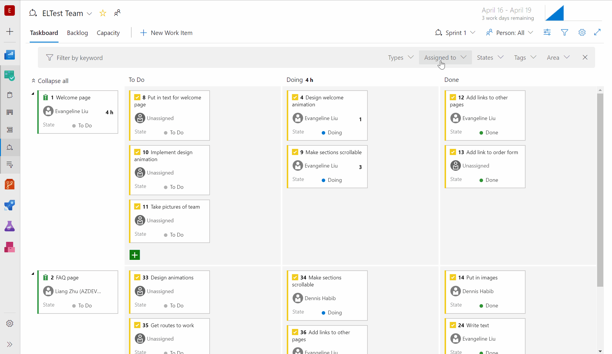

# New Azure Pipelines App for Teams, improved GitHub and Azure Boards integration - Sprint 151 Update

In the **Sprint 151 Update** of Azure DevOps, we improved the GitHub integration with Azure Boards by adding a GitHub Marketplace app to streamline the acquisition and configuration with your GitHub repositories. 
In addition, you can now link work items in Azure Boards with related issues in GitHub. For example, you can accept bug reports from your users in GitHub while organizing your team's work in Azure Boards.

In addition, we added a new Azure Pipelines app for Microsoft Teams that allows you to easily monitor and manage your pipelines from Teams.

Check out the [Features](#features) list below for more.

## Features

Azure Boards:

- [Add Azure Boards from the GitHub Marketplace](#add-azure-boards-from-the-github-marketplace)
- [Accept and execute on issues in GitHub while planning in Azure Boards](#accept-and-execute-on-issues-in-github-while-planning-in-azure-boards)
- [Taskboard people switcher](#taskboard-people-switcher)

Azure Pipelines:

- [Azure Pipelines app for Microsoft Teams](#azure-pipelines-app-for-microsoft-teams)

Azure Repos:

- [Repository creation extension point](#repository-creation-extension-point)
- [Improved encoding support](#improved-encoding-support)

## Azure Boards

### Add Azure Boards from the GitHub Marketplace

> [!IMPORTANT]
> The Azure Boards app for GitHub is in preview. Watch for public availability in the [GitHub Marketplace](https://github.com/marketplace/category/project-management) and announcement in our [release notes](/azure/devops/release-notes/) and [blog](https://devblogs.microsoft.com/devops/) soon.

The new **Azure Boards** app in the [GitHub Marketplace](https://aka.ms/azureboardsgithub/install) streamlines the acquisition and configuration of Azure Boards for your GitHub repositories. 

Previously, you could enable a connection with GitHub repositories through OAuth or personal access token authentication. Using OAuth or PAT, Azure Boards uses **an individual's GitHub identity** to monitor and link code activity with work items. However, since the members of your team may change over time, it can be less desirable to use an individual's GitHub identity and permissions. By installing the Azure Boards app, you can authorize **the app** to perform actions instead. 

To get started, install the app from the [GitHub Marketplace](https://aka.ms/azureboardsgithub/install) in your GitHub account or organization. You can also see the [GitHub & Azure Boards](https://docs.microsoft.com/en-us/azure/devops/boards/github/?view=azure-devops) documentation for more information.

> [!div class="mx-imgBorder"]

### Accept and execute on issues in GitHub while planning in Azure Boards

The integration between Azure Boards and GitHub thus far has been all about linking code activity to work items. While this has been suitable for several teams that want to fully leverage Azure Boards for planning and work management, it's left other teams, who may still want to track issues in GitHub, wanting more. 

Now you can link work items in Azure Boards with related issues in GitHub. With this new type of linking, several other scenarios are now possible. If your team wants to continue accepting bug reports from users, for example, as issues within GitHub but relate and organize the team's work overall in Azure Boards, now you can.

> [!div class="mx-imgBorder"]

The same mention syntax your team uses for commits and pull requests still applies and of course you can link manually in Azure Boards with the issue URL. See the [GitHub & Azure Boards](/azure/devops/boards/github/) documentation for more information.

> [!div class="mx-imgBorder"]

### Taskboard people switcher

Depending on the size of your team and the number of work items in progress, your taskboard can get a bit crowded. You can use filtering to choose which cards to display and focus on what's of interest in the moment. 

Now you can choose how you filter a person on the taskboard.  Use the person switcher when you need to see how the selected person's work relates to the team's work. This will highlight cards belonging to the person selected so you can view, update, and reorder any cards while focusing on the selected person.

> [!div class="mx-imgBorder"]

The filter bar now works in parity with the filtering experiences so you only see the cards that match the filter. Use the **Assigned to** filter when you need to quickly find what you and others are working on.

> [!div class="mx-imgBorder"]

## Azure Pipelines

### Azure Pipelines app for Microsoft Teams

We're excited to announce the new Azure Pipelines app for Microsoft Teams. You can now easily monitor Azure DevOps Pipelines and approve releases in Teams. In addition, you can manage subscriptions for completed builds, releases, pending approvals and get notifications for these events in your Teams channels.

To get started, install the Azure Pipelines app from the Microsoft Teams app store and see the documentation [here](https://docs.microsoft.com/en-us/azure/devops/pipelines/integrations/microsoft-teams?view=azure-devops).

> [!div class="mx-imgBorder"]

## Azure Repos

### Repository creation extension point

We've added an extension point to allow you to add new items to the repository picker. This extension point will let you add custom actions (redirects, popups, etc) to the repository picker menu, enabling flows like alternate repository creation scenarios.

> [!div class="mx-imgBorder"]

### Improved encoding support

Previously, editing and saving files on the web would only save as UTF-8 encoding and we did not prompt you when the file encoding changed. Now, we will give you a warning when you try to save a file that is not UTF encoded via the web (which only supports UTF encoding). In addition, we added support for UTF-16 and UTF-32 encoding via the web pushes endpoint. This means that we will preserve the encoding type so you don't have to rewrite them as UTF-8.

The following screenshot shows and example of the dialog that you will see when you introduce encoding changes by a web push.

> [!div class="mx-imgBorder"]

## Next steps

> [!NOTE]
> These features will roll out over the next two to three weeks.

Head over to Azure DevOps and take a look.

> [!div class="nextstepaction"]
> [Go to Azure DevOps](http://go.microsoft.com/fwlink/?LinkId=307137&campaign=o~msft~docs~product-vsts~release-notes)

## Feedback

We would love to hear what you think about these features. Use the feedback menu to report a problem or provide a suggestion.

> [!div class="mx-imgBorder"]

You can also get advice and your questions answered by the community on [Stack Overflow](https://stackoverflow.com/questions/tagged/azure-devops).

Thanks,

Biju Venugopal
