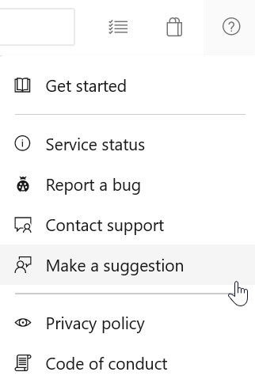

#  Enhancements to Azure Boards - Sprint 156 Update

In the **Sprint 156 Update** of Azure DevOps, we continue to improve Azure Boards to include items that can help enhance the user's experience. For instance, you can now **customize system picklist values** such as Severity, Activity and Priority. In addition, we added rule support for setting fields to read-only or required based on group membership. Finally, we created a new extension to allow you to create [cascading picklists](https://marketplace.visualstudio.com/items?itemName=ms-devlabs.cascading-picklists-extension) on your work item form.

Check out the [Features](#features) list below for more.

## Features

### General:

[!INCLUDE [sprint-156-update-links](_shared/general/sprint-156-update-links.md)]

### Azure Boards:

[!INCLUDE [sprint-156-update-links](_shared/boards/sprint-156-update-links.md)]

### Azure Repos:

[!INCLUDE [sprint-156-update-links](_shared/repos/sprint-156-update-links.md)]

### Azure Artifacts:

[!INCLUDE [sprint-156-update-links](_shared/artifacts/sprint-156-update-links.md)]

### Azure Pipelines:

[!INCLUDE [sprint-156-update-links](_shared/pipelines/sprint-156-update-links.md)]

### Azure Test Plans:

[!INCLUDE [sprint-156-update-links](_shared/testplans/sprint-156-update-links.md)]

### Reporting:

[!INCLUDE [sprint-156-update-links](_shared/reporting/sprint-156-update-links.md)]

### Wiki:

[!INCLUDE [sprint-156-update-links](_shared/wiki/sprint-156-update-links.md)]

## General

[!INCLUDE [sprint-156-update](_shared/general/sprint-156-update.md)]

## Azure Boards

[!INCLUDE [sprint-156-update](_shared/boards/sprint-156-update.md)]

## Azure Repos

[!INCLUDE [sprint-156-update](_shared/repos/sprint-156-update.md)]

## Azure Artifacts

[!INCLUDE [sprint-156-update](_shared/artifacts/sprint-156-update.md)]

## Azure Pipelines

[!INCLUDE [sprint-156-update](_shared/pipelines/sprint-156-update.md)]

## Azure Test Plans

[!INCLUDE [sprint-156-update](_shared/testplans/sprint-156-update.md)]

## Reporting

[!INCLUDE [sprint-156-update](_shared/reporting/sprint-156-update.md)]

## Wiki

[!INCLUDE [sprint-156-update](_shared/wiki/sprint-156-update.md)]

## Next steps

> [!NOTE]
> These features will roll out over the next two to three weeks.

Head over to Azure DevOps and take a look.

> [!div class="nextstepaction"]
> [Go to Azure DevOps](http://go.microsoft.com/fwlink/?LinkId=307137&campaign=o~msft~docs~product-vsts~release-notes)

## Feedback

We would love to hear what you think about these features. Use the feedback menu to report a problem or provide a suggestion.

> [!div class="mx-imgBorder"]
> 

You can also get advice and your questions answered by the community on [Stack Overflow](https://stackoverflow.com/questions/tagged/azure-devops).

Thanks,

[!INCLUDE [sprint-156](_shared/signer/sprint-156.md)]