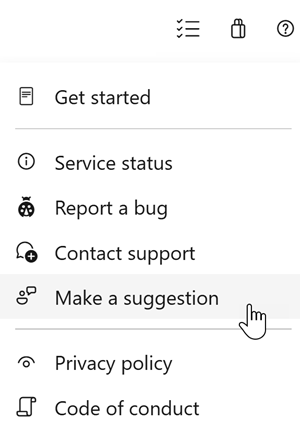

#  Use GitHub Actions to trigger a run in Azure Pipelines - Sprint 161 Update

In the **Sprint 161 Update** of Azure DevOps, we are excited to announce [GitHub Actions](https://github.com/features/actions) for Azure Pipelines. With GitHub Actions, you can trigger an Azure Pipelines run directly from your GitHub Actions workflow. We've also added support for multiple repositories in Azure Pipelines so you can fetch and checkout other repositories in addition to the one you use to store your YAML pipeline.

Check out the [Features](#features) list below for more.

## What’s new in Azure DevOps

> [!VIDEO https://youtube.com/embed/IxwhIlT83LI]

## Features

### General:

[!INCLUDE [sprint-161-update-links](includes/general/sprint-161-update-links.md)]

### Azure Pipelines:

[!INCLUDE [sprint-161-update-links](includes/pipelines/sprint-161-update-links.md)]

### Azure Repos:

[!INCLUDE [sprint-161-update-links](includes/repos/sprint-161-update-links.md)]

## General

[!INCLUDE [sprint-161-update](includes/general/sprint-161-update.md)]

## Azure Pipelines

[!INCLUDE [sprint-161-update](includes/pipelines/sprint-161-update.md)]

## Azure Repos

[!INCLUDE [sprint-161-update](includes/repos/sprint-161-update.md)]

## Next steps

> [!NOTE]
> These features will roll out over the next two to three weeks.

Head over to Azure DevOps and take a look.

> [!div class="nextstepaction"]
> [Go to Azure DevOps](https://go.microsoft.com/fwlink/?LinkId=307137&campaign=o~msft~docs~product-vsts~release-notes)

## How to provide feedback

We would love to hear what you think about these features. Use the help menu to report a problem or provide a suggestion.

> [!div class="mx-imgBorder"]
> 

You can also get advice and your questions answered by the community on [Stack Overflow](https://stackoverflow.com/questions/tagged/azure-devops).

Thanks,

[!INCLUDE [sprint-161](includes/signer/sprint-161.md)]
