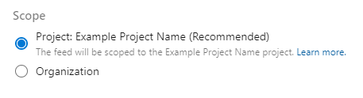

### Ability to create org-scoped feeds from UI 

Previously, the ability to create and manage org-scoped feeds through the UI was removed in order to align with the rest of Azure DevOps projects. However, while the ultimate goal is to move towards project-scoped feeds to align with the rest of Azure DevOps, we did not go about this in the best way - which should have been transparent, educational and timely. You can see more details on this, along with customer feedback and workarounds <a href="https://developercommunity.visualstudio.com/content/problem/859583/can-no-longer-create-organization-scoped-feeds.html">here</a>.

As such, we are giving back customers the ability to create and manage organization-scoped feeds through the web UI for both on-prem and hosted services. 

You can now create org-scoped feeds via the UI, by going to Artifacts -> Create Feed and choosing a type of feed within Scope. 

    