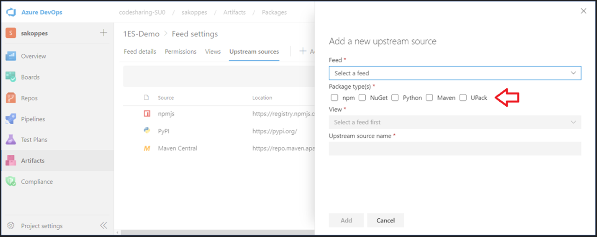

### Configure upstream sources for Universal Packages

Now you can configure your Azure Artifacts feeds to automatically download Universal Packages from upstream sources on demand.

Previously, you could configure upstream sources on your feed for NuGet, Python, Maven, and npm packages, but not for Universal Packages. This was due to a difference in the storage technology used for Universal Packages, which support much larger packages than other supported package types.

You can now configure upstream sources for Universal Packages in the same way as for other package types; open your feed settings, click **Upstream sources** -> **Add upstream source** -> and choose the source type that is right for you. You will see Universal Packages (UPack) as a new option in the next view (see image below). For more information, please see the upstream sources configuration [documentation](/azure/devops/artifacts/how-to/set-up-upstream-sources?view=azure-devops&preserve-view=true#:~:text=Add%20an%20Azure%20Artifacts%20feed%20in%20your%20organization,dialog%20where%20you%20can%20choose%20Add%20upstream%20source.).

Note that Universal Packages in upstream sources are only supported between feeds in the same DevOps Organization.

### Update Package Version REST API now available for Maven packages

You can now use the Azure Artifacts &quot;Update Package Version&quot; REST API to update Maven package versions. Previously, you could use the REST API to update package versions for NuGet, Maven, npm, and Universal Packages, but not Maven packages.

To update Maven packages, use the HTTP PATCH command as follows.

`PATCH` 
`https://pkgs.dev.azure.com/{organization}/{project?}/\_apis/packaging/feeds/{feedId}/maven/groups/{groupId}/artifacts/{artifactId}/versions/{packageVersion}?api-version=5.1-preview.1`

You can set the following:

**URI Parameters**

| **Name** | **In** | **Required** | **Type** | **Description** |
| --- | --- | --- | --- | --- | --- |
| artifactId | path | TRUE | string | Artifact ID of the package |
| feed | path | TRUE | string | Name or ID of the feed |
| groupId | path | TRUE | string | Group ID of the package |
| organization | path | TRUE | string | The name of the Azure DevOps organization |
| version | path | TRUE | string | Version of the package |
| project | path || string | Project ID or project name |
| api-version | query | TRUE | string | Version of the API to use. This should be set to &#39;5.1-preview.1&#39; to use this version of the api |
|

**Request Body**

| **Name** | **Type** | **Description** |
| --- | --- | --- | --- |
| views | [JsonPatchOperation](/rest/api/azure/devops/artifactspackagetypes/python/update%20package%20version?view=azure-devops-rest-5.1&preserve-view=true#jsonpatchoperation) | The view to which the package version will be added |
|

For more information, please refer to the [REST API documentation](/rest/api/azure/devops/artifactspackagetypes/maven?view=azure-devops-rest-5.1&preserve-view=true) as it gets updated.