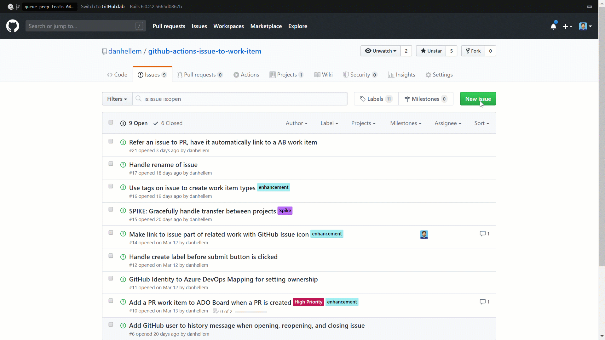

### Sync GitHub Issues to Azure DevOps Work Items

In this sprint we created and published a new [GitHub action that will save your GitHub Issues into Azure Boards work items](https://github.com/marketplace/actions/github-issues-to-azure-devops). This lets you put your code repos into GitHub while continuing to use Azure Boards to manage your work. The action is still in a preview state and we would love your feedback as we work to iron out the edge cases. Give it a try and let us know what you think.

