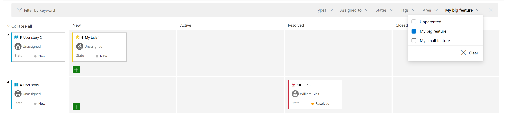
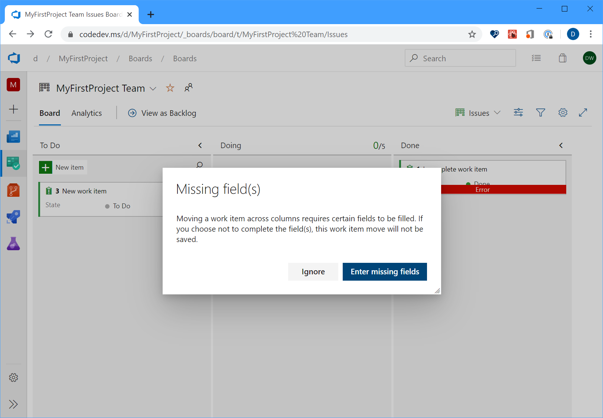

### Add "Parent Work Item" filter to the task board and sprint backlog

We added a new filter to both the Sprint board and the Sprint backlog. This allows you to filter requirements level backlog items (first column on the left) by their parent. For example, in the screen shot below, we have filtered the view to only show user stories where the parent is "My big feature".

### Improve error handling experience –– required fields on Bug/Task

Historically, from the Kanban board, if you moved a work item from one column to another where the state change triggered field rules, the card would just show a red error message which will force you to open up the work item to understand the root cause. In sprint 170, we improved the experience so you can now click on the red error message to see the details of the error without having to open up the work item itself.

