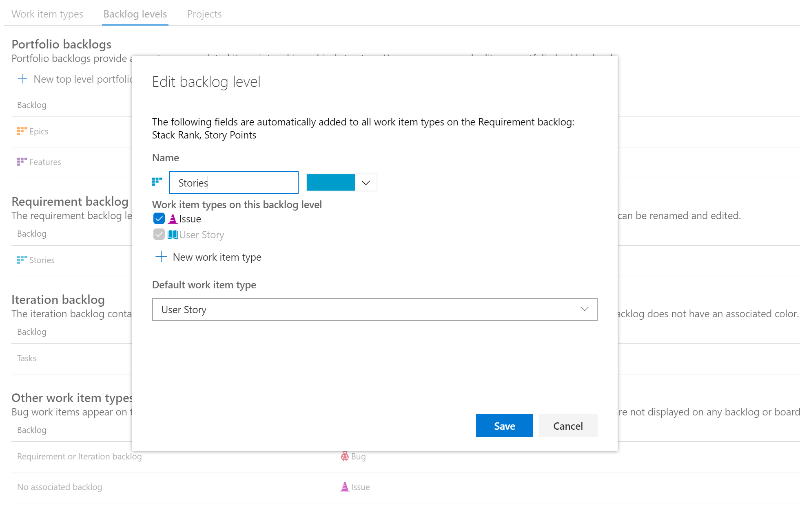
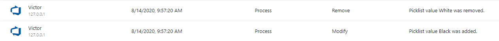
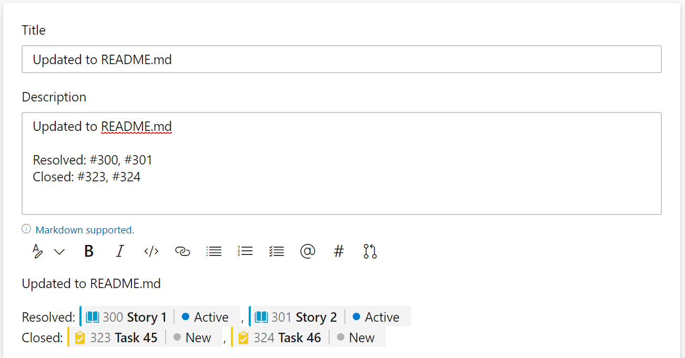

### System work item types on backlogs and boards

We [started a private preview](../../sprint-172-update.md#system-work-item-types-on-backlogs-and-boards-private-preview) of a feature that allows you to add a system work item type to the backlog level of choice. Historically these work item types have only been available from queries.

| Process | Work Item Type |
| :------ | :------------- |
| Agile   | Issue          |
| Scrum   | Impediment     |
| CMMI    | Change Request |
|         | Issue          |
|         | Review         |
|         | Risk           |

We are happy to announce that the feature is now out of preview and generally available to all organizations. Adding a system work item type to a backlog level is simple. Just go into your custom process and click **the Backlog Levels tab**. Select your backlog level of choice (example: Requirements Backlog) and **choose the edit option**. Then add the work item type.

### Audit logging event

We have added a new event to the audit logs to help customers better track process related changes. An event will be logged whenever the values on a picklist are changed. Changes to picklist fields are usually the most common changes made to a process. With this new event, organization admins can better track when and who made changes to those fields.

### Azure Boards GitHub app repo limit raised (private preview)

If you are using the <a href="https://github.com/marketplace/azure-boards">Azure Boards application</a> from the GitHub marketplace, there is a limit of 100 GitHub repositories you can connect to.&nbsp; This becomes a blocker for large organizations that can have well over 100 repositories. In this sprint, we changed how Azure Boards connects to your GitHub repos to support well over 100. If you are currently hitting the 100 repo limit, let us know, and we can enable the feature to increase that limit and unblock you. Please<a href="mailto: dahellem@microsoft.com"> email us directly</a> with your organization name (dev.azure.com/{organization}).

### Customize work item state when pull request is merged (private preview)

Not all workflows are the same. Some customers want to close out their related work items when a Pull Request is completed. Others want to set the work items to another state to be validated before closing. We should allow for both.

Starting in sprint 174, we have a new feature that allows you to set the work items to the desired state when the pull request is merged and completed. To do this, we scan the pull request description and look for the state value followed by the #mention of the work item(s). In this example, we are setting two user stories to Resolved and closing two tasks.

This feature has been a long time coming and we are excited to see what you think. To start, we are just scanning the pull request description and not including any user interface changes. We wanted to get your feedback first before investing further.

If you are interested in participating in the private preview <a href="mailto: dahellem@microsoft.com">please email us directly</a>. Don't forget to include your organization (dev.azure.com/{organization}).