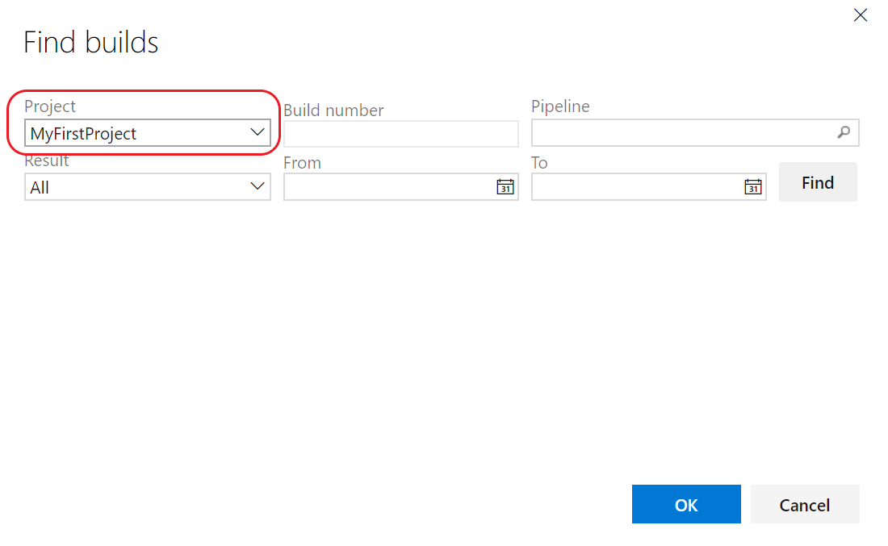
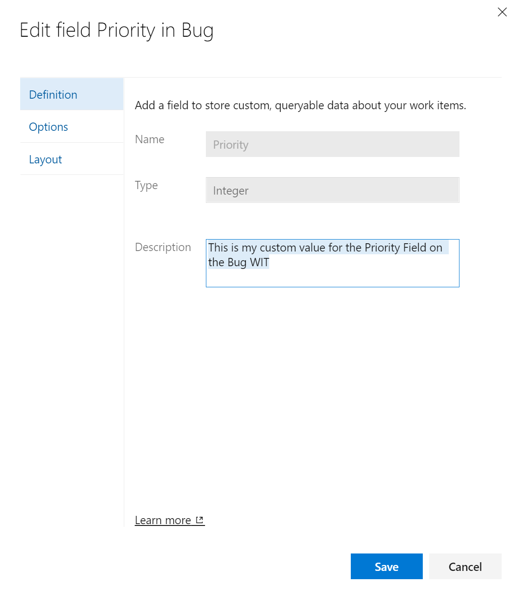

### Allow stakeholders to move work items across board columns

Stakeholders now have the ability move work items across board columns on both the Kanban and Task boards.

### Link your work item to builds in another project

You can now easily track your build dependencies across project just by linking your work item to a Build, Found in build, or Integrated in build.

  

### Editing description (help text) on system fields

You have always been able to edit the description of custom fields. But for system fields like priority, severity, and activity, the description was not editable. This was a feature gap between the Hosted XML and Inherited that prevented some customers from migrating to the Inherited model. In sprint 175, you can now edit the description on system fields. The edited value will only affect that field in the process and for that work item type. This gives you the flexibility to have different descriptions for the same field on different work item types.

    

