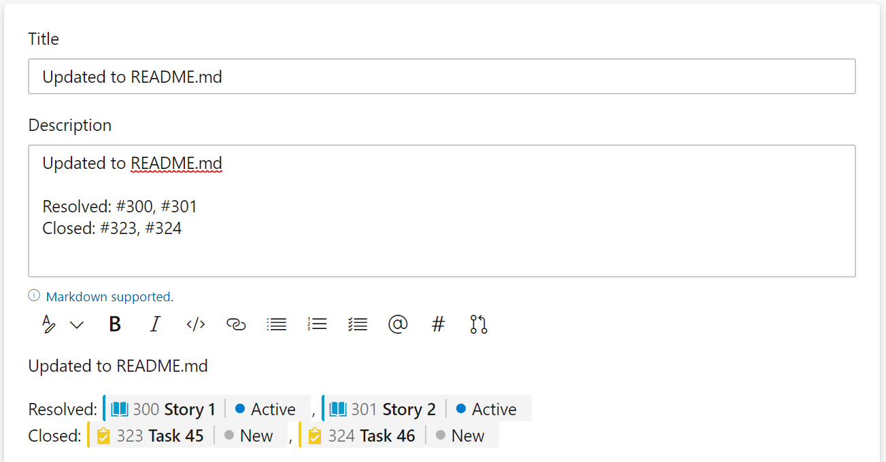
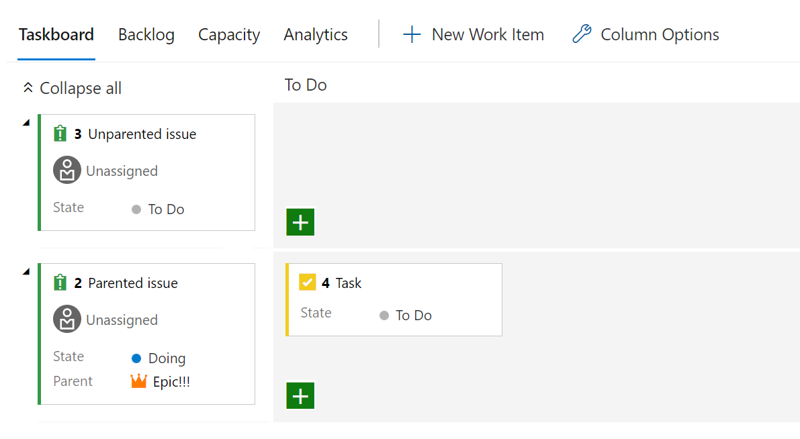

### Customize work item state when pull request is merged

A few sprints back, we released this feature under private preview. After taking feedback and fixing bugs, it is now generally available in all organizations. Pull requests often refer to multiple work items. When you create or update a pull request, you may want to close some of them, resolve some of them, and keep the rest open. You can now use comments such as the ones shown in the figure below to accomplish that. See
 <a href="/azure/devops/notifications/add-links-to-work-items?view=azure-devops&preserve-view=true#set-work-item-state-in-pull-request">documentation for more details</a>. 

 

### Parent field on the task board

Due to popular request, you can now add the Parent field to both the child and parent cards on the Task Board.

