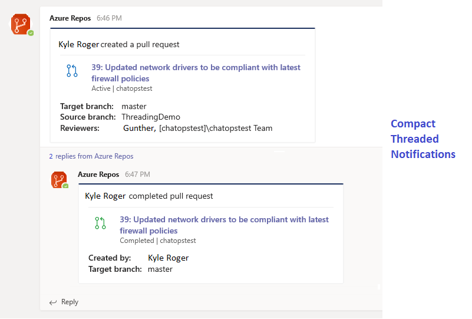
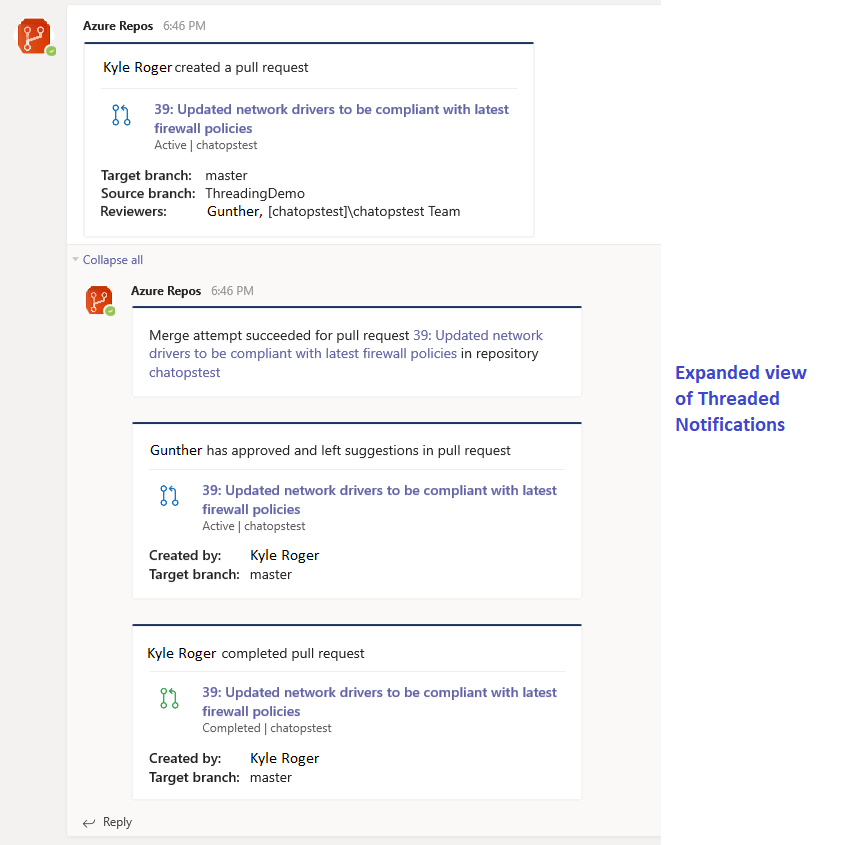

### Get compact and organized notifications in the Microsoft Teams app from Azure Boards, Azure Pipelines, and Azure Repos

Previously, you had to manually keep track of notifications received in your Microsoft Teams channel. Often, notifications from different pipelines, work items or pull requests are posted in the channel simultaneously making it difficult to organize them and resulting in vertical growth of a channel. 

We're excited to announce threaded notifications in the Microsoft Teams app for [Azure Boards](/azure/devops/boards/integrations/boards-teams), [Azure Pipelines](/azure/devops/pipelines/integrations/microsoft-teams) and [Azure Repos](/azure/devops/repos/integrations/repos-teams). Now, all notifications related to a pipeline, work item or pull request will be threaded together to better organize notifications and provide a compact view of timeline and latest status. 

> [!NOTE]
> You won't need to make any changes to start using this feature. 

Here all notifications related to a the pull request are threaded together in the Azure Repos app for Microsoft Teams.

> [!div class="mx-imgBorder"]
> 

> [!div class="mx-imgBorder"]
> 

### Delete bulk subscriptions created in a Microsoft Teams or Slack channel

Currently, you can [create bulk subscriptions](../../../2019/sprint-161-update.md#create-bulk-subscriptions-in-azure-pipelines-app-for-slack-and-microsoft-teams) in the Azure Pipelines and Azure Repos app for Microsoft Teams and Slack. Now, you can quickly delete all the subscriptions created for individual pipelines or repositories in a channel. You can use the **unsubscribe all** command to delete all subscriptions in a channel for a given project. For more details, see the documentation [here](/azure/devops/service-hooks/services/workplace-messaging-apps?view=azure-devops&preserve-view=true).

To delete all the subscriptions in a channel for a given project in the Azure Pipelines app for Microsoft Teams use the following command. 
 
`@azure pipelines unsubscribe all https://dev.azure.com/myorg/myproject`