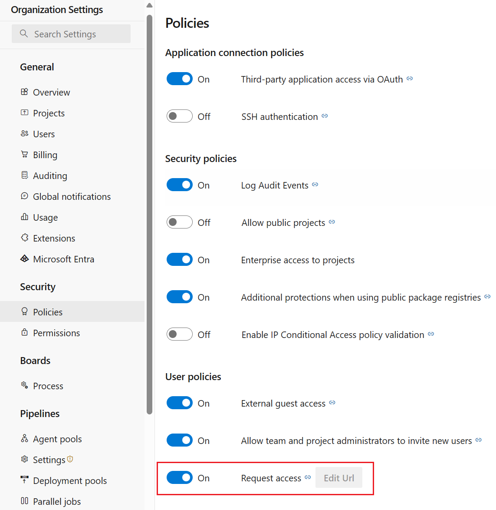
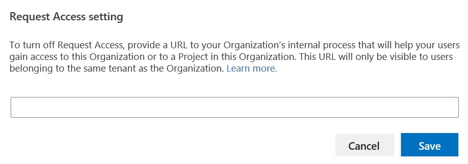

### Disable Request Access policy

Administrators can now turn off the **Request Access** feature in Azure DevOps. With Request Access, users are able to request access to a resource if they do not have access to an Organization in their tenant or to a Project within an Organization. The request resulted in an email notification to the administrators asking them to review and provide access as needed. 

This new policy can be found under Organization Settings -> User policies.

> [!div class="mx-imgBorder"]
> 

When they turn off the Request Access feature, administrators will be prompted to provide a URL to their internal documentation with details to the process required for users to gain access to the associated Organization. 

> [!div class="mx-imgBorder"]
> 