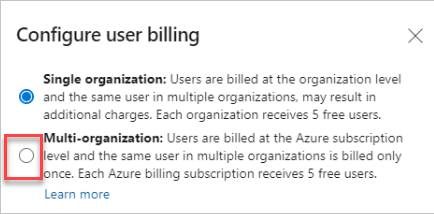

### Pay for users once across multiple organizations

If you have more than one Azure DevOps organization, you can now [turn on multi-organization billing](/azure/devops/organizations/billing/buy-basic-access-add-users?view=azure-devops&preserve-view=true#pay-for-a-user-once-across-multiple-organizations). With **multi-organization** billing you will pay for each **Basic** or **Basic + Test Plan** user once, for all organizations under the same billing Azure subscription. Multi-organization billing applies to the Azure subscription, but can be set from any organization that uses it for billing.

You can turn on multi-organization billing from Organization **Settings -> Billing -> Configure user billing**. 

> [!div class="mx-imgBorder"]
> 

To decide if multi-org billing is the right choice for you, read the [multi-org billing FAQ](/azure/devops/organizations/billing/billing-faq?view=azure-devops&preserve-view=true#multi-organization-billing).

### Assign a new owner to your orphaned organization

An organization can become orphaned when the Owner and all Project Collection Administrators are inactive in Azure Active Directory. Now, any Azure DevOps Administrator can claim ownership of orphaned organizations when the existing owners are inactive or they have left the company. 

To learn more about how to claim ownership of orphaned organizations, see the documentation [here](/azure/devops/organizations/accounts/resolve-orphaned-organization?bc=%2fazure%2fdevops%2forganizations%2fbreadcrumb%2ftoc.json&toc=%2fazure%2fdevops%2forganizations%2ftoc.json&view=azure-devops&preserve-view=true).