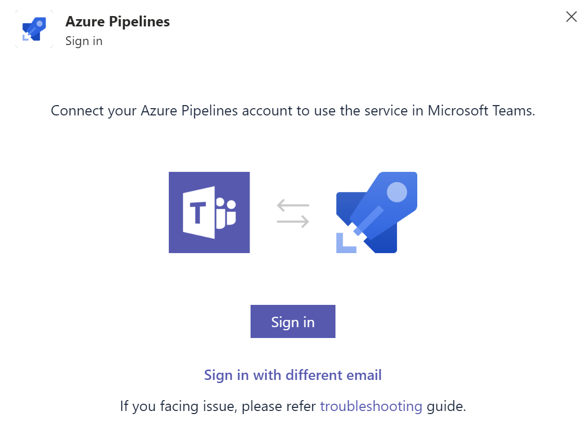

### Support for Team Admins to create subscriptions for messaging apps in Slack and Teams

In addition to project administrators, Team admins can now create subscription for Azure Boards, Repos and pipeline directly from Slack and Microsoft Teams.  

### Multi tenant support for Azure Boards, Repos and Pipelines app in Microsoft Teams

Azure Boards, Repos and Pipelines messaging app now supports connecting to a different tenant in Microsoft Teams. So your Azure DevOps and Microsoft Teams don't have to be in same Azure AD anymore. Use **Sign in with different email** link if your Microsoft Teams and Azure Pipelines are in different tenants.

> [!div class="mx-imgBorder"]
> 

