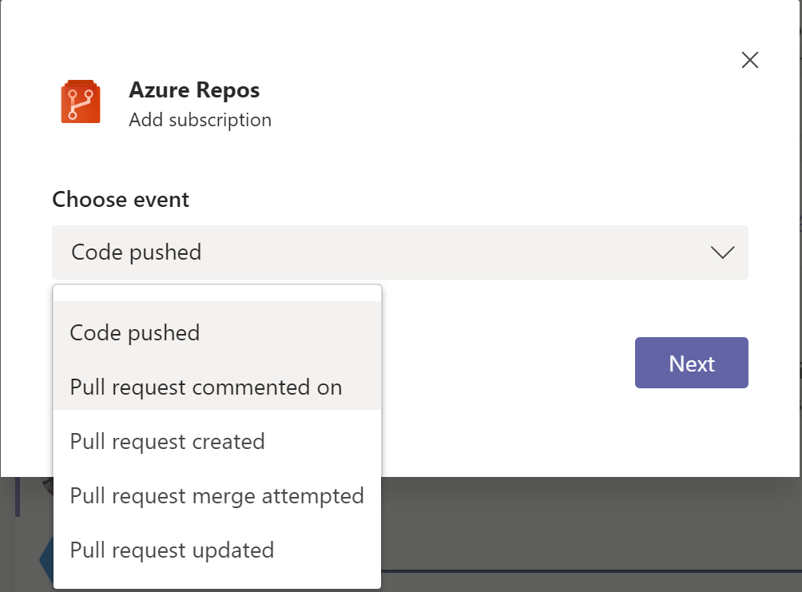

### Azure DevOps now allows team admins to subscribe to events from MS Teams & Slack

In addition to Project administrators, Azure DevOps now allows Team admins to subscribe to events for Azure Boards, Azure Repos, and Azure Pipelines directly from Slack and MS Teams.

### MS Teams & Slack notifications for Repos events

As enhancement to our MS Teams and Slack integration you now can choose to subscribe to one or more events on a pull request such as comments, code push, updates, and merge attempts.

