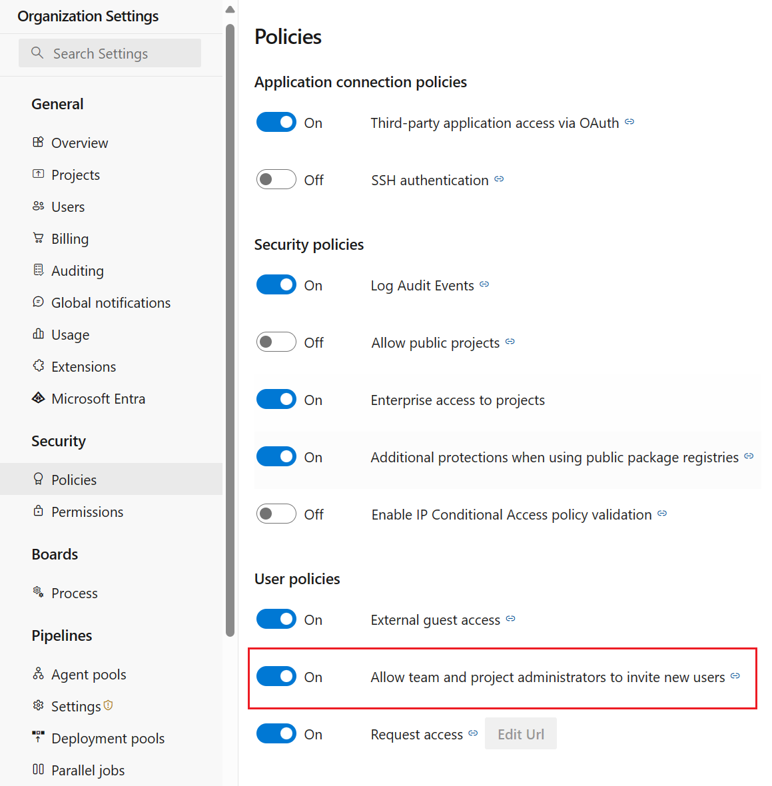

### Restrict new user invitations from Project and Team Administrators

By default, all administrators can invite new users to Azure DevOps. We've added a new security policy that can be used to block Team and Project Administrators from adding new users. Project Collection Administrators (PCAs) can add new users to the organization, regardless of the policy status.

