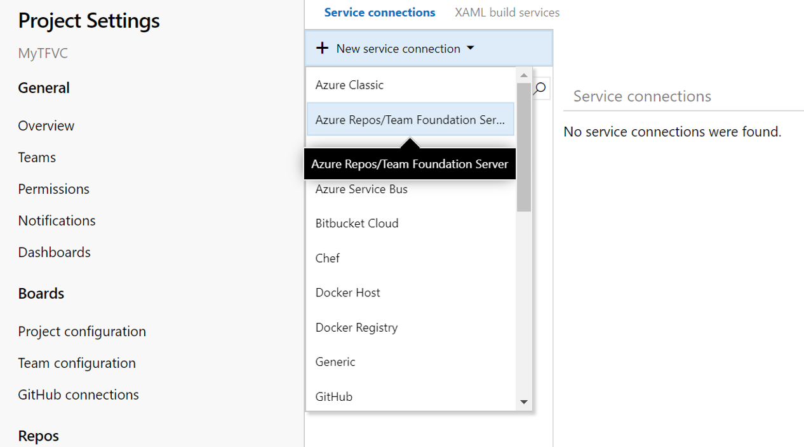
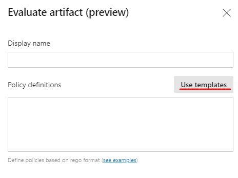
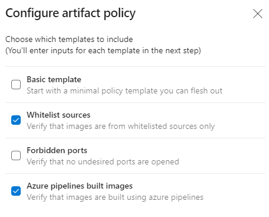

### Use pipeline decorators to inject steps automatically in a deployment job

You can now add [pipeline decorators](/azure/devops/extend/develop/add-pipeline-decorator) to deployment jobs. You can have any custom step (e.g. vulnerability scanner) auto-injected to every [life cycle hook](/azure/devops/pipelines/process/deployment-jobs?view=azure-devops&preserve-view=true#descriptions-of-life-cycle-hooks) execution of every deployment job. Since pipeline decorators can be applied to all pipelines in an organization, this can be leveraged as part of enforcing safe deployment practices.

In addition, deployment jobs can be run as a [container job](/azure/devops/pipelines/process/container-phases) along with [services side-car](/azure/devops/pipelines/process/service-containers) if defined.

### Allow repository references to other Azure Repos organizations

Previously, when you referenced repositories in a YAML pipeline, all Azure Repos repositories had to be in the same organization as the pipeline. Now, you can point to repositories in other organizations using a service connection. For example:

```yaml
resources:
  repositories:
  - repository: otherrepo
    name: ProjectName/RepoName
    endpoint: MyServiceConnection
steps:
- checkout: self
- checkout: otherrepo
```

`MyServiceConnection` points to another Azure DevOps organization and has credentials which can access the repository in another project. Both repos, `self` and `otherrepo`, will end up checked out.

> [!IMPORTANT]
> `MyServiceConnection` must be an Azure Repos / Team Foundation Server service connection, see the picture below.

> [!div class="mx-imgBorder"]
> 

### Step targeting and command isolation

Azure Pipelines supports running jobs either in containers or on the agent host. Previously, an entire job was set to one of those two targets. Now, individual steps (tasks or scripts) can run on the target you choose. Steps may also target other containers, so a pipeline could run each step in a specialized, purpose-built container. 

> [!NOTE]
> This feature is in public preview. If you have any feedback or questions about this feature, let us know in the [Developer Community](https://developercommunity.visualstudio.com/spaces/21/index.html). 

Containers can act as isolation boundaries, preventing code from making unexpected changes on the host machine. The way steps [communicate with and access services from the agent](/azure/devops/pipelines/scripts/logging-commands) is not affected by isolating steps in a container. Therefore, we're also introducing a command restriction mode which you can use with step targets. Turning this on will restrict the services a step can request from the agent. It will no longer be able to attach logs, upload artifacts, and certain other operations.

Here's a comprehensive example, showing running steps on the host in a job container, and in another container:

```yaml
resources:
  containers:
  - container: python
    image: python:3.8
  - container: node
    image: node:13.2

jobs:
- job: example
  container: python

  steps:
  - script: echo Running in the job container

  - script: echo Running on the host
    target: host

  - script: echo Running in another container, in restricted commands mode
    target:
      container: node
      commands: restricted
```
 
### Builds and releases auditing

We're happy to let you know that Release and Pipeline events are now available in the audit logs. These events can be accessed from **Organization Settings -> Auditing**. 

The following events are available now:
 
* Agent pool - create, delete, adding an agent (private agents) and removing and agent
* Service Connection - execution, create, delete, and update
* Variable Group - create, delete and update
* Release - deleted, approval completed and definition update
* RM stage completed
* Deployment job completed

### Enhancements to evaluate artifacts checks policy in pipelines

We've enhanced the [evaluate artifact check](/azure/devops/pipelines/process/approvals?tabs=check-pass&view=azure-devops&preserve-view=true#evaluate-artifact) to make it easier to add policies from a list of out of the box policy definitions. The policy definition will be generated automatically and added to the **check configuration** which can be updated if needed.

> [!div class="mx-imgBorder"]
> 

> [!div class="mx-imgBorder"]
> 