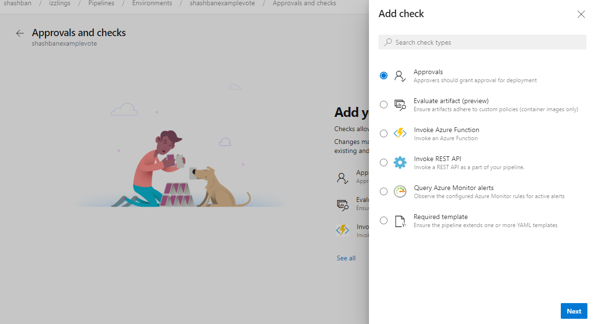
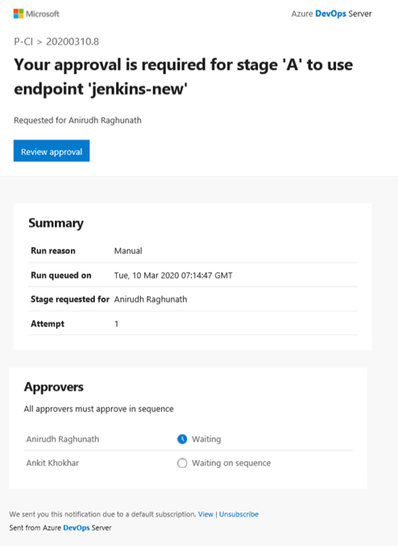

### Additional control of your deployments

Azure Pipelines has supported deployments controlled with manual approvals for some time now. With the latest enhancements, you now have additional control over your deployments. In addition to approvals, resource owners can now add automated `checks` to verify security and quality policies. These checks can be used to trigger operations and then wait for them to complete. Using the additional checks, you can now define health criteria based on multiple sources and be assured that all deployments targeting your resources are safe, regardless of the YAML pipeline performing the deployment. Evaluation of each check can be repeated periodically based on the specified **Retry Interval** for the check.
The following additional checks are now available:

- Invoke any REST API and perform validation based on response body or a callback from the external service
- Invoke an Azure function and perform validation based on response or a callback from the function
- Query Azure Monitor rules for active alerts
- Ensure the pipeline extends one or more YAML templates

> [!div class="mx-imgBorder"]
> 

### Approval notification

When you add an approval to an environment or a service connection, all multi-stage pipelines that use the resource automatically wait for the approval at the start of the stage. The designated approvers need to complete the approval before the pipeline can continue.

With this update, the approvers are sent an email notification for the pending approval. Users and team owners can opt-out of or configure custom subscriptions using <a href="/azure/devops/notifications/navigating-the-ui?view=azure-devops&preserve-view=true">notification settings</a>.

> [!div class="mx-imgBorder"]
> 

In addition to email notifications, project administrators can also direct notifications to <a href="/azure/devops/pipelines/integrations/microsoft-teams?view=azure-devops&preserve-view=true">Microsoft Teams</a> or <a href="/azure/devops/pipelines/integrations/slack?view=azure-devops&preserve-view=true">Slack</a>.