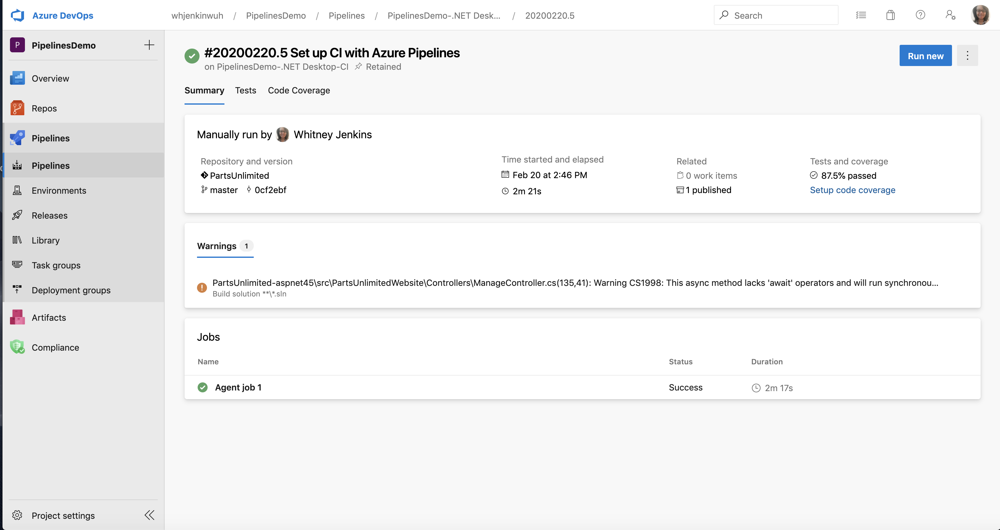
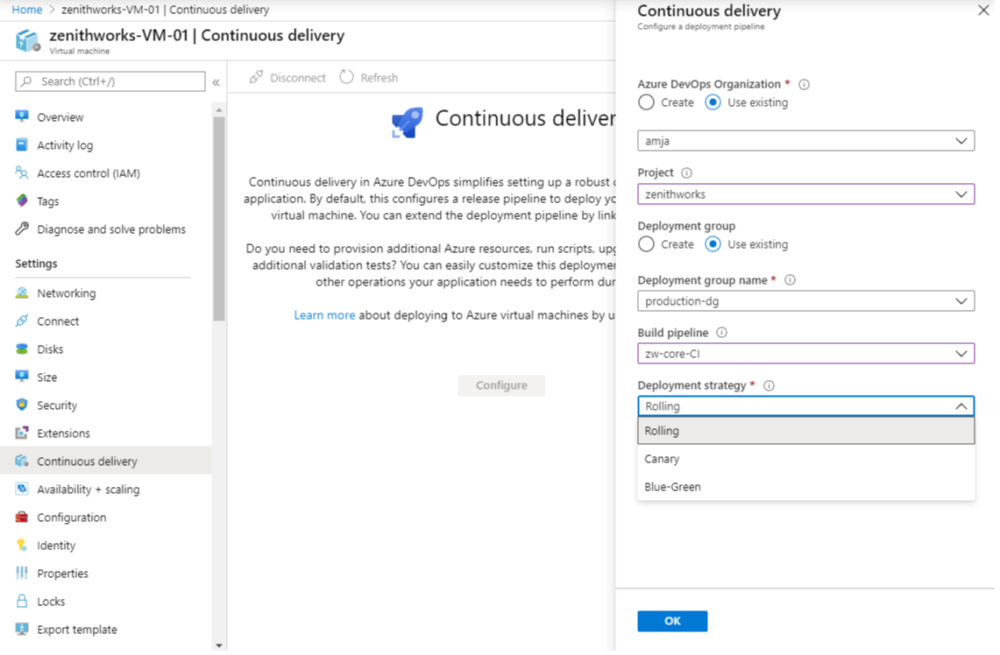

### Jobs can access output variables from previous stages

Output variables may now be used across stages in a YAML-based pipeline. This helps you pass useful information, such as a go/no-go decision or the ID of a generated output, from one stage to the next. The result (status) of a previous stage and its jobs is also available.

Output variables are still produced by steps inside of jobs. Instead of referring to **`dependencies.jobName.outputs['stepName.variableName']`**, stages refer to **`stageDependencies.stageName.jobName.outputs['stepName.variableName']`**. 

> [!NOTE]
> By default, each stage in a pipeline depends on the one just before it in the YAML file. Therefore, each stage can use output variables from the prior stage. You can alter the dependency graph, which will also alter which output variables are available. For instance, if stage 3 needs a variable from stage 1, it will need to declare an explicit dependency on stage 1.

    
### Limit build service repos scope access

Building upon [improving pipeline security by restricting the scope of access tokens](../../../2019/sprint-160-update.md#improve-pipeline-security-by-restricting-the-scope-of-access-tokens) Azure Pipelines can now scope down its repository access to just the repos required for a **YAML-based pipeline**. This means that if the pipelines's access token were to leak, it would only be able to see the repo(s) used in the pipeline. Previously, the access token was good for any Azure Repos repository in the project, or potentially the entire collection.

This feature will be on by default for new projects and organizations. For existing organizations, you must enable it in <b>Organization Settings</b> &gt; <b>Pipelines</b> &gt; <b>Settings</b>. When using this feature, all Azure Repos Git repositories accessed by the pipeline using the [build service identity](/azure/devops/pipelines/build/options?view=azure-devops&preserve-view=true#scoped-build-identities) must be explicitly checked out using a `checkout` step in the job that uses the repository. For more information, see [Limit job authorization scope to referenced Azure DevOps repositories](/azure/devops/pipelines/repos/azure-repos-git?tabs=yaml&view=azure-devops&preserve-view=true#limit-job-authorization-scope-to-referenced-azure-devops-repositories).

    
### Getting details at runtime about multiple repositories

When a pipeline is running, Azure Pipelines adds information about the repo, branch, and commit that triggered the run. Now that YAML pipelines support [checking out multiple repositories](../../../2019/sprint-161-update.md#checkout-multiple-repositories-in-azure-pipelines), you may also want to know the repo, branch, and commit that were checked out for other repositories. This data is available via a runtime expression, which now you can map into a variable. For example:<pre><code>
resources:

  repositories:

  - repository: other

    type: git

    name: MyProject/OtherTools

variables:

  tools.ref: $[ resources.repositories['other'].ref ] 

 

steps:

- checkout: self

- checkout: other - bash: echo &quot;Tools version: $TOOLS_REF&quot; 
</code></pre>

    
### Multi stage pipelines GA

Multi-stage pipelines UI is now generally available. The corresponding preview feature toggle has been removed.&nbsp; 

You can navigate to the new experience by selecting **Pipelines** -&gt; **Pipelines** under the left navigation menu in Azure DevOps. This experience is the entry point for both classic build pipelines as well as YAML pipelines. It is mobile-friendly and brings various improvements to how you manage your pipelines.&nbsp;You can drill down and view pipeline details, run details, pipeline analytics, job details, logs, and more.

To learn more about the multi-stage pipelines user experience, see the documentation [here](/azure/devops/pipelines/get-started/multi-stage-pipelines-experience?view=azure-devops&preserve-view=true).

    
### Configure Deployment Strategies from Azure portal

With this capability, we have made it easier for you to configure pipelines that use the deployment strategy of your choice, for example, **Rolling**, **Canary**, or **Blue-Green**. Using these out-of-box strategies, you can roll out updates in a safe manner and mitigate associated deployment risks. To access this, click on the 'Continuous Delivery' setting in an Azure Virtual Machine. In the configuration pane, you will be prompted to select details about the Azure DevOps project where the pipeline will be created, the deployment group, build pipeline that publishes the package to be deployed and the deployment strategy of your choice. Going ahead will configure a fully functional pipeline that deploys the selected package to this Virtual Machine. 

For more details, check out our documentation on [configuring Deployment Strategies](/azure/virtual-machines/linux/tutorial-devops-azure-pipelines-classic). 

