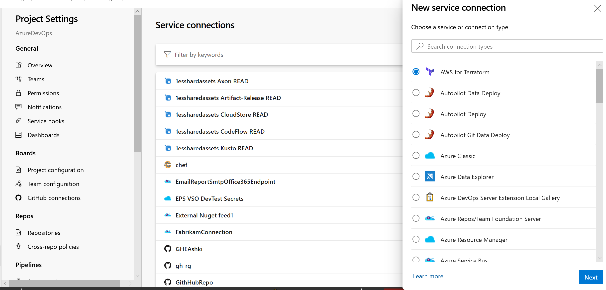
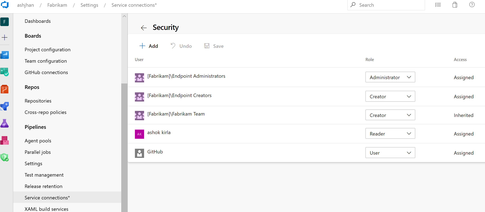
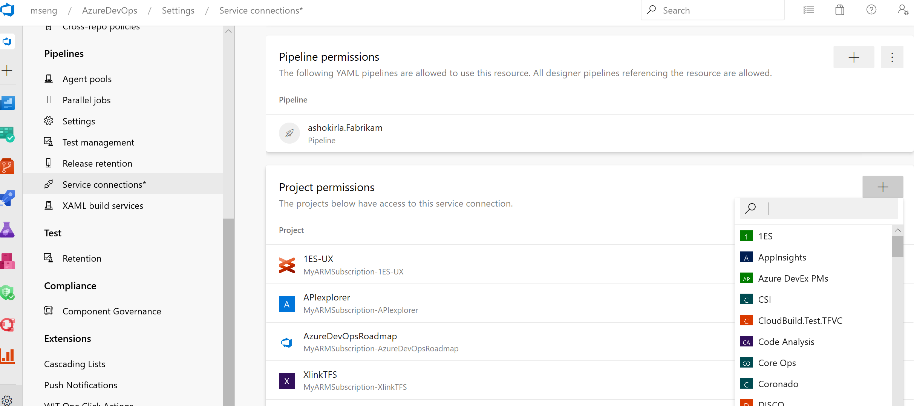
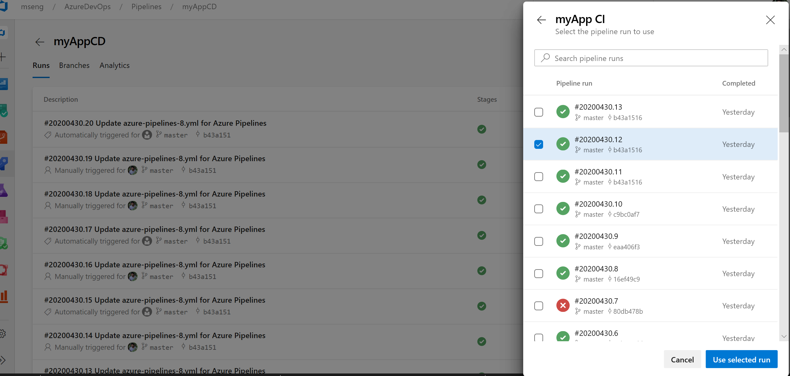

### Pipelines YAML CD features now generally available

We’re excited to announce the general availability of the Azure Pipelines YAML CD features. We now offer a unified YAML experience so you can configure each of your pipelines to do CI, CD, or CI and CD together. YAML CD features introduces several new advanced features that are available for all organizations using multi-stage YAML pipelines. Some of the highlights include:

- [Multi-stage YAML pipelines (for CI and CD)](/azure/devops/pipelines/process/stages?tabs=yaml&view=azure-devops&preserve-view=true) 
- [Approvals and checks on resources](/azure/devops/pipelines/process/approvals?tabs=check-pass&view=azure-devops&preserve-view=true)
- [Environments](/azure/devops/pipelines/process/environments?view=azure-devops&preserve-view=true) and [deployment strategies](/azure/devops/pipelines/process/deployment-jobs?view=azure-devops&preserve-view=true#deployment-strategies)
- [Kubernetes](/azure/devops/pipelines/process/environments-kubernetes?view=azure-devops&preserve-view=true) and [Virtual Machine](/azure/devops/pipelines/process/environments-virtual-machines?view=azure-devops&preserve-view=true) resources in environment
- [Review apps for collaboration](/azure/devops/pipelines/process/environments-kubernetes?view=azure-devops&preserve-view=true#setup-review-app)
- [Refreshed UX for service connections](/azure/devops/pipelines/library/service-endpoints?tabs=yaml&view=azure-devops&preserve-view=true) 
- [Resources in YAML pipelines](/azure/devops/pipelines/process/resources?tabs=schema&view=azure-devops&preserve-view=true)

If you’re ready to start building, check out the [documentation](/azure/devops/pipelines/yaml-schema?tabs=schema%2cparameter-schema&view=azure-devops&preserve-view=true)&nbsp;or [blog](https://devblogs.microsoft.com/devops/announcing-general-availability-of-azure-pipelines-yaml-cd)&nbsp;for building multi-stage CI/CD pipelines.

### Service connections new UI as default experience

In this sprint, we are making the new service connections UI the default experience and the old service connections UI will no longer be available. For the past six months, we have provided a new UI to service connections as a preview feature. Based on feedback we received from the customers, we added various features and are now ready to make it the mainstream experience for all users.

New service connections UI is built on modern design standards and it comes with various critical features to support multi-stage YAML CD pipelines such as approvals, authorizations, and cross-project sharing.

Learn more about service connections [here](/azure/devops/pipelines/library/service-endpoints).

### Role-based access for service connections

In this sprint, we have added role-based access for service connections. Previously, service connection security could only be managed through pre-defined Azure DevOps groups such as Endpoint administrators and Endpoint Creators.

As part of this work, we have introduced the new roles of Reader, User, Creator and Administrator. You can set these roles via the service connections page in your project and these are inherited by the individual connections. And in each service connection you have the option to turn inheritance on or off and override the roles in the scope of the service connection.

Learn more about service connections security [here](/azure/devops/pipelines/library/service-endpoints).

### Showing associated CD pipelines info in CI pipelines

Also in this sprint we have added support to the CD YAML pipelines details where the CI pipelines are referred to as pipeline resources. In your CI pipeline run view, you will now see a new 'Associated pipelines' tab where you can find all the pipeline runs that consume your pipeline and artifacts from it.

### Cross-project sharing of service connections is now public

In this sprint we are enabling support for service connection sharing across projects. For the past three months, this feature has been in private preview and many customers have provided valuable feedback on the feature.

Thank you for your support. You can now share your service connections with your projects safely and securely.

Learn more about service connections sharing [here](/azure/devops/pipelines/library/service-endpoints).

### Pipeline resource version picker in the create run dialogue

In this sprint, as part of multi-stage CD YAML pipelines, we have added the ability to manually pick up pipeline resource versions in the create run dialogue. If you consume a [pipeline as a resource](/azure/devops/pipelines/process/resources?tabs=schema&view=azure-devops&preserve-view=true#resources-pipelines) in another pipeline, you can now pick the version of that pipeline when creating a run.

