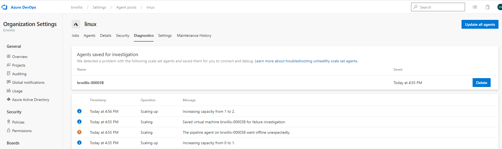

### Updating Node in the Azure Pipelines agent
<!-- original link, in case anyone bookmarked it -->

 _Update from what was originally published: Due to an incompatibility with Red Hat Enterprise Linux 6 and Node 14, we've suspended work on Node 14 and will first focus on getting to Node 10._

This release, we've begun our move away from Node 6 and towards a supported Node version as the preferred runtime for Azure Pipelines tasks. We've updated the first batch of in-the-box tasks to run on Node 10. This change marks the start of a process to remove Node 6 from the agent by default. Node 6 has exited long-term support and is often flagged as a security risk by automated scanners. While we believe our use of Node 6 is unlikely to be subject to most of the potential flaws, it's nevertheless important for us to get tasks onto a supported runtime. In calendar year 2021, we plan to begin shipping a version of the agent without Node 6.

If you use any of the Node 10-enabled tasks, your self-hosted agents will update themselves to run the new versions of tasks. Other than that, there should be no impact for most customers. On the other hand, if you're the author of any tasks, you should begin updating them to run on Node 10. In your `task.json`, under `execution`, you can update from `Node` to `Node10`. If you need to support older server versions, you can leave your `Node` entrypoint. Instances of Azure DevOps which understand the Node 10 handler will choose it by default, and those which don't will fall back to your Node 6 implementation.

### Save an unhealthy agent for investigation in scale set agents

When you use scale set agents, Azure Pipelines manages the scaling up and down of agent instances. When Azure Pipelines detects an unhealthy VM in the scale set, it will log the issue to the Pool Diagnostics UI and attempt to delete the VM. There are many reasons why a VM can be unhealthy: the scale set's network configuration may have prevented the Azure Pipelines extension from downloading the latest agent, your custom script extension may have failed, or the scale set VM image may have a pending reboot or pending Windows Updates.
  
   
 
By deleting unhealthy VMs, Azure Pipelines keeps your agent pool optimized to run CI/CD jobs. In some cases, you may be able to use the Azure Pipelines diagnostics page (shown above) or the Azure diagnostics page to debug this problem. However, in many cases, the best way to diagnose the problem is to log into the VM and review the agent logs and event viewer logs. At present, this is not easy to do since the unhealthy VM is deleted automatically.

With this release, we enhanced the diagnosability of unhealthy VMs by giving you the ability to save an unhealthy agent for investigation. 

When an unhealthy agent is saved, you can connect to the virtual machine, debug, and retrieve any logs you need. When finished, you can release the agent and the associated VM. For more information, see the section on [troubleshooting unhealthy agents](/azure/devops/pipelines/agents/scale-set-agents).

### `ubuntu-latest` pipelines will soon use Ubuntu-20.04

Ubuntu 20.04 will soon be the default version for the `ubuntu-latest` label in Azure Pipelines. This change will be rolled out over a period of several weeks beginning on November 30.

If you see any issues with your Ubuntu pipelines:

- File an issue in the [virtual-environments repository](https://github.com/actions/virtual-environments)
- Switch back to Ubuntu 18.04 by specifying `ubuntu-18.04` as the `vmImage` in your pipeline. We will continue to support Ubuntu 18.04.

Note that `ubuntu-18.04` and `ubuntu-20.04` may differ in both pre-installed tools and the default versions of tools. For information on all the differences, see https://github.com/actions/virtual-environments/issues/1816.