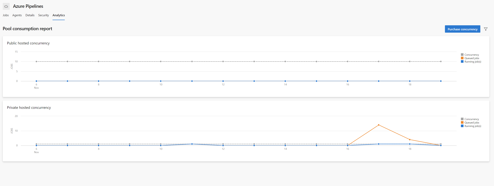
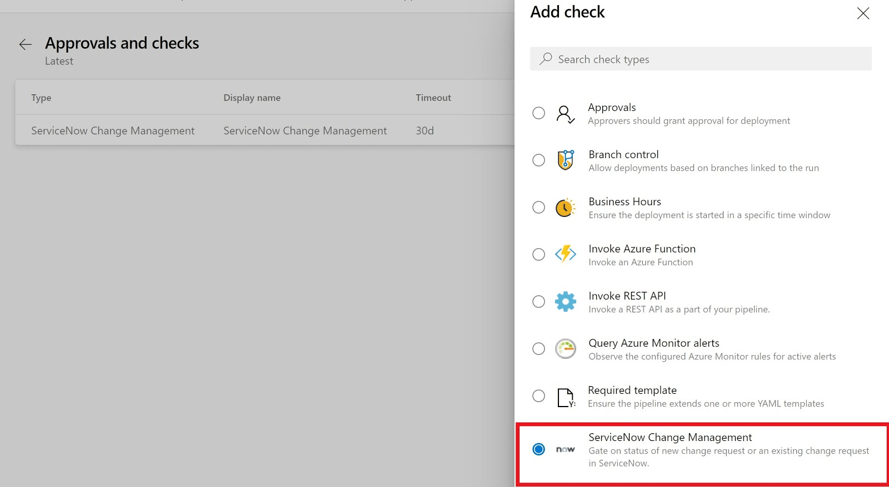

> [!NOTE]
> Azure Pipelines images are continuously updated in an effort to provide users with the best experience possible. These routine updates are predominantly aimed at addressing bugs or out of date software. They will often have no impact on your pipelines, however this is not always the case. Your pipeline may be impacted if it takes a dependency on a piece of software that has either been removed or updated on the image.
>
> To learn more about upcoming updates on our Windows, Linux and MacOS images, please read the following announcements:
>
> - [Windows 2016](https://github.com/actions/virtual-environments/blob/d6d20c9d84ca1e4f4d1c9767bc00ce26d226c7f9/images/win/Windows2016-Readme.md)
> - [Windows 2019](https://github.com/actions/virtual-environments/blob/d6d20c9d84ca1e4f4d1c9767bc00ce26d226c7f9/images/win/Windows2019-Readme.md)
> - [Ubuntu 16.04](https://github.com/actions/virtual-environments/blob/d6d20c9d84ca1e4f4d1c9767bc00ce26d226c7f9/images/linux/Ubuntu1604-README.md)
> - [Ubuntu 18.04](https://github.com/actions/virtual-environments/blob/d6d20c9d84ca1e4f4d1c9767bc00ce26d226c7f9/images/linux/Ubuntu1804-README.md)
> - [Ubuntu 20.04](https://github.com/actions/virtual-environments/blob/d6d20c9d84ca1e4f4d1c9767bc00ce26d226c7f9/images/linux/Ubuntu2004-README.md)
> - [MacOS 10.15](https://github.com/actions/virtual-environments/blob/d6d20c9d84ca1e4f4d1c9767bc00ce26d226c7f9/images/macos/macos-10.15-Readme.md)
>
> To view release notes for upcoming (pre-release) and deployed changes, please subscribe to the following release notes:
>
> - [Release notes](https://github.com/actions/virtual-environments/releases)

### Historical graph for agent pools (Preview)

We often receive questions from users wondering why their jobs aren’t running. The most common answer to this question is that the pool doesn’t have enough concurrency, however it has historically been difficult to diagnose this. 

Today, we are excited to announce a public preview of historical usage graphs for agent pools. These graphs allow you to view jobs running in your pools up against your pool concurrency over a span of up to 30 days. You can drill into this data at four different intervals of time (1, 7, 14, 30 days).  
  
 

Agent pool usage data is sampled and aggregated by the Analytics service every 10 mins. The number of jobs is plotted based on the max number of running jobs for the specified interval of time.

This feature is enabled by default. To try it out, follow the guidance below.

1. Within project settings, navigate to the pipelines “Agent pools” tab
2. From the agent pool, select a pool (e.g., Azure Pipelines)
3. Within the pool, select the “Analytics” tab

### ServiceNow change management integration with YAML pipelines

The [Azure Pipelines app for ServiceNow](https://marketplace.visualstudio.com/items?itemName=ms-vscs-rm.vss-services-servicenowchangerequestmanagement) helps you integrate Azure Pipelines and ServiceNow Change Management. With this update, we take our journey of making Azure Pipelines aware of the change management process managed in ServiceNow further to YAML pipelines. 

By configuring the "ServiceNow Change Management" check on a resource, you can now pause for the change to be approved before deploying the build to that resource. You can automatically create a new change for a stage or wait on an existing change request.
  
 

You can also add the `UpdateServiceNowChangeRequest` task in a server job to update the change request with deployment status, notes etc.  
