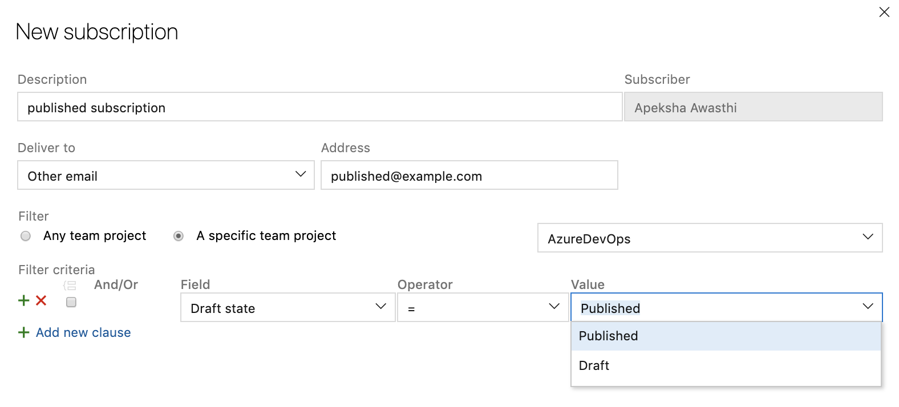

### Custom notification subscription for draft pull requests
​
To help reduce the number of email notifications from pull requests, you can now create a custom notification subscription for pull requests that are created or updated in **draft state**. You can get emails specifically for draft pull requests or filter out emails from draft pull requests so your team doesn't get notified before the pull request is ready to be reviewed.

> [!div class="mx-imgBorder"]
> 