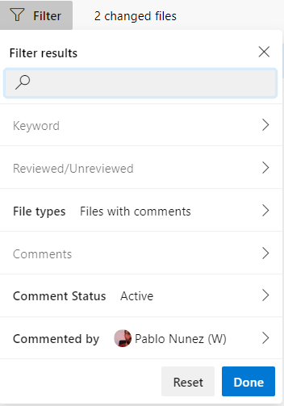
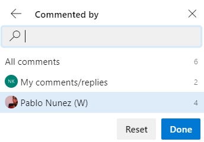

### Improved PR actionability

When you have many pull requests to review, understanding where you should take action first can be difficult. To improve pull request actionability, you can now create multiple custom queries on the pull request list page with several new options to filter by such as draft state. These queries will create separate and collapsible sections on your pull request page in addition to "Created by me" and "Assigned to me". You can also decline to review a pull request that you were added to via the Vote menu or the context menu on the pull request list page. In the custom sections, you will now see separate tabs for pull requests that you have provided a review on or declined to review. These custom queries will work across repositories on the "My pull requests" tab of the organization home page. If you want to come back to a pull request, you can flag it and they will show up at the top of your list. Lastly, pull requests that have been set to auto-complete will be marked with a pill that says 'Auto-complete' in the list.

### Improved comment-related filtering within pull requests 

We have added more filters to the pull request details page so you review them faster:
- Comment status: Active (default), All, Pending, Resolved, As designed, Won't fix, and Closed.
- Commented by: Filter to comments left by a specific person.
- File types: Show all files (default), and Show only the files that have been commented on.

> [!div class="mx-imgBorder"]
> 

> [!div class="mx-imgBorder"]
> 
