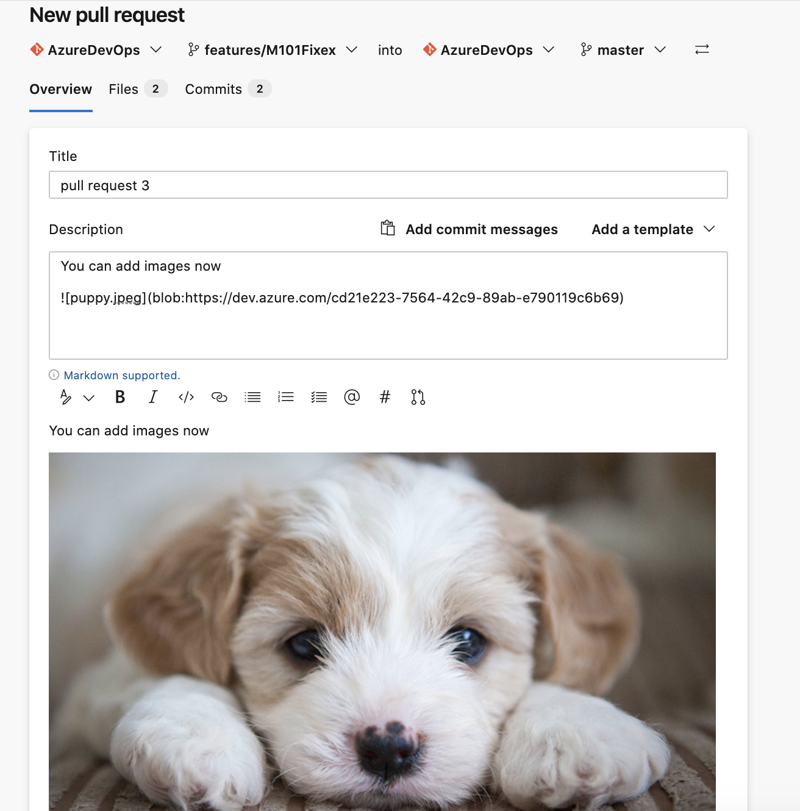
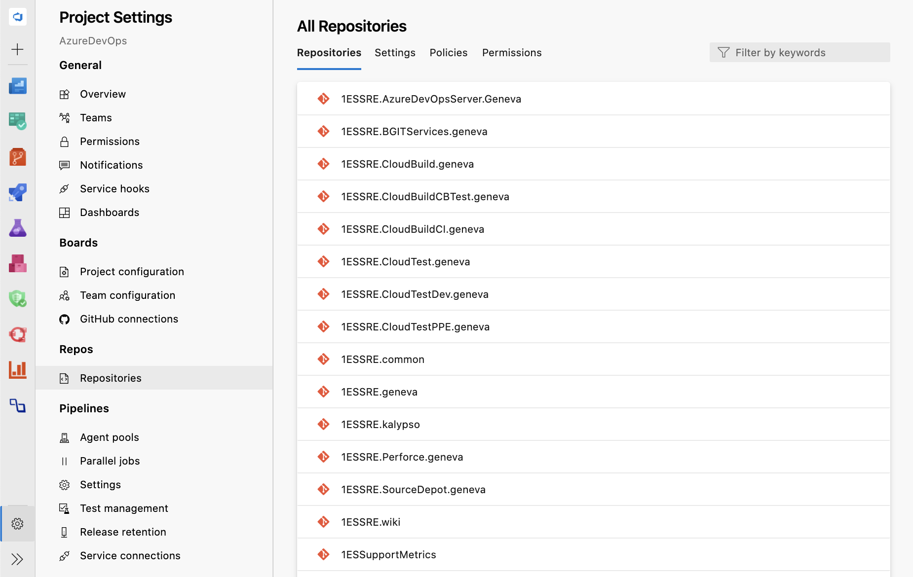
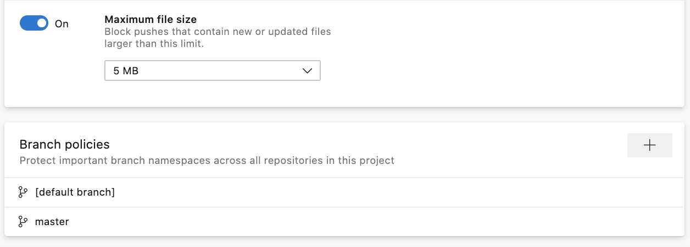
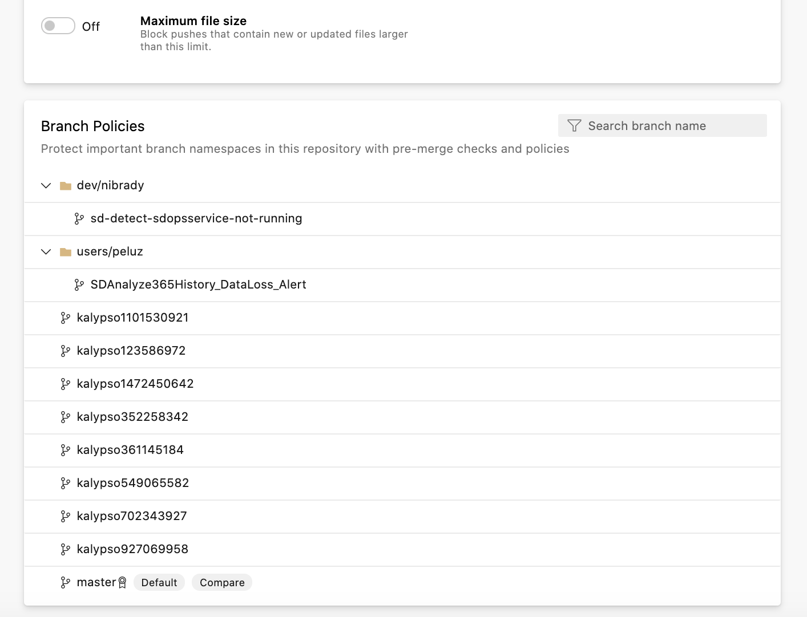
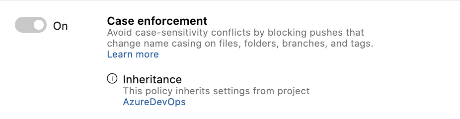
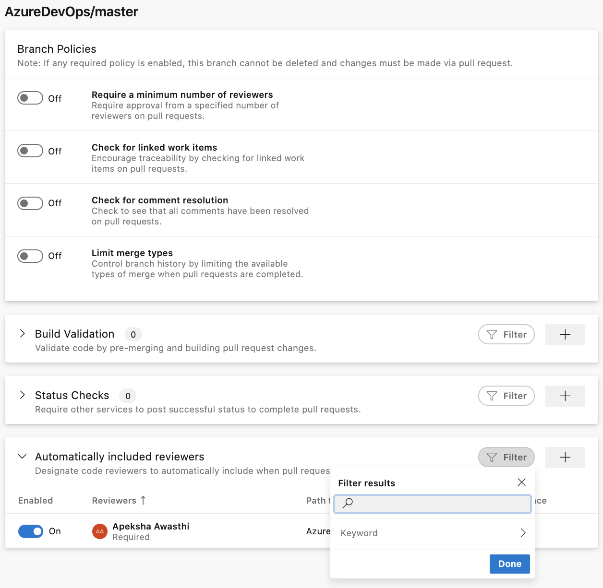

### Add attachments while creating a pull request

You can now add an attachment to a pull request when creating it. To add an attachment, you previously had to create the pull request then edit it, but now you can directly drag and drop an image to the create pull request page.

### New web platform conversion – Repository settings 

We have converted the two Repository settings pages to a single experience that was upgraded to a new web platform. This upgrade not only makes the experience faster and more modern, but these pages also provide a single entry-point for all policies from the project level to the branch level. 

With this new experience, navigation for projects with a substantial number of repositories has become easier because of faster load times and an added search filter. You can also view project level policies and the list of cross-repo policies under the Policies tab.

If you click into a repository, you can view policies and permissions set at the repository level. Within the policies tab, you can view a list of every branch that policy is set on. Now, click on the branch to see the policies all while never leaving the Repository settings page.  

Now, when policies are inherited from a higher scope than what you are working with, we show you where the policy was inherited from next to each individual policy. You can also navigate to the page where the higher-level policy was set by clicking the scope name. 

The policy page itself has also been upgraded to the new web platform with collapsible sections! To improve the experience of looking for a particular Build Validation, Status Check, or Automatic Reviewer policy, we have added search filters for each section. 

