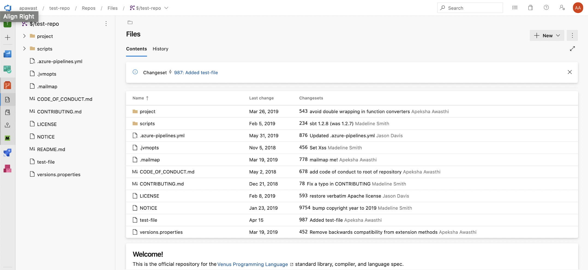
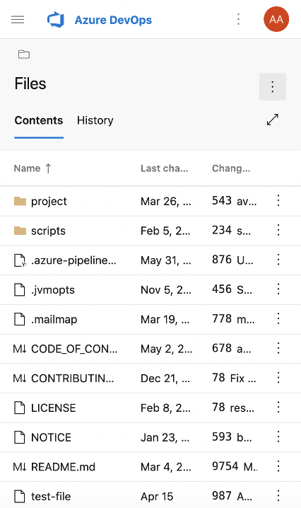

### Add attachments while creating a pull request

You can now add an attachment to a pull request when creating it. To add an attachment, you previously had to create the pull request then edit it, but now you can directly drag and drop an image to the create pull request page.

### New web platform conversion - TFVC Hubs

We have updated the TFVC hubs to a more modern experience. The pages are now faster and more mobile-friendly! Web experience:
 Mobile experience: 
