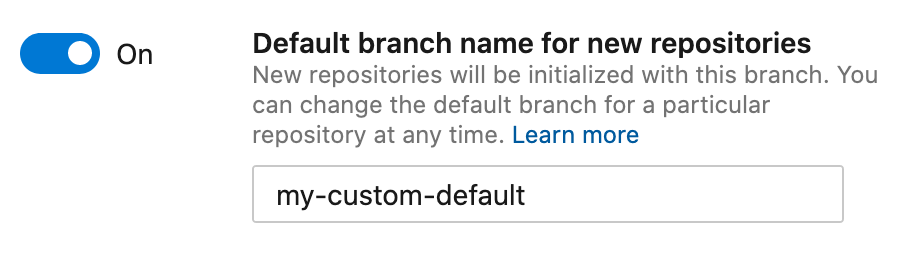

### Default branch name preference

Azure Repos now offers a customizable default branch name for Git. In repository settings, you may choose any legal branch name to use when a repository is initialized. Azure Repos has always supported changing the default branch name for an existing repository. Visit [Manage branches](/azure/devops/repos/git/manage-your-branches?view=azure-devops&preserve-view=true) for more details.  

&nbsp;

Note: if you don't enable this feature, your repositories will be initialized with Azure Repos's default name. Right now, that default is **master**. To honor Microsoft's commitment to, and customer requests for, inclusive language, we'll be joining [industry peers](https://github.com/github/renaming) in changing this default to **main**. That change will occur later this summer. If you want to keep using **master**, you should turn on this feature now and set it to **master**.