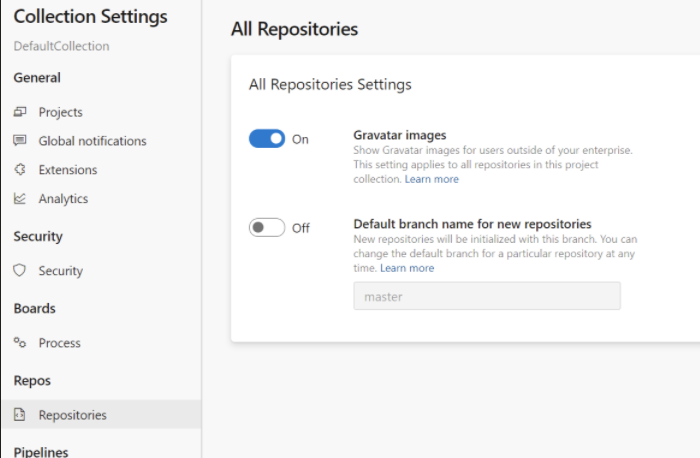

### Org-level setting for default branch

There is now an organization-level setting for your preferred initial branch name for new repositories. If a project has not chosen an initial branch name, then this org-level setting will be used. If you did not specify the initial branch name in the org settings or the project settings, then new repositories will use an Azure DevOps defined default.

### Add a new auth scope for contributing PR comments

This release adds a new OAuth scope for reading/writing pull request comments. If you have a bot or automation which only needs to interact with comments, you can give it a PAT with only this scope. This process reduces the blast radius if the automation has a bug or if the token were compromised.