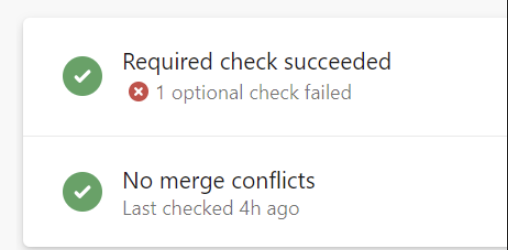
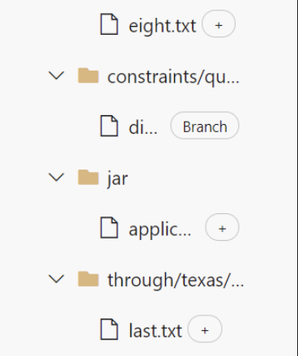
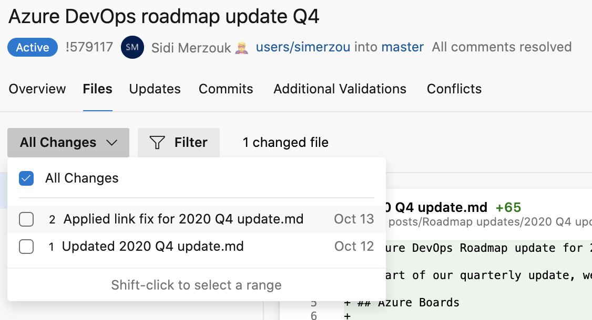
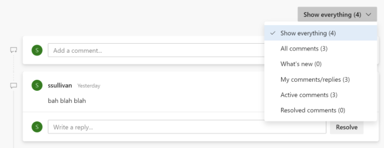

    
### A batch of improvements to the Pull Request experience

The new pull request experience has been in preview for a few months now. We've been addressing feedback we received from many of you. We are happy to announce the following improvements that you will see with this sprint's deployment:

#### Make the optional checks more visible 

Customers use optional checks to draw a developer's attention to potential issues. In the previous experience, it used to be obvious when these checks fail. However, that is not the case in the preview experience. A big, green checkmark on the required checks masks the failures in optional checks. Users could only discover that optional checks failed by opening the checks panel. Developers don't often do that when there is no indication of a problem. In this deployment, we made the status of optional checks more visible in the summary.
  
 
  
 

#### Ctrl-clicks on menu items

Tab menus on a PR didn't support Ctrl-click. Users often open new browser tabs as they review a pull request. This has been fixed.

#### Location of [+] annotation

The tree listing of files in a PR shows an annotation [+] to help authors and reviewers identify new files. Since the annotation was after the ellipsis, it was often not visible for longer file names.

  
   
 

**PR updates dropdown regain timing information**

The dropdown to select update and compare files in a PR lost an important element in the preview experience. It didn't show when that update was made. This has been fixed.
  
   
 

#### Improved comment filter layout 

When filtering comments on the summary page of a pull request, the drop-down was on the right, but the text was left-aligned. This has been fixed.
  
   
 
We have more improvements planned over the next two sprints.
