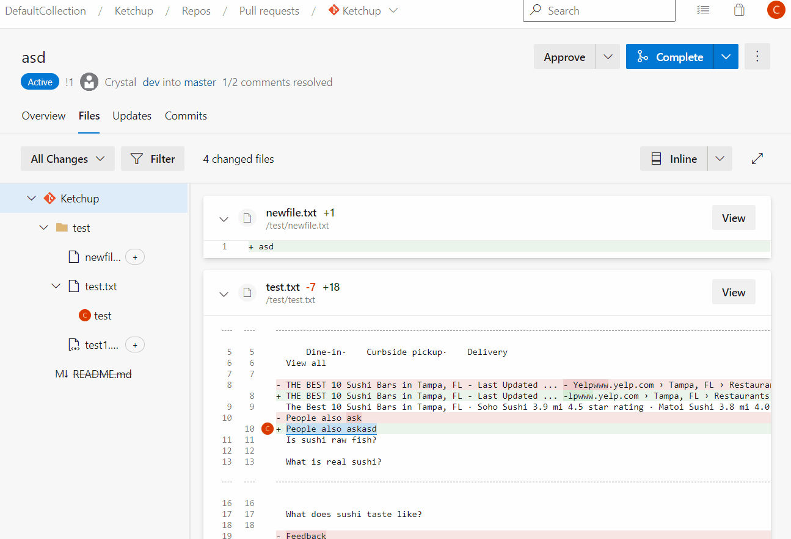
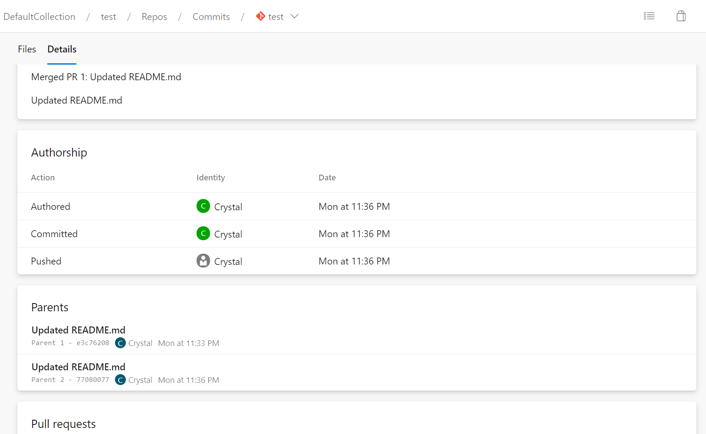
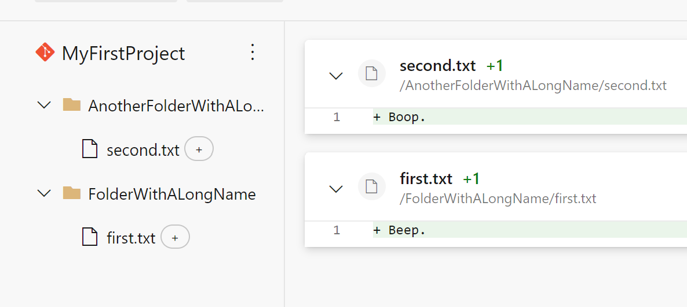
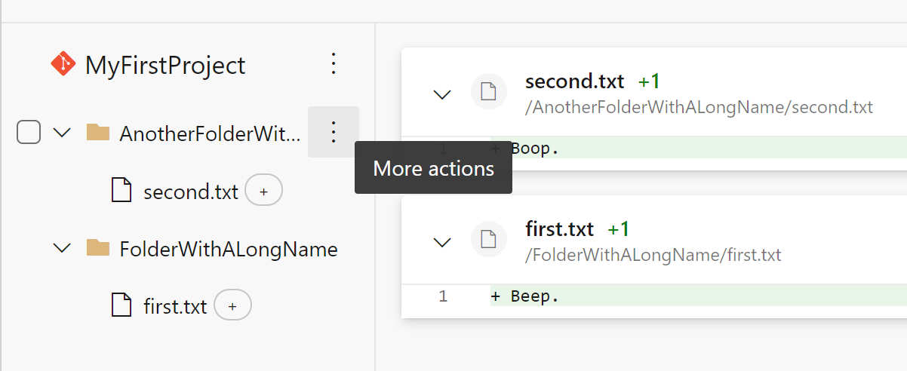
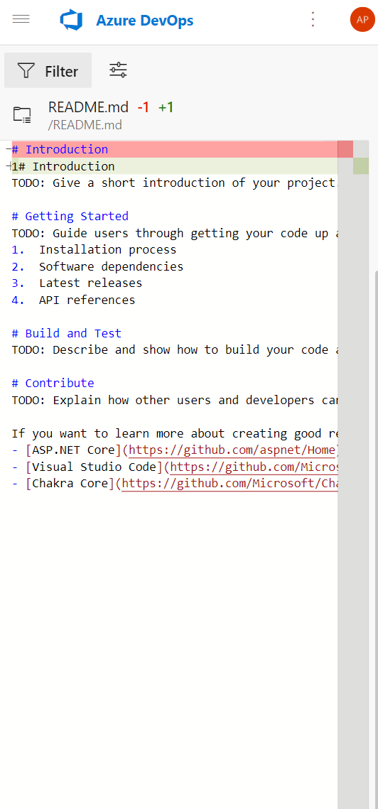
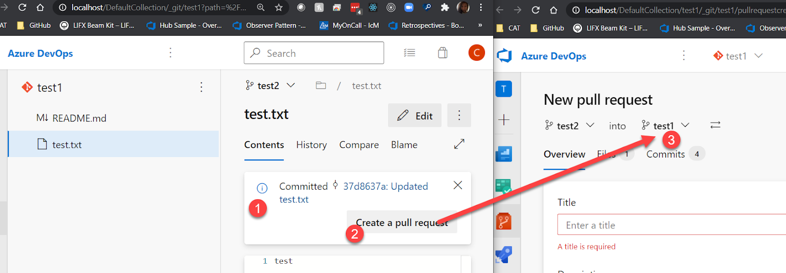

This update includes the following enhancements to the pull request experience based on <a href="https://devblogs.microsoft.com/devops/introducing-the-new-pull-request-experience-for-azure-repos/">your feedback</a>. 

> [!NOTE]
> Please note that the new pull request experience will be enabled for all organizations in January 2021, and you will not be able to toggle back to the older experience.

### Single-click to toggle between inline and diff views

In the previous experience, you could toggle between inline and diff views with a single click. We brought this functionality back in the new experience without having to select a dropdown.
  
 

### Navigation to parent commits

Under the Commits page, you can compare the changes made in a particular commit with its parent commit. However, you may want to navigate to the parent commit and further understand how that commit differs from its own parent. This is often needed when you want to understand all the changes in a release. We added a parent(s) card to a commit to help you achieve this.
  
 

### More space for folders and files with long names in the PR files tab

Folders and files with long names were cut off due to a lack of horizontal spacing in the file tree. We recovered some additional space in the tree by modifying the tree’s indentation to match the root node and by hiding the ellipsis button from the page except on hover.

Image of the new file tree:
  
 
 
Image of the file tree when hovering over a directory:
  
 

### Preserve scroll position when resizing diff pane in PR files tab

When resizing the side-by-side diff pane in the PR files tab, the user’s scroll location would be lost. This issue has been fixed; the user’s scroll location is now retained on a diff pane resize.

### Search for a commit on a mobile device

When viewing the Commits page on a mobile device, the search box is missing in the new experience. As a result, it is hard for you to find a commit by its hash and open it. This has been fixed now.
  
 

### Improved usage of space for new PR file diff mobile view

We updated this page to make better use of the space so that users can see more of the file in mobile views instead of having 40% of the screen taken up by a header.
  
 

### Enhanced images in PR summary view

Images edited in a PR were not showing in the PR summary view but did show correctly in the PR files view. This issue has been resolved.

### Enhanced branch experience when creating a new PR

Before this update, this experience was not ideal as it would compare the changes with the default branch of the repository instead of the compare branch.
  
 
