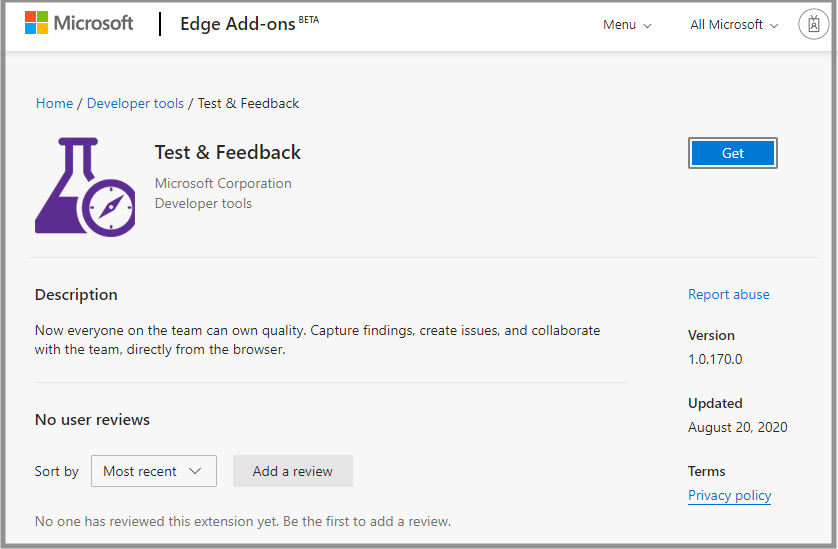

### The Test and Feedback extension is now available in the Microsoft Edge store

You can now perform exploratory testing in both [connected mode](/azure/devops/test/connected-mode-exploratory-testing) and [standalone mode](/azure/devops/test/standalone-mode-exploratory-testing) on the Microsoft Edge browser by installing the Test and Feedback [add-on](https://microsoftedge.microsoft.com/addons/detail/test-feedback/leeakgkdanfdoebeohldonigkalooaej?hl=en-US). Visit the [marketplace](https://marketplace.visualstudio.com/items?itemName=ms.vss-exploratorytesting-web) for more details. 

