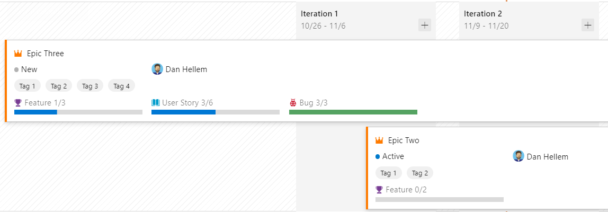

### Delivery Plans: Rollup Information

As part of the Delivery Plans 2.0 public preview, roll-up information is now available. When dealing with higher level work items like Epics or Features, you may want to see more details. Roll-up shows the progress of the underlying child work items, revealing the full story. To enable this feature, go to your **plan settings**, then **Fields**, and select **Show child rollup data**.

 

### Delivery Plans: Condensed views

As part of the Delivery Plans 2.0 public preview, customers can now switch between Normal and Condensed views. Cards with additional fields can take up a lot of vertical space. This makes it hard to see more than a few cards on the screen at a time, even when fully zoomed out. We created a collapsed card view which hides all the fields from the cards and only displays the work item type icon and title. Hiding and showing all fields is now just a click away.

 
