### Delivery Plans 2.0 is generally available

We are excited to announce that Delivery Plans 2.0 is generally available! It delivers on 3 key scenarios:

* A timeline view of the plan
* Progress of the work
* Dependency Tracking

These scenarios work across teams and projects. Delivery Plans 2.0 is now native to the product so an extension is no longer required. Plans created with the original Plans extension will continue to work in Delivery Plans.

Here’s a quick comparison of the differences between Plans and Delivery Plans

|Feature|	Plans 1.0 (extension) |	Delivery Plans 2.0|
| -------------------------------|-----------------------------------------|--------------------------|
| Number of teams |	Limit is 10 |	Limit is 15|
| Work item timeframe |	Iterations only |	Start/Target date and Iteration |
| Visualization |	Full card view |Condensed and Expanded views |
| Roll-up information |	None |	% done of child and linked items |
| Dependency Tracking |	None |	Yes |
| Start Time visualization | No, only where work item ends | Yes, both start and target dates |
| Card Styling | No	| Yes |

#### Delivery Plans Features
Below are the main features. Filtering, Markers and Field Criteria are also part of Delivery Plans.

#### There are two main views: condensed and expanded

Delivery Plans 2.0 enables viewing all the work items in your plan on a timeline, using start and target dates or iteration dates. The order of precedence is start & target dates then followed by iteration. This lets you add portfolio level work items like Epic which often are not defined to an iteration. 

There are two main views the **condensed view** and **expanded view**. You can also zoom in and out of the plan by clicking on the magnifying glass in the right-hand side of the plan.

* Condensed View

    The condensed view shows all work item cards **collapsed** meaning that not all card information is shown. This view is useful for an overall view of the work in the plan. To collapse the card fields, click on the card icon next to the magnifying icons in the right-hand side of the plan. 

    Here’s an example of a plan toggling between the condensed and expanded views.

    > [!div class="mx-imgBorder"]
    > 

* Expanded View

    The expanded view shows the progress of a work item by counting the number of child and linked items and showing the percentage complete. Currently progress is determined by work item count. 

    Here is an example of a plan using an expanded view. Note the progress bars and percentage complete.

    > [!div class="mx-imgBorder"]
    > 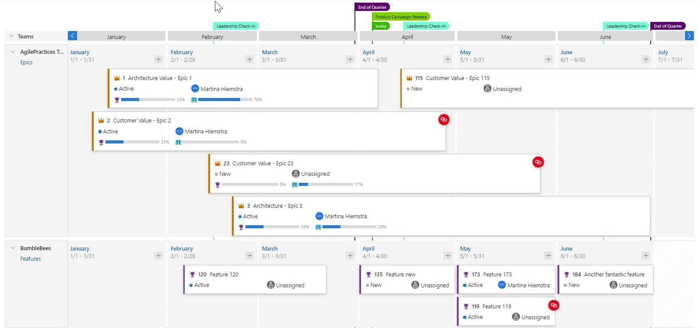

#### Dependency Tracking

Dependency tracking is based on predecessor and successor links being defined in work items. If those links are not defined, then no dependency lines will be displayed. When there is a dependency issue with a work item, the dependency link icon is colored red.

> [!div class="mx-imgBorder"]
> 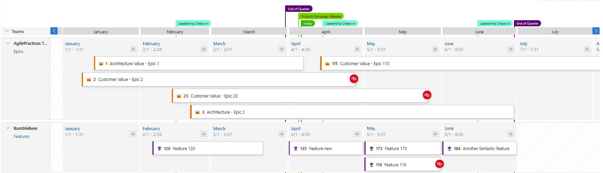

* Viewing Dependencies

    Specific dependencies are viewed through the dependency panel which shows all the dependencies for that work item, including the direction. A red exclamation mark indicates a dependency problem. To bring up the panel simply click on the dependency link icon in the upper right corner of the card. Here are examples of dependencies.

    > [!div class="mx-imgBorder"]
    > 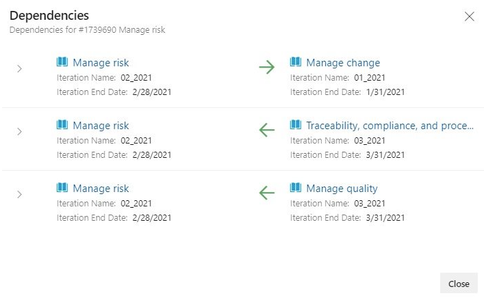

    > [!div class="mx-imgBorder"]
    > 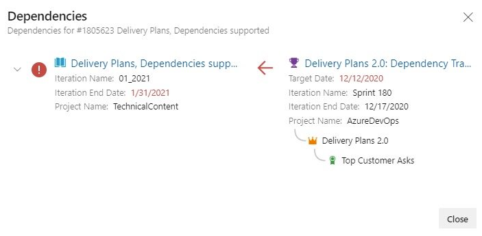

* Dependency Lines

    Dependencies between work items are visualized with directional arrow lines between the respective work items. Multiple dependencies will display as multiple lines. A red colored line indicates a problem. 

    Here are some examples.

    > [!div class="mx-imgBorder"]
    > 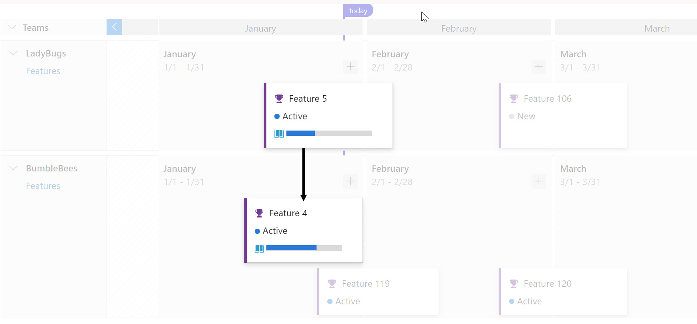

    Here’s an example of a work item with multiple dependencies and it works using condensed view too.

    > [!div class="mx-imgBorder"]
    > 

    When there is an issue the line color is red, and so is the dependency icon. 

    Here is an example.

    > [!div class="mx-imgBorder"]
    > 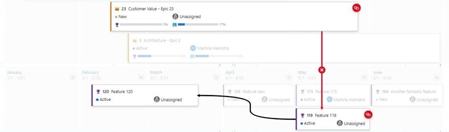
#### Card Styling

Cards can now be styled using rules, like the Kanban boards. Open the plan settings and click on **Styles**. In the Styles pane click on **+ Add styling rule** to add the rule and then click **Save**. There can be up to 10 rules and each rule can have up to 5 clauses.

> [!div class="mx-imgBorder"]
> 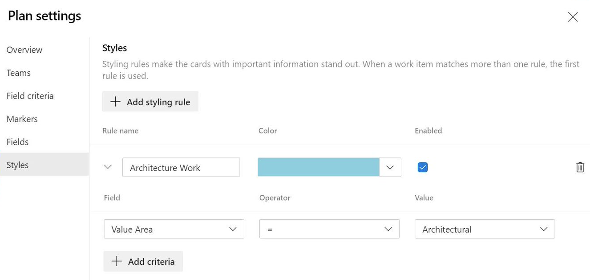

* Before

 > [!div class="mx-imgBorder"]
 > 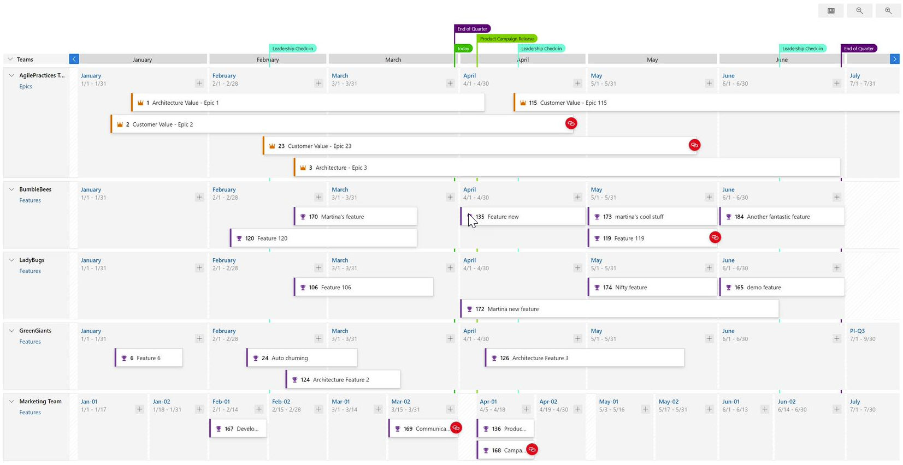

* After

 > [!div class="mx-imgBorder"]
 > 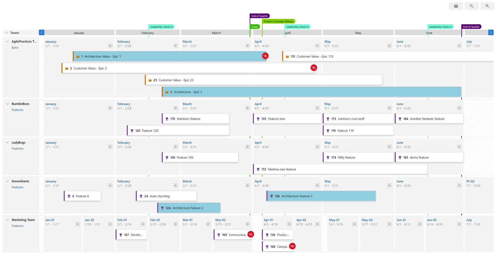

### Copy Dashboard is now available in public preview

With this release, a team or project dashboard can now be copied to the same or a new project. The widgets and layout of the dashboard will be copied over but the widgets will still need to be configured with new queries and settings. 

To preview this feature simply turn on the feature flag named **Copy Dashboard Experience** (under preview features). 

> [!div class="mx-imgBorder"]
> 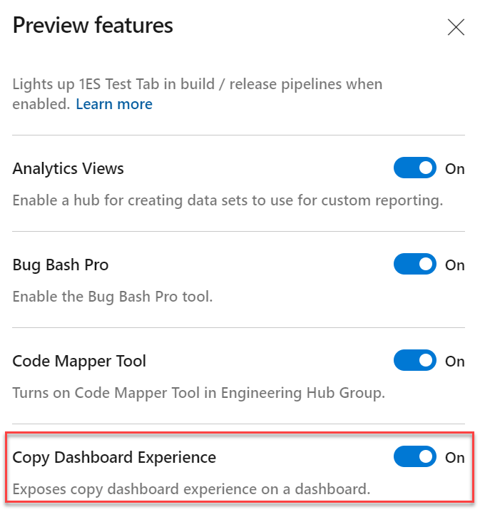

Here are the steps to copy a dashboard:

1. Go to the dashboard you want to copy. From there click the menu to bring up **Copy Dashboard** and then click on it.

> [!div class="mx-imgBorder"]
> 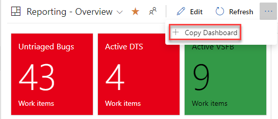

2. Enter the name and description of the new dashboard, then select the dashboard type, Team or Project. When selecting a Team Dashboard, the new project and team are selected from the project and team drop down boxes respectively. For a Project dashboard, only the project is required.

> [!div class="mx-imgBorder"]
> 
### New iteration capacity REST API

You can now get the total capacity for all teams in an iteration by using the new **Iterationcapacities** REST Api. Provide the `iterationId` and the API will return the total capacity for each team associated with the iteration, as well as an overall total. This feature will make capacity planning for an increment easier. To learn more about **Iterationcapacities**, see the documentation [here](/rest/api/azure/devops/work/iterationcapacities/get?view=azure-devops-rest-6.1&preserve-view=true#iterationcapacity).